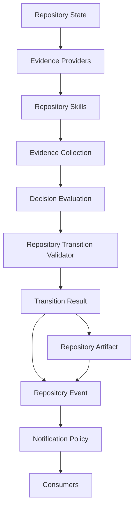

# Phase 115I Complete — Repository Skills Contract Freeze

- **Phase ID:** `115I`
- **Status:** completed
- **Report completeness:** complete
- **Missing trust fields:** none
- **Files changed:** 8
- **Tests run:** 52 (focused architecture/documentation suite)
- **Commits:** 4cb8884d, 792c907b
- **Pushed:** not_pushed
- **origin/main..HEAD:** 2

## Summary

Phase 115I freezes the Repository Skills contract 115H designed:
building on 115C (Evidence), 115D (Evidence Providers), 115E (Decision
Evaluation), 115F (integration), 115G (verification), and 115H
(architecture). Contract phase only; zero implementation added.

## Repository Skill Contract Summary

Core principle: **Repository Skills never decide. Repository Skills
produce Evidence. Repository Skills are model-agnostic.** The frozen
`RepositorySkill` interface requires every skill to declare
capabilities, evidence categories produced, determinism class,
confidence defaults, and required repository inputs, and to produce
only an `EvidenceCollection`. Explicitly and permanently forbidden:
repository mutation, decision making, validator bypass, lifecycle
authority, artifact promotion, notification dispatch, execution,
authorization, commit, push, finalize.

## Capability Model

`RepositorySkillCapability` describes evidence outputs, never
implementations. Frozen minimum set: `git_analysis`,
`runtime_analysis`, `architecture_analysis`, `documentation_analysis`,
`report_analysis`, `metadata_analysis`, `dependency_analysis`,
`ai_review`. Two skills may declare the same capability while using
entirely different internal logic.

## Manifest Summary

Frozen fields, no schema/loader/registry implemented: `skill_id`,
`name`, `version`, capability list, `determinism`, confidence policy,
evidence categories, required inputs, optional inputs, `timeout`,
failure policy, side-effect policy, model-produced flag, experimental
flag.

## Determinism Classes

Five classes frozen, reusing 115C's existing `EvidenceDeterminism`
enum with no new member: `deterministic`, `reproducible_external`,
`probabilistic`, `human_assisted`, `experimental`.

## Failure Contract

Every Repository Skill failure must produce exactly one of two
outcomes: honest `UNKNOWN` evidence (115D's established pattern) or an
explicit, structured failure outcome. Never partial hidden failure.
Never silent success — a timeout is itself a failure requiring one of
the two outcomes, never a fabricated passing result.

## Advisory Boundary

Future DeepSeek, GLM, GPT, Qwen, or local-SLM-backed skills must
produce advisory evidence only, declare `probabilistic` determinism by
default, be labelled model-produced (via 115C's existing
`Evidence.producer`/`EvidenceProvenance`), never become sole authority
for Accept, and never bypass Decision Evaluation — advisory evidence
flows through the identical `EvidenceCollection` -> `evaluate()` path
as every other evidence item.

## Composition Model

One Repository Skill may internally use multiple 115D Evidence
Providers to assemble its own evidence. Decision Evaluation never sees
this internal composition — it receives only an `EvidenceCollection`,
looked up by evidence ID/category, never by producing skill or
provider.

## Explainability Summary

Every Evidence item a Repository Skill produces must preserve
provenance via 115C's existing `Evidence.provenance` field — no new
provenance field introduced. Decision explanations reference Evidence
IDs regardless of which Repository Skill produced them — a guarantee
115G already verified end-to-end for adapter-produced evidence, now
frozen as contract for skill-produced evidence with zero additional
code required.

## Wire Diagram

Unchanged from 115H's diagram; frozen here as canonical rather than
merely descriptive.

## PCAE Architecture Status

*Generated conceptually from canonical project state. Never manually
maintained as runtime state.*

### Completed

- Repository Decision & Explainability Framework through Phase 115A
- Repository Evidence Framework Contract Freeze through Phase 115B
- Repository Evidence Framework Prototype through Phase 115C
- Repository Evidence Provider Prototype through Phase 115D
- Repository Decision Evaluation Prototype through Phase 115E
- Repository Decision Evaluation Integration through Phase 115F
- Repository Decision Evaluation Verification & Compatibility through Phase 115G
- Repository Skills Architecture through Phase 115H
- Repository Skills Contract Freeze through Phase 115I

### Planned

- 115J — Repository Skills Prototype

### Current Runtime State

- **State:** Observed
- **Maximum Capability:** observe
- **Execution Availability:** unavailable

## Governance Results

- **pcae_health:** healthy
- **pcae_check:** passed
- **pcae_doctor_task_memory:** clean
- **pcae_push_check:** pending (not yet pushed at report-write time)
- **pcae_agent_verify_handoff:** pending (dirty working tree until final commit/push)
- **pcae_session_bootstrap_compact:** completed
- **pcae_runtime_inspect:** execution unavailable, Observed, observe
- **telegram_runtime:** loaded, configured, enabled
- **phase_finalization_skill:** resolved, target completed

## Test Results

- **focused_architecture_documentation_tests:** 52/52 (passed)
- **report_notification_tests:** present_in_canonical_metadata (present)
- **bootstrap_session_reporting_tests:** present_in_canonical_metadata (present)
- **fast_green:** 4390/4390 (passed)

## No-Go Confirmations

- No Repository Skill implemented.
- No deterministic skill implemented.
- No AI/SLM/LLM-backed skill implemented.
- No DeepSeek integration.
- No changes to Evidence Providers, Decision Evaluation, the
  Repository Transition Validator, lifecycle commands, Notification
  Policy, Canonical Artifact Promotion, Push-State Reconciliation, or
  Post-Push Canonicalization.
- No execution.
- No authorization.
- No Permission Broker enforcement.
- No plugins.
- No Telegram inbound.
- No REST.
- No Web UI.
- No Dashboard.
- No raw git commit.
- No raw git push.
- No force push.
- No tags.
- No releases.
- No package publication.

## Recommended Next Phase

115J — Repository Skills Prototype

## Report Consistency

- **Canonical report:** present
- **Metadata:** present
- **Status:** consistent

---
*Report generated for PCAE Phase 115I. Schema version 1.0.*
