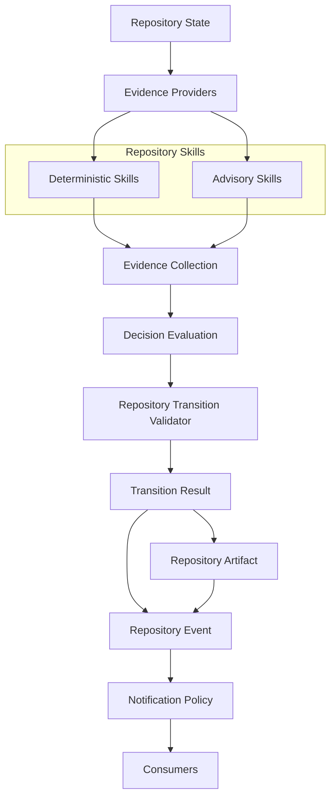

# Phase 115L Complete — Repository Skills Integration Design

- **Phase ID:** `115L`
- **Status:** completed
- **Report completeness:** complete
- **Missing trust fields:** none
- **Files changed:** 8
- **Tests run:** 70 (focused architecture/documentation suite)
- **Commits:** 73ab8377, bda6f172
- **Pushed:** not_pushed
- **origin/main..HEAD:** 2

## Summary

Phase 115L designs how Repository Skills (115H design, 115I contract
freeze, 115J prototype, 115K verification) become the primary
evidence-acquisition layer for Decision Evaluation, without changing
any observable lifecycle behavior. Architecture and design only; zero
implementation added.

## Integration Architecture Summary

Repository Skills become the sole orchestrators of Evidence
Providers. Decision Evaluation receives only `EvidenceCollection`
(already its shape today) and never knows which providers exist. The
target pipeline:

```
Repository State -> Evidence Providers -> Repository Skills
    -> Evidence Collection -> Decision Evaluation -> Transition Validator
```

replaces today's reality where 115F's validator adapter builds
`Evidence` directly from `RepositoryState` and 115J's Repository
Skills exist as a parallel, currently-unused path.

## Orchestration Summary

Decision Evaluation must never construct, discover, or call an
Evidence Provider directly, and must never know provider ordering —
Repository Skills own provider orchestration exclusively. One
Repository Skill may invoke zero, one, or multiple providers, merging
its own `EvidenceCollection` before returning — the only two merge
points that may ever exist are within one skill and across skills
(`RepositorySkillRegistry.merge_evidence`). A skill may compose
sub-skills internally, preserving deterministic invocation order
(already 115K-verified for multi-skill invocation), with no recursive
cycles permitted.

## Migration Strategy

Four stages, frozen: **Stage 1** (current — Decision Evaluation
consumes `RepositoryState`-derived evidence via 115F's adapter);
**Stage 2** (completed: 115J/115K — Repository Skills wrap providers,
proven read-only/deterministic/provider-equivalent, not yet wired);
**Stage 3** (not started — Decision Evaluation receives Repository
Skill output, candidate for 115M); **Stage 4** (not started —
providers become a fully encapsulated implementation detail). Each
stage is additive and reversible; this phase does not authorize
skipping or collapsing stages.

## Dependency Direction

```
Repository Skills   -> Evidence Providers
Decision Evaluation  -> Evidence (only)
Transition Validator -> EvaluationResult (only)
```

One-way only, no reverse dependency: Evidence Providers never import
Repository Skills; Evidence never imports Decision Evaluation;
`EvaluationResult` never imports the Transition Validator.

## Compatibility Guarantees

No provider API change (`EvidenceProvider.collect(context) ->
EvidenceProviderResult` unchanged); no Decision Evaluation semantic
change (the six frozen invariant families keep evaluating whatever
evidence is present, unaware of pipeline shape); no Transition
Validator behavior change (`validate_transition`'s structural checks
remain sole verdict authority); no lifecycle command change (`pcae
phase complete`/`pcae task finish --commit` continue calling the
existing 115F adapter path unchanged).

## AI Insertion Point

Future AI-backed Repository Skills (DeepSeek, GLM, GPT, Qwen, local
SLM) fit beside deterministic Repository Skills as parallel
implementations of the same `RepositorySkill` interface, both merging
into the same `EvidenceCollection`. Decision Evaluation and the
Transition Validator remain unaware of which skills ran or whether
any were model-backed. Repository State remains authoritative — no
AI skill's evidence becomes a second source of truth.

## Wire Diagram Summary



Deterministic and Advisory Repository Skills are parallel
implementations under one Repository Skills layer; Decision Evaluation
cannot tell, and does not need to tell, which kind of skill (or
whether a skill at all) produced a given `Evidence` item.

## PCAE Architecture Status

*Generated conceptually from canonical project state. Never manually
maintained as runtime state.*

### Completed

- Repository Decision & Explainability Framework through Phase 115A
- Repository Evidence Framework Contract Freeze through Phase 115B
- Repository Evidence Framework Prototype through Phase 115C
- Repository Evidence Provider Prototype through Phase 115D
- Repository Decision Evaluation Prototype through Phase 115E
- Repository Decision Evaluation Integration through Phase 115F
- Repository Decision Evaluation Verification & Compatibility through Phase 115G
- Repository Skills Architecture through Phase 115H
- Repository Skills Contract Freeze through Phase 115I
- Repository Skills Prototype through Phase 115J
- Repository Skills Verification & Compatibility through Phase 115K
- Repository Skills Integration Design through Phase 115L

### Planned

- 115M — Repository Skills Integration Prototype

### Current Runtime State

- **State:** Observed
- **Maximum Capability:** observe
- **Execution Availability:** unavailable

## Governance Results

- **pcae_health:** healthy
- **pcae_check:** passed
- **pcae_doctor_task_memory:** clean
- **pcae_push_check:** pending (not yet pushed at report-write time)
- **pcae_agent_verify_handoff:** pending (dirty working tree until final commit/push)
- **pcae_session_bootstrap_compact:** completed
- **pcae_runtime_inspect:** execution unavailable, Observed, observe
- **telegram_runtime:** loaded, configured, enabled
- **phase_finalization_skill:** resolved, target completed

## Test Results

- **focused_architecture_documentation_tests:** 70/70 (passed)
- **report_notification_tests:** present_in_canonical_metadata (present)
- **bootstrap_session_reporting_tests:** present_in_canonical_metadata (present)
- **fast_green:** 4390/4390 (passed)

## No-Go Confirmations

- No Repository Skills integration implemented.
- No Repository Skill modified.
- No Evidence Provider modified.
- No Decision Evaluation modified.
- No Repository Transition Validator modified.
- No lifecycle command modified.
- No Notification Policy modified.
- No Canonical Artifact Promotion modified.
- No Push-State Reconciliation modified.
- No Post-Push Canonicalization modified.
- No execution.
- No authorization.
- No Permission Broker enforcement.
- No plugins.
- No Telegram inbound.
- No REST.
- No Web UI.
- No Dashboard.
- No raw git commit.
- No raw git push.
- No force push.
- No tags.
- No releases.
- No package publication.

## Recommended Next Phase

115M — Repository Skills Integration Prototype

## Report Consistency

- **Canonical report:** present
- **Metadata:** present
- **Status:** consistent

---
*Report generated for PCAE Phase 115L. Schema version 1.0.*
