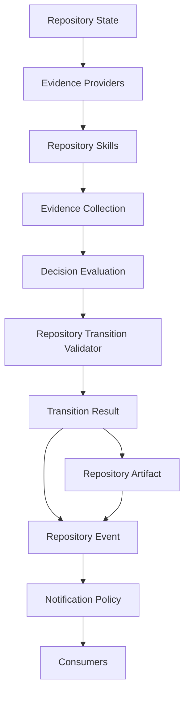

# Phase 115H Complete — Repository Skills Architecture

- **Phase ID:** `115H`
- **Status:** completed
- **Report completeness:** complete
- **Missing trust fields:** none
- **Files changed:** 8
- **Tests run:** 33 (focused architecture/documentation suite)
- **Commits:** 77215568, d32acf74
- **Pushed:** not_pushed
- **origin/main..HEAD:** 2

## Summary

Phase 115H designs Repository Skills as the governed extension
mechanism for PCAE decision support, building on 115C (Evidence), 115D
(Evidence Providers), 115E (Decision Evaluation), 115F (integration),
and 115G (verification). Architecture and design only; zero
implementation added.

## Repository Skills Architecture Summary

Core principle: **Repository Skills produce evidence. Repository
Skills do not decide.** A Repository Skill observes repository state,
collects or derives evidence, may enrich existing evidence, and
returns an `EvidenceCollection` — reusing 115C's frozen Evidence shape
unmodified. A skill never mutates repository state, decides, votes,
authorizes, promotes artifacts, sends notifications, bypasses the
Repository Transition Validator, or invokes execution.

## Skill Class Summary

Five skill classes defined, mapped onto 115C's existing
`EvidenceDeterminism` enum (no new enum introduced):

| Class | Determinism | Example |
| --- | --- | --- |
| Deterministic | `DETERMINISTIC` | Git Topology Skill |
| Reproducible External | `REPRODUCIBLE_EXTERNAL` | Pinned static-analysis wrapper |
| Advisory | `PROBABILISTIC` | Future DeepSeek/Claude/Codex/GLM/Qwen code-review skill |
| Human-Assisted | `HUMAN_ASSERTED` | Human code-review sign-off skill |
| Experimental | any + `experimental: true` | Prototype skill exploring a new evidence category |

Six deterministic skill concepts named (design only): Git Topology,
Report Consistency, Metadata Consistency, Architecture Status,
Documentation Completeness, Test-Result Consistency.

## Evidence-Only Boundary

Every skill class, without exception, is bound by the same
prohibitions: never mutate repository state, never decide, never vote,
never authorize, never promote artifacts, never notify, never bypass
the validator, never invoke execution. Advisory skills add strictly
narrower guarantees on top, never a looser set.

## Advisory / AI Skill Boundary

Advisory skills are the governed home for any future AI/SLM/LLM-backed
contribution (DeepSeek, GLM, Qwen, Claude, Codex, or a local SLM).
Must be advisory only, probabilistic by default, labelled
model-produced (via 115C's existing `Evidence.producer`/
`EvidenceProvenance`), never sole authority for Accept, never allowed
to mutate state or finalize/push/notify, allowed only to produce
evidence.

## DeepSeek Future Pilot Boundary

DeepSeek must not be reintroduced as lifecycle authority,
decision-maker, approver, artifact-promoter, notifier, or execution
authority, under any framing. Any future DeepSeek pilot must be scoped
as a bounded Advisory Repository Skill: evidence-only, `model_produced:
true`, `PROBABILISTIC` by default, never sole authority for Accept.

## Skill Lifecycle Summary

Seven stages: registered -> configured -> invoked -> evidence produced
-> evidence validated -> evidence consumed by Decision Evaluation ->
result referenced in explanation. No stage authorizes, decides,
mutates, promotes, or notifies.

## Skill Manifest Concept

Documented, not frozen: `skill_id`, `name`, `version`, `class`,
`determinism`, `categories produced`, `required inputs`, `allowed
outputs`, `side-effect policy`, `timeout policy`, `failure behavior`,
`confidence defaults`, `model-produced flag`. Schema freeze explicitly
deferred to 115I.

## Skill Safety Boundary

Skills must never own Repository State, Repository Transition,
Repository Artifact promotion, Repository Event emission, Notification
Policy, lifecycle authority, or execution authority.

## Wire Diagram Summary

Repository Skills sit strictly between Evidence Providers and Evidence
Collection. Decision Evaluation cannot tell, and does not need to
tell, whether an `Evidence` item came from a 115D Provider or a Skill.

## PCAE Architecture Status

*Generated conceptually from canonical project state. Never manually
maintained as runtime state.*

### Completed

- Repository Decision & Explainability Framework through Phase 115A
- Repository Evidence Framework Contract Freeze through Phase 115B
- Repository Evidence Framework Prototype through Phase 115C
- Repository Evidence Provider Prototype through Phase 115D
- Repository Decision Evaluation Prototype through Phase 115E
- Repository Decision Evaluation Integration through Phase 115F
- Repository Decision Evaluation Verification & Compatibility through Phase 115G
- Repository Skills Architecture through Phase 115H

### Planned

- 115I — Repository Skills Contract Freeze

### Current Runtime State

- **State:** Observed
- **Maximum Capability:** observe
- **Execution Availability:** unavailable

## Governance Results

- **pcae_health:** healthy
- **pcae_check:** passed
- **pcae_doctor_task_memory:** clean
- **pcae_push_check:** pending (not yet pushed at report-write time)
- **pcae_agent_verify_handoff:** pending (dirty working tree until final commit/push)
- **pcae_session_bootstrap_compact:** completed
- **pcae_runtime_inspect:** execution unavailable, Observed, observe
- **telegram_runtime:** loaded, configured, enabled
- **phase_finalization_skill:** resolved, target completed

## Test Results

- **focused_architecture_documentation_tests:** 33/33 (passed)
- **report_notification_tests:** present_in_canonical_metadata (present)
- **bootstrap_session_reporting_tests:** present_in_canonical_metadata (present)
- **fast_green:** 4390/4390 (passed)

## No-Go Confirmations

- No Repository Skill implemented.
- No AI/SLM/LLM-backed skill implemented.
- No DeepSeek integration.
- No changes to Evidence Providers, Decision Evaluation, the
  Repository Transition Validator, or lifecycle commands.
- No execution.
- No authorization.
- No Permission Broker enforcement.
- No plugins.
- No Telegram inbound.
- No REST.
- No Web UI.
- No Dashboard.
- No raw git commit.
- No raw git push.
- No force push.
- No tags.
- No releases.
- No package publication.

## Recommended Next Phase

115I — Repository Skills Contract Freeze

## Report Consistency

- **Canonical report:** present
- **Metadata:** present
- **Status:** consistent

---
*Report generated for PCAE Phase 115H. Schema version 1.0.*
