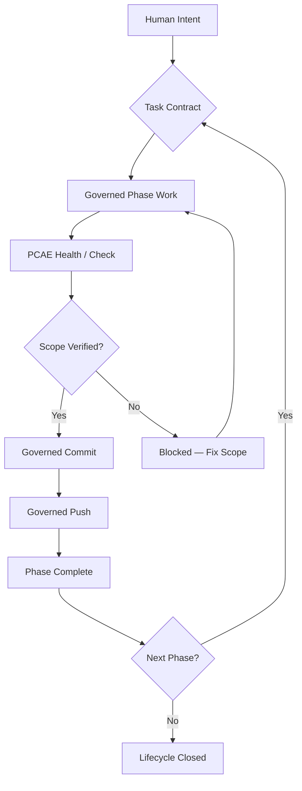
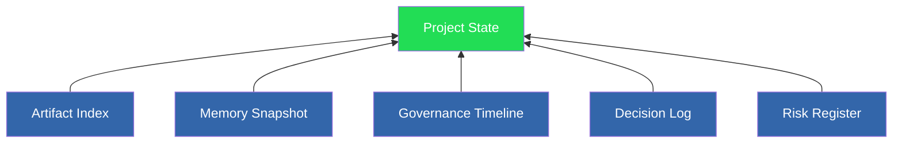
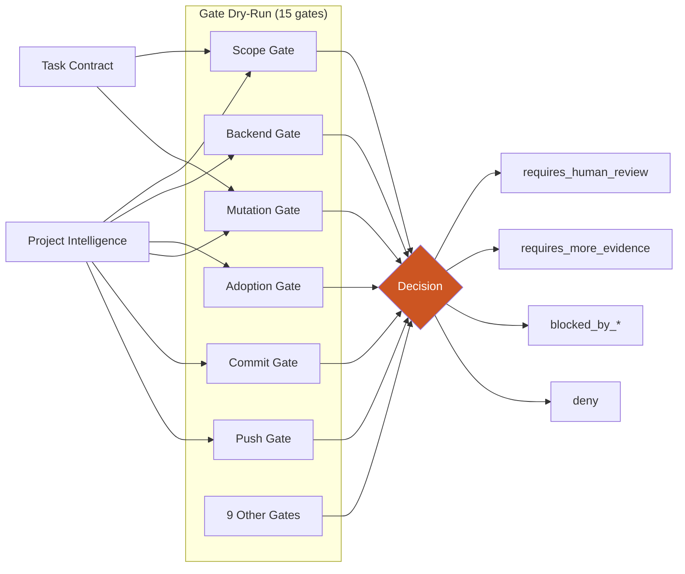
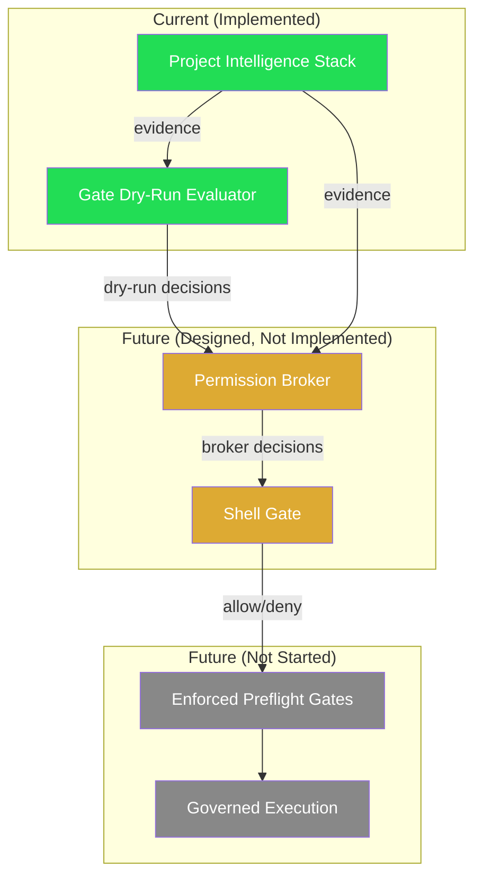

# Governance Lifecycle Diagrams

Mermaid diagrams illustrating PCAE's governance architecture and transition path.

## 1. High-Level Governance Lifecycle

## 2. Read-Only Project Intelligence Stack

All six layers are **read-only** and **non-authorizing**.

## 3. Gate Dry-Run Evaluation Layer

No gate produces `allow`. All decisions are non-authorizing.

## 4. Future Broker and Shell Gate Architecture

## 5. Transition Path

**Green** = implemented. **Orange** = designed, not implemented. **Gray** = future.
