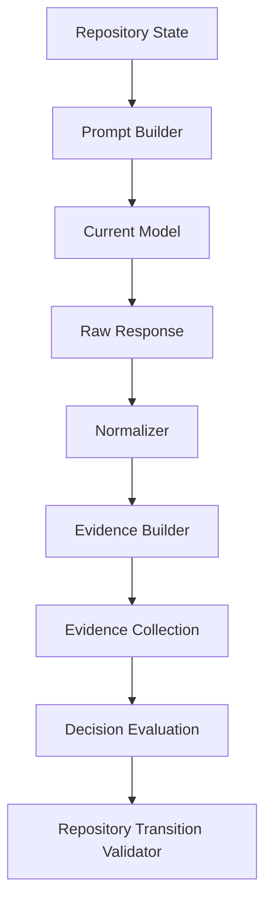
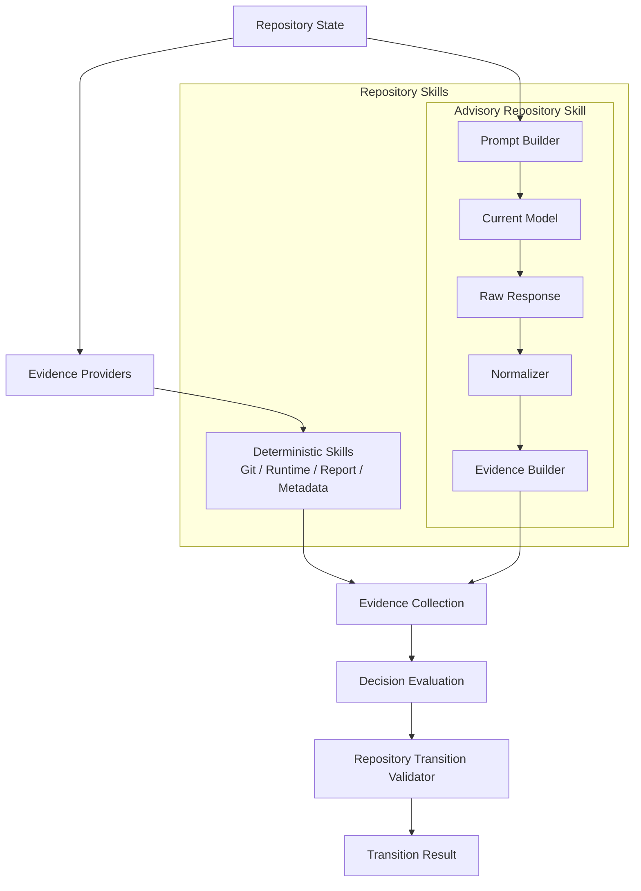

# PCAE Advisory Repository Skills Architecture

## Status

Phase 115P. Architecture and design only. No Advisory Repository Skill
is implemented by this document. No model call is implemented. No
DeepSeek, GLM, Claude, Codex, Qwen, OpenAI, local SLM, or any other
backend is integrated. No model configuration is added. No Repository
Skills runtime, Evidence Provider, Decision Evaluation, Repository
Transition Validator, or lifecycle command is modified. No execution,
authorization, Permission Broker enforcement, plugin, Telegram inbound,
REST, Web UI, or Dashboard capability is introduced.

## Purpose

Design Advisory Repository Skills as model-backed, evidence-only
Repository Skills — the concrete elaboration this arc has twice
deferred: 115H Section 4 named "Advisory" as one of five skill classes
but specified no pipeline, no model boundary, and no default-mode
rule; 115L Section 8 drew a "Future AI Insertion Point" showing
Advisory Skills sitting beside Deterministic Skills in the wire diagram
but likewise specified no internal mechanism. This document is that
mechanism: a frozen pipeline from repository state to `EvidenceCollection`
via a model, a frozen model boundary preventing a model from ever
returning a trusted PCAE object directly, a same-model default mode
requiring no new configuration, and a documented (not implemented)
future split-model mode.

## Core Principle

**Advisory models may produce evidence. PCAE decides.**

Every property below is a restatement or direct consequence of this
one sentence, itself a narrower restatement of 115H's "Repository
Skills produce evidence. Repository Skills do not decide." A future
reader who forgets every other detail in this document but retains
this sentence has retained its entire safety argument.

## 1. Advisory Repository Skill Definition

An **Advisory Repository Skill** is a Repository Skill (115H Section 1,
unchanged) whose evidence-production mechanism is a model invocation.
It inherits every deterministic-skill prohibition (115H Section 7)
without exception, plus the narrower guarantees 115H Section 4 already
attached to the Advisory class. Restated here in full because this is
the phase that makes those guarantees concrete:

An Advisory Repository Skill:

- uses a model only as an evidence producer
- produces `EvidenceCollection` (115C's frozen shape — reused
  unmodified, never a bespoke advisory-specific evidence type)
- never decides (produces no `TransitionVerdict`, no accept/reject/
  quarantine outcome of any kind)
- never mutates repository state
- never authorizes anything
- never promotes artifacts (never writes `.pcae/phase-reports/latest.*`
  or any canonical artifact)
- never sends notifications
- never commits
- never pushes
- never finalizes (never calls, wraps, or is called by `pcae phase
  complete` or `pcae task finish --commit`)

This is a *narrower* capability set than a deterministic skill's,
never a broader one: an Advisory Skill can do everything a
deterministic skill can do (produce evidence) and nothing a
deterministic skill cannot (it still never decides/mutates/authorizes/
promotes/notifies/commits/pushes/finalizes).

## 2. Advisory Pipeline (Frozen)

```
Repository State
    -> Prompt Builder
    -> Current Model
    -> Raw Response
    -> Normalizer
    -> Evidence Builder
    -> EvidenceCollection
    -> Decision Evaluation
    -> Repository Transition Validator
```

| Stage | Responsibility | Trust Level |
| --- | --- | --- |
| **Repository State** | The same read-only repository state every other skill/provider observes (114R's kernel primitive, unchanged). | Authoritative. |
| **Prompt Builder** | Assembles a bounded, deterministic prompt from repository state and/or already-collected evidence. Never includes secrets or credential material. Prompt content and length are bounded, analogous to 115I's manifest-level `timeout_seconds`/`required_inputs` discipline for deterministic skills. | Deterministic given the same inputs. |
| **Current Model** | The model invocation itself — by default, the same model already acting within the current PCAE session (Section 4). A single bounded call; no tool use, no PCAE command invocation, no filesystem write access granted to the model during this call. | Untrusted (see Section 3). |
| **Raw Response** | The model's unprocessed text/JSON output. Not itself `Evidence`. Not consumed by Decision Evaluation, the Validator, or any lifecycle command in this form. | Untrusted. |
| **Normalizer** | Parses and validates the Raw Response into a canonical intermediate shape. Rejects malformed, incomplete, or out-of-schema output outright (see Section 3) rather than coercing it into a best-effort guess. The only stage where model output may become Evidence-shaped data. | Boundary stage — converts untrusted input into a validated intermediate form, or fails closed. |
| **Evidence Builder** | Constructs actual `Evidence`/`EvidenceCollection` items (115C's frozen 14-field contract, reused unmodified) from the Normalizer's validated output: sets `determinism=PROBABILISTIC` (Section 6), an appropriate `confidence`, `references` where derivable, non-empty `limitations`, and `provenance` marking the item model-produced. | Produces trusted `Evidence` shape; content remains probabilistic. |
| **EvidenceCollection** | An ordinary 115C `EvidenceCollection` — structurally indistinguishable from provider-produced or deterministic-skill-produced evidence. Merges into the same `RepositorySkillRegistry.merge_evidence()` point 115J/115M already established for deterministic skills; no second merge point is introduced. | Trusted container; individual item confidence/determinism still governs how Decision Evaluation weighs it. |
| **Decision Evaluation** | 115E's `evaluate()`, unmodified. Reasons over advisory evidence exactly as it does over any other evidence — no advisory-specific code path exists or is added. | Unchanged authority. |
| **Repository Transition Validator** | `validate_transition`, unchanged. Remains the sole source of `TransitionVerdict`. | Unchanged, sole authority. |

Every arrow in this pipeline is one-way, and no stage after Prompt
Builder may write back to Repository State, request additional model
turns with side effects, or bypass a later stage. A model invocation
that would require multiple turns, tool calls, or write access is, by
definition, not an Advisory Repository Skill under this architecture.

## 3. Model Boundary (Frozen)

**The model never returns a trusted PCAE object directly.**

A model's Raw Response is plain text or JSON the model produced — it
is never treated as, cast to, or silently accepted as an `Evidence`,
`EvidenceCollection`, `InvariantResult`, `EvaluationResult`,
`TransitionResult`, or any other PCAE dataclass. The Normalizer is the
only permitted conversion point, and conversion is validation, not
trust extension:

- A Raw Response that fails to parse, fails schema validation, or
  claims a field this architecture does not authorize (e.g. a
  `verdict` field, a `commit` instruction, an `authorized: true` claim)
  is rejected by the Normalizer — never partially accepted, never
  coerced by best-effort guessing.
- The model has no tool-call authority, no file-write access, and no
  ability to invoke a `pcae` command during its invocation. Its sole
  output channel is the Raw Response text/JSON the Prompt Builder's
  single call receives back.
- A rejected or malformed Raw Response degrades to Section 7's failure
  behavior — it never becomes a fabricated evidence item.

This boundary is the Advisory pipeline's direct analogue of 115D's
"providers never decide" boundary and 115H Section 2's "Advisory ...
produces evidence labelled as model-produced" — restated here as a
pipeline-stage guarantee rather than a class-level property.

## 4. Default Same-Model Mode (Frozen)

**The current acting model may be the advisory model by default.**

When a single model is both performing PCAE governance work in a
session (writing code, running commands, completing phases) and that
same model's invocation also serves as the Advisory Repository Skill's
"Current Model" stage, **no separate advisory model configuration is
required**:

- no new configuration file
- no new CLI flag
- no new environment variable
- no new model registry or backend-selection entry

**Rationale.** A model reviewing its own prior work is still
qualitatively different from that model *deciding* anything: the
review is only ever Evidence, subject to Decision Evaluation and the
Repository Transition Validator identically to every other evidence
item, and per Section 6 is never sole authority for Accept regardless
of which model produced it. Requiring a second, separately-configured
model purely to review the first model's own state — when the review
carries no additional authority than any other evidence item already
would — is safety-theater without a corresponding safety benefit. The
actual safety property this architecture provides (models never
decide) holds identically whether one model or two are involved.

Same-model mode is therefore the default, and requires zero net-new
implementation surface beyond the pipeline itself (Section 2).

## 5. Future Split-Model Mode (Documented, Not Implemented)

A future configuration *may* introduce a distinction between:

- **Writer model** — the model performing the session's actual
  code/documentation/governance changes.
- **Advisory model** — a distinct model invoked solely to produce
  Advisory Repository Skill evidence about the writer model's own
  state, output, or changes.

**Why configuration may eventually be needed:** a second, independently
selected model may reduce same-model blind-spot risk (a model may be
statistically less likely to catch a mistake pattern it just made
itself than a differently-trained model would be), and a named
advisory-model identity keeps `Evidence.provenance.producer` for
advisory items unambiguous relative to the writer model's own
identity, should the two ever diverge.

**This phase implements none of it.** No configuration schema, no
model-selection logic, no backend adapter, no new manifest field is
added. Split-model mode is named here only so a future phase choosing
to implement it has an already-scoped rationale to build against,
exactly as 115H named Advisory Skills as a class before this phase
elaborated the pipeline, and exactly as 115L named Stage 3/4 of its
migration strategy before 115M/115N implemented and verified Stage 3.

## 6. Safety Rules (Frozen)

Every Advisory Repository Skill's evidence must:

- be **probabilistic by default** — `EvidenceDeterminism.PROBABILISTIC`
  (115H Section 4, restated; a `HUMAN_ASSERTED` variant remains
  possible only when a human, not a model, directly asserts the
  evidence, per 115H Section 2's Human-Assisted class, unchanged)
- be **model-produced** — labelled via `Evidence.provenance.producer`/
  `EvidenceProvenance` (115C's existing fields, no new field required)
  and, at the manifest level, `model_produced: true` (already a frozen
  field on `RepositorySkillManifest` since 115I/115J — no schema
  change needed)
- **never be sole authority for Accept** — a blocking invariant that
  would resolve Accept-eligible must have at least one deterministic
  or reproducible-external supporting evidence item independently; this
  is not new logic to add, since 115B's frozen confidence model and
  115E's invariant evaluators already treat evidence by its declared
  determinism/confidence rather than by its source, and a future
  invariant consuming advisory evidence inherits this property for
  free by using the same evaluation machinery
- **may trigger human review** — via the existing `InvariantStatus`/
  severity mechanism (e.g. a future invariant classifying certain
  advisory findings as `requires_human_review`-adjacent severity); no
  new status value or mechanism is introduced by this phase
- **may suggest repair** — via `InvariantResult.suggested_repair`
  (already a frozen, optional field since 115E — no new field)
- **must include limitations** — `Evidence.limitations` must be
  non-empty for advisory-produced items, describing what the model's
  review could and could not verify
- **must cite references where possible** — `Evidence.references`/
  `EvidenceReference` (115C's existing citation shape) should point to
  the specific repository artifacts (files, Evidence IDs, commit
  hashes) the model's review actually considered, so a human can verify
  the review's basis without re-running the model

None of these rules require a new field, enum value, or type anywhere
in `core/evidence.py`, `core/decision_evaluation.py`, or
`core/repository_skills.py` — every mechanism an Advisory Repository
Skill needs already exists, frozen, from 115C through 115K.

## 7. Failure Behavior (Frozen)

If the advisory model invocation fails (timeout, error, refusal,
malformed or unparseable Raw Response, or a Normalizer rejection per
Section 3):

- the skill must produce either **`UNKNOWN`-freshness evidence**
  (115D's established provider-failure pattern, reused unmodified — an
  honestly unknown/unavailable observation, never a fabricated value)
  or an **explicit advisory failure** (115I/115J's existing
  `RepositorySkillResult` two-outcome contract: `status=FAILED` with a
  non-empty `failure_reason`, zero evidence)
- the failure **must never block deterministic checks by itself** — a
  failed or degraded Advisory Repository Skill must never prevent any
  deterministic invariant from evaluating; each invariant already looks
  up only its own specific Evidence IDs (115E's established pattern),
  so an absent or `UNKNOWN` advisory item simply leaves
  advisory-dependent invariants at `NOT_APPLICABLE`/`UNKNOWN` without
  affecting any other invariant's evaluation
- the failure **must never silently succeed** — a failed model
  invocation must never be disguised as a passing, `PASS`-looking, or
  high-confidence evidence item; this is the same "never silent
  success" discipline 115I Section 5 already froze for every
  Repository Skill

This is a direct reuse of 115D's provider failure contract and 115I's
skill failure contract — no new failure taxonomy is introduced for
Advisory Skills specifically.

## 8. First Future Pilot Scope (Documented, Not Implemented)

A future Advisory Repository Skill pilot, when proposed, should be
narrowly scoped to:

- **Repository consistency review** — an advisory, model-assisted
  cross-check of repository state for inconsistencies a deterministic
  check cannot easily express (softer than 115H Section 3's
  "Metadata Consistency Skill" deterministic concept, which only
  compares exact field values).
- **Documentation consistency review** — an advisory check of whether
  documentation content actually reflects current repository state
  (softer than 115H Section 3's "Documentation Completeness Skill",
  which only checks structural presence of expected sections).
- **Report consistency review** — an advisory check of a phase
  report's narrative coherence against its own declared fields (softer
  than 115H Section 3's "Report Consistency Skill", which only
  compares exact declared counts).

A first pilot must **not** include:

- code execution
- lifecycle authority (no pilot may be called by, or gain authority
  over, `pcae phase complete`, `pcae task finish --commit`, or any
  other lifecycle command)
- commit/push/finalize authority

Each in-scope pilot area is a probabilistic *softening* of an existing
115H deterministic skill concept — advisory review supplements, never
replaces, the deterministic check for the same category.

## 9. Wire Diagram

### Advisory Pipeline



### Where It Plugs Into Repository Skills



The Advisory Repository Skill is one more `RepositorySkill`
implementation under the same Repository Skills layer 115H/115L/115M
already established — it merges into the identical `EvidenceCollection`
stage via the identical `RepositorySkillRegistry.merge_evidence()`
point (115J, unchanged), and Decision Evaluation cannot tell, and does
not need to tell, whether a given `Evidence` item came from a
deterministic skill, a direct provider, or an Advisory Repository
Skill's model invocation.

## Relationship to Prior Phases

- **115H Section 4** named the Advisory skill class and its
  guarantees; this phase is that class's concrete pipeline, model
  boundary, and default-mode rule.
- **115I** already froze `RepositorySkillManifest`'s `determinism`,
  `model_produced`, and `confidence_policy` fields with exactly the
  shape an Advisory Repository Skill needs (Section 6) — no manifest
  schema change is required for a future pilot to conform.
- **115L Section 8** drew the "Future AI Insertion Point" wire diagram
  this phase's Section 9 elaborates concretely.
- **115M/115N** proved `RepositorySkillRegistry.merge_evidence()` is
  the sole cross-skill merge point and that Decision Evaluation/the
  Validator are source-agnostic — both properties an Advisory
  Repository Skill relies on without requiring any change to either.

## Frozen Boundaries

Phase 115P freezes architecture and design concepts only:

- the Advisory Repository Skill definition (Section 1)
- the advisory pipeline: Prompt Builder, Current Model, Raw Response,
  Normalizer, Evidence Builder, EvidenceCollection output (Section 2)
- the model boundary: a model never returns a trusted PCAE object
  directly (Section 3)
- the default same-model mode, requiring no new configuration
  (Section 4)
- the future split-model mode, documented but not implemented
  (Section 5)
- safety rules: probabilistic by default, model-produced,
  never-sole-authority-for-Accept, may trigger human review, may
  suggest repair, must include limitations, must cite references
  (Section 6)
- failure behavior: `UNKNOWN` evidence or explicit failure, never
  blocks deterministic checks, never silently succeeds (Section 7)
- a narrow first future pilot scope: repository/documentation/report
  consistency review only, excluding code execution and lifecycle/
  commit/push/finalize authority (Section 8)
- an updated wire diagram showing the advisory pipeline and its
  Repository Skills integration point (Section 9)

This phase implements no Advisory Repository Skill, no model call, no
DeepSeek/GLM/Claude/Codex/Qwen/OpenAI/local-SLM/any-backend
integration, and adds no model configuration. It modifies no
Repository Skills runtime, Evidence Provider, Decision Evaluation,
Repository Transition Validator, or lifecycle command. No execution,
authorization, Permission Broker enforcement, plugin, Telegram inbound,
REST, Web UI, or Dashboard capability is introduced.

Execution capability remains unavailable. Runtime state remains
Observed. Maximum plugin capability remains `observe`.

## Recommended Next Phase

115Q — Advisory Repository Skills Contract Freeze
