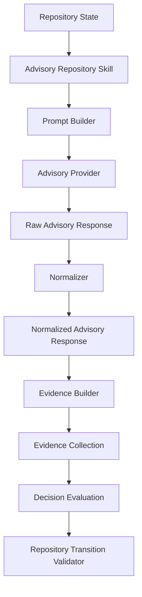
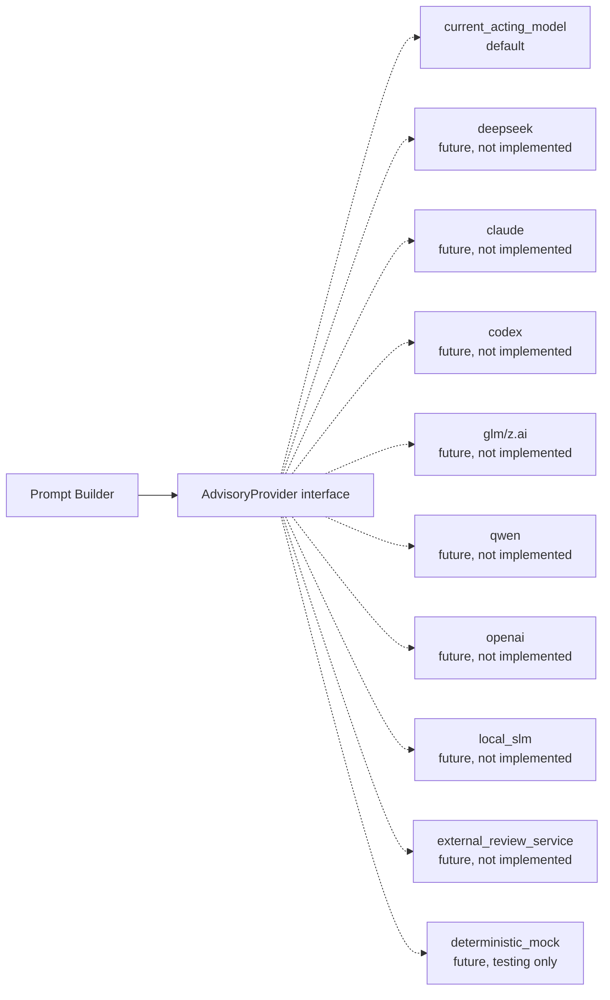

# PCAE Advisory Repository Skills Contract

## Purpose

Freeze the exact, backend-agnostic contract every future Advisory
Repository Skill must conform to — the interface, the Advisory
Provider abstraction, the prompt/response/evidence boundaries, the
default same-model mode, the deferred split-model mode, the failure
contract, the safety rules, and the first pilot scope — before any
Advisory Repository Skill, Advisory Provider, or model call is
implemented.

Phase 115P designed Advisory Repository Skills as model-backed,
evidence-only skills and named a concrete pipeline (Prompt Builder,
Current Model, Raw Response, Normalizer, Evidence Builder). Phase 115Q
freezes that pipeline as contract language and inserts one additional
abstraction 115P did not name: the **Advisory Provider**, so that no
Advisory Repository Skill ever depends directly on a specific model
backend. No Advisory Repository Skill, no Advisory Provider, no model
call, and no backend integration is implemented by this document.

## Core Principle

Advisory Repository Skills produce evidence. They never decide.

## Backend-Agnostic Principle

**An Advisory Repository Skill must not depend directly on a specific
model backend.** A skill talks only to an `AdvisoryProvider`
abstraction (Section 2); it never imports, names, or hard-codes
DeepSeek, GLM, Claude, Codex, Qwen, OpenAI, a local SLM, or any other
backend directly. Swapping which `AdvisoryProvider` implementation
answers a given `AdvisoryRequest` must never require changing the
Advisory Repository Skill itself — exactly as swapping which Evidence
Provider a Repository Skill wraps (115J's established pattern) never
requires changing the skill's own contract-facing shape.

## Architecture

```
Repository State
    -> Advisory Repository Skill
    -> Prompt Builder
    -> Advisory Provider
    -> Raw Advisory Response
    -> Normalizer
    -> Normalized Advisory Response
    -> Evidence Builder
    -> EvidenceCollection
    -> Decision Evaluation
    -> Repository Transition Validator
```

This refines 115P's pipeline by inserting the Advisory Provider
abstraction between Prompt Builder and the model call itself (115P's
"Current Model" stage), and by naming the Normalizer's output shape
explicitly (`NormalizedAdvisoryResponse`) as a distinct, frozen type
from the Normalizer's input (`RawAdvisoryResponse`).

## 1. Advisory Repository Skill Contract

The canonical `AdvisoryRepositorySkill` interface — frozen, not
implemented — requires every conforming skill to declare:

| Declaration | Meaning |
| --- | --- |
| Advisory capability | That this skill is Advisory class (115H Section 2), not Deterministic/Reproducible External/Human-Assisted/Experimental. |
| Evidence categories produced | Which 115C `EvidenceCategory` values this skill may emit. |
| Probabilistic determinism by default | `EvidenceDeterminism.PROBABILISTIC` unless a specific `HUMAN_ASSERTED` variant applies (115H Section 2, unchanged) — never `DETERMINISTIC`. |
| Model-produced evidence boundary | `model_produced: true` on every `Evidence` item and on the skill's manifest (115I Section 3, unchanged field) whenever the skill is backed by any model, via any `AdvisoryProvider`. |

And to perform exactly these responsibilities:

- **build a prompt/request** — assemble an `AdvisoryRequest` (Section
  2) via a Prompt Builder (Section 5), from bounded repository
  state/evidence
- **consume a normalized advisory response** — accept only a
  `NormalizedAdvisoryResponse` (Section 2/6) from the Normalizer, never
  a `RawAdvisoryResponse` directly
- **produce `EvidenceCollection`** — the skill's sole return value,
  115C's frozen shape, reused unmodified

An Advisory Repository Skill is explicitly, permanently forbidden from:

- **decision making** — produces no `TransitionVerdict`, no accept/
  reject/quarantine/human-review outcome
- **repository mutation** — writes no repository file, git object, or
  state
- **lifecycle authority** — is never called by, and has no authority
  over, `pcae phase complete`, `pcae task finish --commit`, or any
  other lifecycle command
- **commit** — never performs a `git commit`
- **push** — never performs a `git push`
- **finalize** — never finalizes a phase, task, or report
- **notification dispatch** — never sends or marks a notification as
  sent
- **artifact promotion** — never writes `.pcae/phase-reports/latest.*`
  or any canonical artifact
- **execution** — never invokes a subprocess, adapter, or runner
- **authorization** — never grants, checks, or asserts permission for
  anything
- **validator bypass** — never circumvents `validate_transition`/the
  Repository Transition Validator

This list is exhaustive and permanent for the
`AdvisoryRepositorySkill` interface — identical in kind to 115I
Section 1's exhaustive `RepositorySkill` prohibition list, restated
here in full because Advisory Skills are the class most likely to
eventually wrap an execution-capable model backend, and the boundary
must be unambiguous even under that pressure.

## 2. Advisory Provider Abstraction (Contract Only)

Four types are frozen — names, fields, and meanings only; no class, no
loader, no registry, no implementation:

### `AdvisoryProvider`

The backend-agnostic interface an Advisory Repository Skill talks to.
An `AdvisoryProvider` must declare:

| Field | Meaning |
| --- | --- |
| `provider_id` | Stable, unique identifier (mirrors 115D's Evidence ID / 115I's `skill_id` stability discipline). |
| `backend_kind` | What kind of backend this provider represents — e.g. `current_acting_model`, `deepseek`, `claude`, `codex`, `glm`, `qwen`, `openai`, `local_slm`, `external_review_service`, `deterministic_mock` (Section 3's default is `current_acting_model`; every other value here names a *possible future* provider, none implemented by this phase). |
| `determinism` | Always `EvidenceDeterminism.PROBABILISTIC` for any real model backend; a `deterministic_mock` provider (for future testing only) may declare `DETERMINISTIC`. |
| `invoke(request: AdvisoryRequest) -> RawAdvisoryResponse` | The sole operation: takes one `AdvisoryRequest`, returns one `RawAdvisoryResponse`. No streaming, no multi-turn, no tool-call callback, no side channel. |

An `AdvisoryProvider` never returns a trusted PCAE object, never
mutates repository state, and never has more than this one operation.

### `AdvisoryRequest`

The bounded input to an `AdvisoryProvider.invoke()` call, built by the
Prompt Builder (Section 5):

| Field | Meaning |
| --- | --- |
| `bounded_context` | The bounded repository state/evidence excerpt the request carries — never unrestricted access to the full repository. |
| `question` | The explicit task/question this request asks the provider to address. |
| `response_schema_hint` | A description of the expected `RawAdvisoryResponse` shape, so a provider implementation can format its output for successful normalization (a hint, not an enforcement mechanism — the Normalizer, not the request, is the actual boundary). |
| `timeout_seconds` | Bounded invocation time, analogous to 115I Section 3's `timeout` manifest field — an `AdvisoryProvider` exceeding it is a failure (Section 8), never an indefinite block. |

### `RawAdvisoryResponse`

The untrusted, unprocessed output of one `AdvisoryProvider.invoke()`
call:

| Field | Meaning |
| --- | --- |
| `raw_content` | The provider's unprocessed text/JSON output. Not itself `Evidence`. Not consumed by Decision Evaluation, the Validator, or any lifecycle command in this form. |
| `provider_id` | Which `AdvisoryProvider` produced this response (provenance, not authority). |
| `succeeded` | Whether the provider's own invocation completed without error — distinct from whether `raw_content` is well-formed (that is the Normalizer's concern, Section 6). |

### `NormalizedAdvisoryResponse`

The Normalizer's validated output — the only shape the Evidence
Builder (Section 7) may consume:

| Field | Meaning |
| --- | --- |
| `findings` | A structured, schema-validated list of the provider's actual findings/observations — never free-form text passed through unchanged. |
| `confidence_signal` | The provider's own self-reported confidence, if any — advisory only; never a substitute for `EvidenceConfidence`, which the Evidence Builder assigns independently. |
| `references` | Repository artifacts (files, Evidence IDs, commit hashes) the provider's findings cite, feeding `Evidence.references`/`EvidenceReference` (Section 7). |
| `limitations` | What the provider's review could not verify — feeds `Evidence.limitations` (Section 7), never optional. |
| `normalization_status` | Whether normalization fully succeeded, partially succeeded (some findings dropped as invalid), or failed outright (Section 6/8). |

No provider is implemented in this phase. `AdvisoryProvider` may later
represent the current acting model (default, Section 3), DeepSeek,
Claude, Codex, GLM/Z.ai, Qwen, OpenAI, a local SLM, an external review
service, or a deterministic mock provider (for future testing) — this
list names *possible* future providers, not a commitment to implement
any of them, and not an exhaustive list a future phase is limited to.

## 3. Default Same-Model Mode (Frozen)

The default `AdvisoryProvider` is, conceptually, the current acting
model — the same model already performing PCAE governance work in a
session. This is an **architecture rule, not an implementation**:

- no separate `AdvisoryProvider` configuration is required for default
  mode
- no new configuration file, CLI flag, environment variable, or model
  registry entry is required
- the rationale is unchanged from 115P Section 4: a model reviewing
  its own prior work still only produces Evidence, never a decision,
  and the never-sole-authority-for-Accept rule (Section 7) holds
  identically regardless of which model (or how many) are involved

## 4. Split-Model Future Mode (Documented, Not Implemented)

A future configuration *may* distinguish:

- **writer model** — the model performing the session's actual
  changes
- **advisory model** — a distinct `AdvisoryProvider` invoked solely to
  produce Advisory Repository Skill evidence about the writer model's
  own state/output

Configuration is only needed for this split-model mode — never for
default same-model mode (Section 3). This phase implements no
configuration schema, no provider-selection logic, and no backend
adapter for split-model mode; it is named here only so a future phase
choosing to implement it has an already-scoped rationale to build
against (identical in kind to 115P Section 5, restated as contract
language rather than architecture narrative).

## 5. Prompt Boundary (Frozen)

The Prompt Builder, in constructing an `AdvisoryRequest`, must:

- **receive bounded repository context** — a deliberately limited
  excerpt of repository state/evidence, never the full repository
  tree or unrestricted read access
- **receive an explicit task/question** — the `AdvisoryRequest.question`
  field must always be a concrete, specific ask, never an open-ended
  "review everything" prompt
- **include no secrets** — no credential, token, key, or other secret
  material may ever appear in `bounded_context` or `question`
- **include no unrestricted command capability** — the request grants
  the receiving `AdvisoryProvider` no ability to request further
  repository access beyond what `bounded_context` already contains
- **include no execution request** — the request never asks a
  provider to run, execute, or invoke anything; it asks only for
  review/analysis output
- **produce an advisory request only** — the Prompt Builder's sole
  output is one `AdvisoryRequest`; it is not itself a channel for any
  other PCAE operation

## 6. Response Boundary (Frozen)

**Raw model output is never trusted directly.** A `RawAdvisoryResponse`
must pass through both of the following stages before it may
contribute to any PCAE decision:

1. **Normalizer** — parses and validates `raw_content` into a
   `NormalizedAdvisoryResponse` (Section 2), rejecting malformed,
   unparseable, out-of-schema, or unauthorized-field content outright
   (e.g. a response claiming a `verdict`, a `commit` instruction, or an
   `authorized: true` field is rejected, never partially accepted)
2. **Evidence Builder** — converts a `NormalizedAdvisoryResponse` into
   actual `Evidence`/`EvidenceCollection` items (Section 7)

**Only canonical `Evidence` enters PCAE.** No stage after the
Normalizer may hand raw or partially-processed model output to
Decision Evaluation, the Repository Transition Validator, or any
lifecycle command — the only object that ever crosses that boundary is
an ordinary 115C `Evidence`/`EvidenceCollection` item, structurally
indistinguishable from provider-produced or deterministic-skill-
produced evidence.

## 7. Evidence Builder Contract (Frozen)

The Evidence Builder converts one `NormalizedAdvisoryResponse` into an
`EvidenceCollection`. Every `Evidence` item it produces must be:

- **probabilistic by default** — `EvidenceDeterminism.PROBABILISTIC`
  (Section 1/4, restated)
- **model-produced if applicable** — `model_produced: true` at the
  manifest level, and identified via 115C's existing
  `Evidence.provenance`/`EvidenceProvenance` fields; no new field
  required
- **advisory only** — carries no separate authority channel; consumed
  by Decision Evaluation identically to any other evidence item
- **confidence-labelled** — `Evidence.confidence` set from the
  `NormalizedAdvisoryResponse`'s content (never copied verbatim from
  the provider's own self-reported `confidence_signal`, which is
  advisory input only, per Section 2)
- **limitation-labelled** — `Evidence.limitations` populated from
  `NormalizedAdvisoryResponse.limitations`, never empty for an
  advisory-produced item
- **provenance-preserving** — `Evidence.provenance` populated exactly
  as any 115D provider or 115J skill already populates it (`producer`/
  `produced_from`/`timestamp`/`deterministic_origin`), plus the
  `AdvisoryProvider.provider_id` that produced the underlying response
- **never sole authority for Accept** — a blocking invariant that
  would resolve Accept-eligible must have at least one deterministic
  or reproducible-external supporting evidence item independently
  (115H/115P, restated); this requires no new logic, since 115B's
  frozen confidence model and 115E's invariant evaluators already
  treat evidence by declared determinism/confidence, not by source

No new field, enum value, or type is required anywhere in
`core/evidence.py`, `core/decision_evaluation.py`, or
`core/repository_skills.py` for the Evidence Builder to conform to
this contract — every mechanism it needs already exists, frozen, from
115C through 115K.

## 8. Failure Contract

Every Advisory Repository Skill failure — an `AdvisoryProvider`
timeout/error, a Normalizer rejection, or an Evidence Builder unable to
construct valid `Evidence` — must produce exactly one of two outcomes,
never anything in between:

1. **`UNKNOWN` evidence** — an `Evidence` item with
   `freshness=EvidenceFreshness.UNKNOWN` (115D's established
   provider-failure pattern, reused unmodified)
2. **Explicit advisory failure result** — a structured, machine-
   readable failure statement distinct from "ran and produced
   `UNKNOWN` evidence" (115I Section 5's existing two-outcome
   `RepositorySkillResult` contract, reused unmodified: `status=FAILED`
   with a non-empty `failure_reason`, zero evidence)

**Never silent success.** A failed, timed-out, or rejected advisory
invocation must never be disguised as a passing or high-confidence
evidence item.

**Never hidden partial output.** A partially-normalized response (some
findings valid, some rejected) must surface its
`normalization_status` (Section 2) honestly — an Advisory Repository
Skill must never silently drop the rejected portion without recording
that it happened.

## 9. Safety Rules

Advisory Repository Skills must never:

- **execute commands** — no subprocess, adapter, or runner invocation
- **request shell access** — no `AdvisoryProvider`, `AdvisoryRequest`,
  or response-handling stage grants or requests shell/terminal access
- **mutate the repository** — no write to any repository file, git
  object, or state
- **authorize transitions** — no skill grants, checks, or asserts
  permission for a `TransitionVerdict` or any other authorization
- **override deterministic evidence** — advisory evidence is preserved
  and evaluated centrally alongside deterministic evidence (115B's
  Conflict Semantics, unchanged); it never discards, replaces, or
  silently resolves another item's evidence
- **override the validator** — `validate_transition`'s own invariant
  checks remain the sole verdict authority (115F/115G/115I,
  restated)
- **produce final lifecycle decisions** — no skill is called by, or
  has authority over, `pcae phase complete`, `pcae task finish
  --commit`, or any other lifecycle command
- **send notifications** — no skill dispatches or marks a notification
  as sent
- **access secrets** — no credential, token, or key material may ever
  reach a Prompt Builder, an `AdvisoryRequest`, or any `AdvisoryProvider`
  invocation (Section 5, restated)

This is an exhaustive restatement, gathered in one place, of every
prohibition already frozen individually in Sections 1, 5, 6, and 8 —
present here as a single safety checklist a future implementer or
reviewer can check a proposed Advisory Repository Skill or Advisory
Provider against without cross-referencing the whole document.

## 10. First Future Pilot Scope (Documented, Not Implemented)

A future first pilot, when proposed, should be narrowly scoped to
**exactly one** of:

- **repository consistency review**
- **documentation consistency review**
- **report consistency review**

(115P Section 8, restated — each a probabilistic softening of an
existing 115H deterministic skill concept.)

A first pilot must **not** include:

- code execution
- security authorization
- lifecycle control
- autonomous repair

This is a narrower framing than 115P Section 8's own list (which named
all three review areas as jointly in-scope): 115Q additionally
constrains a *first* pilot to picking one narrow area, not all three
at once, and explicitly adds "security authorization" and "autonomous
repair" to the excluded list alongside 115P's "code execution" and
"lifecycle authority"/"commit/push/finalize authority".

## Wire Diagram



### Advisory Provider as a Swappable Backend



The Advisory Repository Skill and Prompt Builder never know which
concrete `AdvisoryProvider` answers a request — the dotted lines
represent *possible* future implementations, none present today, all
interchangeable behind the identical `AdvisoryProvider.invoke()`
operation.

## Relationship to Prior Phases

- **115H Section 4** named the Advisory skill class; **115I Section 7**
  froze its boundary as contract language; **115P** elaborated a
  concrete pipeline; **115Q** (this phase) freezes that pipeline plus
  the Advisory Provider abstraction 115P did not name, as contract
  language.
- **115I**'s `RepositorySkillManifest` (`determinism`, `model_produced`,
  `confidence_policy`) already carries the exact shape an Advisory
  Repository Skill needs (Section 7) — no manifest schema change is
  required.
- **115J/115K/115M/115N** proved `RepositorySkillRegistry.
  merge_evidence()` is the sole cross-skill merge point and that
  Decision Evaluation/the Validator are source-agnostic — properties
  an Advisory Repository Skill relies on without requiring any change
  to either.

## Frozen Boundaries

Phase 115Q freezes contract language only:

- the `AdvisoryRepositorySkill` interface and its exhaustive
  prohibitions (Section 1)
- the `AdvisoryProvider`/`AdvisoryRequest`/`RawAdvisoryResponse`/
  `NormalizedAdvisoryResponse` abstraction, contract only (Section 2)
- the default same-model mode, requiring no new configuration
  (Section 3)
- the split-model future mode, documented but not implemented
  (Section 4)
- the prompt boundary (Section 5)
- the response boundary: raw output never trusted, only canonical
  Evidence enters PCAE (Section 6)
- the Evidence Builder contract (Section 7)
- the two-outcome failure contract, never silent success, never hidden
  partial output (Section 8)
- an exhaustive safety-rule checklist (Section 9)
- a narrow first future pilot scope (Section 10)
- an updated wire diagram, including the swappable Advisory Provider
  boundary

This phase implements no Advisory Repository Skill, no Advisory
Provider, no model call, no DeepSeek/GLM/Claude/Codex/Qwen/OpenAI/
local-SLM/any-backend integration, and adds no model configuration. It
modifies no Repository Skills runtime, Evidence Provider, Decision
Evaluation, Repository Transition Validator, or lifecycle command. No
execution, authorization, Permission Broker enforcement, plugin,
Telegram inbound, REST, Web UI, or Dashboard capability is introduced.

Execution capability remains unavailable. Runtime state remains
Observed. Maximum plugin capability remains `observe`.

## Recommended Next Phase

115R — Advisory Repository Skills Prototype
