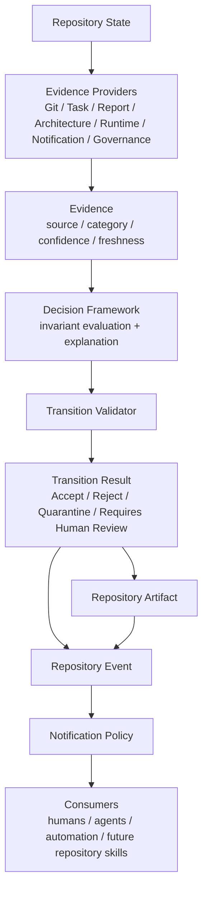

# PCAE Repository Decision Framework

## Purpose

This document freezes the architecture by which PCAE explains why a
repository transition is accepted, rejected, quarantined, or requires
human review. Phase 115A is architecture and contract only: it adds no
runtime implementation, no execution capability, no Repository Transition
Validator changes, no Notification Policy changes, no lifecycle command
changes, no Permission Broker changes, no plugins, no Telegram inbound,
no REST, no Web UI, and no Dashboard.

The framework extends the Phase 114R conclusion: Repository Decision is
not a fifth Repository State Kernel primitive. It remains a computation,
materialized today as `TransitionResult`, produced by centralized
evaluation over repository state and evidence.

## Framework Flow

```
Repository State
        |
        v
Repository Transition
        |
        v
Evidence Collection
        |
        v
Decision Evaluation
        |
        v
Transition Result
        |
        v
Repository Artifact
        |
        v
Repository Event
```

## Concept Boundaries

| Concept | Role | Persistence |
| --- | --- | --- |
| Repository State | The canonical facts PCAE can inspect now | Kernel primitive |
| Evidence | Deterministic observations collected for evaluation | Evaluation-scoped only |
| Decision | Centralized computation over evidence and invariants | Not a primitive |
| Repository Artifact | Durable result or evidence record after certification | Kernel primitive |
| Repository Event | Observable outcome emitted or represented after a transition | Kernel primitive |

Evidence is deliberately not a kernel primitive. It is
evaluation-scoped: it exists only during evaluation, can be reproduced
from repository state and providers, and must not become a second source
of truth.

## Evidence Architecture

**Evidence** is a deterministic, structured observation produced during
evaluation. Evidence explains what fact was considered, where it came
from, how fresh it is, and how much confidence PCAE assigns to that
observation.

**Evidence Source** identifies the provider or repository subsystem that
produced the observation. Examples: Git, Reports, Metadata, Tasks,
Architecture, Runtime, Push State, Notification, Governance, Tests.

**Evidence Category** classifies what kind of question the observation
answers. Categories include identity, completeness, consistency,
freshness, push-state, notification-readiness, governance-readiness,
test-readiness, runtime-boundary, and architecture-boundary.

**Evidence Confidence** is a deterministic confidence label derived from
source quality, not model judgment. Recommended labels are `high`,
`medium`, `low`, and `unknown`. A live git command with a successful exit
code is high confidence; missing optional metadata may be low confidence;
unreadable input is unknown.

**Evidence Freshness** describes when the observation was obtained and
whether it is current for the transition being evaluated. Freshness is
computed from timestamps, commit references, live repository reads, or
known stale markers. It is never inferred from the identity of the actor
that proposed the transition.

Evidence must be deterministic, reproducible, structured, and
model-independent. It must never depend on `model_id`, `agent_id`,
`backend_id`, `vendor`, prompt wording, conversational state, or
AI-generated prose.

## Evidence Providers

Evidence Providers produce evidence and nothing else. They do not decide,
vote, authorize transitions, mutate state, promote artifacts, send
notifications, bypass the validator, or invoke runtime execution.

Initial provider families:

| Provider | Evidence Produced |
| --- | --- |
| Git Provider | branch, dirty tree, commit identity, push state, tracked changes |
| Task Provider | active task, allowed files, forbidden files, acceptance state |
| Report Provider | phase identity, report completeness, recommended next phase |
| Architecture Provider | architecture status, documented boundaries, invariant references |
| Runtime Provider | runtime state, execution availability, plugin capability |
| Notification Provider | notification eligibility, idempotency marker, delivery status |
| Governance Provider | health, check, task-memory, push-check results |

Future provider families may include Static Analysis, Security,
Performance, Documentation, Dependency, and AI Review. Future providers
remain evidence-only even when they inspect richer material.

## Evaluation Pipeline

```
Evidence
   |
   v
Invariant Evaluation
   |
   v
Decision
   |
   v
Explanation
   |
   v
Transition Result
```

Invariant evaluation is centralized. Providers supply observations; the
Decision Framework applies frozen invariants to those observations. The
decision remains deterministic because the same repository state, same
transition, same provider contracts, and same invariant set produce the
same verdict and explanation.

No skill or provider can override another provider. Conflicting evidence
is not resolved by voting; it is represented as evidence and evaluated
by the centralized framework. When conflict prevents a safe automated
acceptance, the result is reject, quarantine, or requires human review
according to the invariant breached and the configured severity.

## Explanation Structure

Every `TransitionResult` must be explainable without AI-generated prose.
No AI-generated prose is required. The explanation is structured,
reproducible data that can be rendered for humans later.

Required explanation fields:

| Field | Meaning |
| --- | --- |
| Decision | One of Accept, Reject, Quarantine, Requires Human Review |
| Reason | Stable reason code or concise deterministic summary |
| Evidence Used | Evidence item identifiers consumed by the invariant |
| Invariant(s) | Invariant names that passed, failed, warned, or requested review |
| Severity | informational, warning, blocking, quarantine, or human-review |
| Suggested Repair | Deterministic repair guidance or `none` |
| Confidence | Deterministic confidence label derived from evidence quality |

Explanations must be reproducible: rerunning evaluation against the same
state and transition must produce the same reason codes, evidence links,
invariant references, severity, repair guidance, and confidence labels.

## Verdict Categories

### Accept

Appropriate when all blocking invariants pass, required evidence is
present and fresh, no quarantine condition exists, and no human-review
condition is requested. Typical evidence: clean git state, complete
report metadata, matching phase identity, required governance checks, and
execution-unavailable confirmation. Explanation should name the
invariants satisfied and the evidence set used.

### Reject

Appropriate when the proposed transition violates a blocking invariant
and cannot be safely represented as a quarantined artifact. Typical
evidence: phase identity conflict, missing required transition metadata,
forbidden execution availability, or task scope violation. Explanation
must identify the failed invariant, blocking evidence, and repair.

### Quarantine

Appropriate when PCAE can preserve the proposed artifact for inspection
but must not promote it canonically. Typical evidence: partial report
completeness, stale push-state evidence, or incomplete trust metadata.
Explanation must state why canonical promotion is blocked and where the
non-canonical artifact can be inspected.

### Requires Human Review

Appropriate when deterministic evidence indicates the transition may be
valid but policy requires explicit human judgment. Typical evidence:
explicit human-review marker, ambiguous conflicting evidence, low
confidence for a safety-critical category, or a future provider's review
requirement. Explanation must state the review trigger, evidence, and the
decision that remains blocked until review.

## Decision Composition

Repository Skills and Evidence Providers contribute evidence only.
They never vote. They never override one another. They never authorize a
transition. They never promote an artifact. They never send a
notification. They never bypass the Repository Transition Validator.

Composition is evidence aggregation followed by centralized invariant
evaluation:

1. Providers collect deterministic evidence.
2. The framework normalizes evidence shape and source metadata.
3. Invariants evaluate the combined evidence set.
4. Conflicts are represented as evidence, not resolved by provider
   priority.
5. The centralized decision emits one verdict and one explanation set.

## Canonical Wire Diagram



## Model Independence

The framework enables DeepSeek, Claude, Codex, GLM, future SLMs, humans,
and automation without architectural change because decisions are based
on repository state, proposed transitions, deterministic evidence, and
centralized invariants. Actor identity is not an evidence category and is
not an input to the decision. A model or human can propose a transition;
PCAE explains the transition outcome by repository facts, not by who
proposed it.

## Frozen Boundaries

Phase 115A freezes the architecture only. It does not implement provider
classes, evidence storage, a new explanation type, a new validator
interface, runtime execution, plugin loading, Telegram inbound, REST, Web
UI, Dashboard, Permission Broker behavior, or lifecycle command behavior.

Execution capability remains unavailable.
