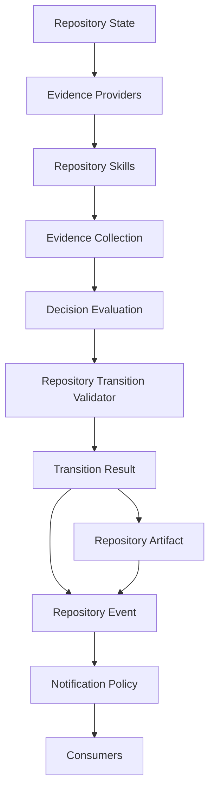

# PCAE Repository Skills Architecture

## Status

Phase 115H. Architecture and design only. No Repository Skill is
implemented by this document. No AI/SLM/LLM-backed skill is
implemented. No DeepSeek integration is introduced. No Evidence
Providers, Decision Evaluation, Repository Transition Validator, or
lifecycle commands are modified. No execution, authorization,
Permission Broker enforcement, plugins, Telegram inbound, REST, Web UI,
or Dashboard capability is introduced.

## Purpose

Define Repository Skills as the governed extension mechanism through
which PCAE's decision support (115C Evidence, 115D Evidence Providers,
115E Decision Evaluation, 115F integration, 115G verification) grows
richer over time, without ever relocating verdict authority away from
the Repository Transition Validator.

Repository Skills were named informally in 115A
(`docs/PCAE_REPOSITORY_SKILLS.md`) as "future evidence-provider
packages." This document is the deeper architectural elaboration 115A
deferred: skill classes, concrete deterministic examples, the advisory/
AI-skill boundary, a lifecycle, a manifest concept, an explicit safety
boundary, and a named DeepSeek future-pilot boundary. It supersedes
115A's brief sketch as the canonical Repository Skills reference;
115A's own document is left unmodified as a historical artifact.

## Core Principle

**Repository Skills produce evidence. Repository Skills do not
decide.**

Every property below is a restatement or direct consequence of this
one sentence. A future reader who forgets every other detail in this
document but retains this sentence has retained the architecture's
entire safety argument.

## 1. Repository Skill Definition

A **Repository Skill** is a governed unit of work that:

- observes repository state
- collects or derives evidence
- may enrich existing evidence (e.g. adding confidence, cross-references,
  or a derived observation atop evidence another skill or provider
  already produced)
- returns an `EvidenceCollection` (115C's frozen shape — reused
  unmodified, never a bespoke skill-specific evidence type)

A Repository Skill **never**:

- mutates repository state
- decides (produces no `TransitionVerdict`, no accept/reject/quarantine
  outcome of any kind)
- votes (has no weighted or unweighted say relative to another skill;
  see "Decision Composition" in `docs/PCAE_DECISION_FRAMEWORK.md`,
  unchanged by this phase)
- authorizes anything
- promotes artifacts (never writes `.pcae/phase-reports/latest.*` or
  any canonical artifact)
- sends notifications
- bypasses the Repository Transition Validator
- invokes execution (no subprocess, no runner, no adapter invocation of
  any kind)

A Repository Skill is, structurally, a more disciplined synonym for a
115D Evidence Provider: same contract (produce `Evidence`/
`EvidenceCollection`, never decide), broader intended scope (skills may
compose existing evidence, not only collect fresh observations, and may
eventually be AI/SLM-backed — see Advisory Skills below, which 115D's
four initial providers were not designed to be).

## 2. Skill Classes

Five skill classes are defined. A skill declares exactly one class; the
class is a manifest field (see Section 6), never inferred at runtime.

| Class | Definition | Determinism | Example |
| --- | --- | --- | --- |
| **Deterministic** | Same repository state and transition always produce the same evidence, byte-for-byte. No probabilistic or model-based reasoning anywhere in the skill. | `EvidenceDeterminism.DETERMINISTIC` | Git Topology Skill |
| **Reproducible External** | Depends on an external, versioned tool or service whose own output is stable for a given input (e.g. a pinned linter, a specific test runner version), but is not authored by PCAE itself. Reproducible given the same external tool version; not necessarily reproducible across tool upgrades. | `EvidenceDeterminism.REPRODUCIBLE_EXTERNAL` | A pinned static-analysis tool wrapper |
| **Advisory** | May be probabilistic (including AI/SLM/LLM-backed). Produces evidence labelled as model-produced and never treated as sole authority for Accept. See Section 4. | `EvidenceDeterminism.PROBABILISTIC` (or `HUMAN_ASSERTED` when a human directly asserts the evidence) | A future DeepSeek/Claude/Codex/GLM/Qwen code-review skill |
| **Human-Assisted** | Evidence is directly asserted by a human (e.g. an explicit human sign-off recorded as evidence), not derived automatically. Distinct from Advisory: no model inference is involved, only a human's direct assertion, but the assertion is still only evidence, never a decision. | `EvidenceDeterminism.HUMAN_ASSERTED` | A human code-review sign-off skill |
| **Experimental** | Under active development; not yet trusted for any evidence category that a blocking invariant depends on. Always attaches `EvidenceConfidence.LOW` or lower, regardless of what the skill's own internal logic believes. | Any (must additionally declare `experimental: true` in the manifest) | A prototype skill exploring a new evidence category before it graduates to Deterministic/Reproducible External/Advisory |

All five classes reuse 115C's existing `EvidenceDeterminism` enum
values (`DETERMINISTIC`, `REPRODUCIBLE_EXTERNAL`, `PROBABILISTIC`,
`HUMAN_ASSERTED`) plus one new orthogonal manifest-level flag
(`experimental`) — no new enum is required in `core/evidence.py`, and
none is added by this architecture-only phase.

## 3. Deterministic Skills

Deterministic skills are the natural next generation of 115D's initial
four providers (Git, Runtime, Report, Metadata). At minimum, six
deterministic skill concepts are named here (design only — none
implemented):

| Skill | Evidence Responsibility |
| --- | --- |
| **Git Topology Skill** | Branch topology beyond 115D's flat ahead/behind count: merge-base identity, divergence from a named integration branch, tag/release proximity, submodule state if any. Extends, does not replace, `GitEvidenceProvider`. |
| **Report Consistency Skill** | Cross-checks the canonical phase report's own internal fields (e.g. declared `files_changed_count` vs. `len(files_changed)`, declared `phase_commits` vs. commits actually reachable from `HEAD`) — a deeper consistency check than `ReportEvidenceProvider`'s single-field reads. |
| **Metadata Consistency Skill** | Cross-checks `.pcae/phase-completion-metadata.json` against `PROJECT_STATUS.md`'s own "Current Phase" section and `tasks/DONE.md`'s latest entry — three independently-authored sources of the same phase identity, currently reconciled only informally by human/agent discipline. |
| **Architecture Status Skill** | Verifies `docs/*ARCHITECTURE*`/`docs/PROJECT_STATUS.md`'s claimed "Completed"/"Planned" phase lists against `git log`-derived phase history, surfacing drift as evidence rather than silently trusting hand-maintained prose. |
| **Documentation Completeness Skill** | Checks that every phase referenced as "Recommended Next Phase" in `PROJECT_STATUS.md` eventually gets a `docs/PHASE_<id>_*.md` file, and that every such file has the sections this codebase's own convention expects (Status/Purpose/Validation/Governance/Recommended Next Phase). |
| **Test-Result Consistency Skill** | Cross-checks a phase-completion-metadata.json's declared `validation_results`/`test_results` pass counts against a live, bounded re-run of the named test files (never a full-suite re-run — bounded scope only), surfacing a mismatch as evidence rather than trusting a hand-typed count. |

Every deterministic skill above is a *design concept*, not code. This
phase adds zero implementation files under `src/pcae/core/`.

## 4. Advisory Skills

Advisory skills are the governed home for any future AI/SLM/LLM-backed
contribution to PCAE — including, but not limited to, DeepSeek, GLM,
Qwen, Claude, Codex, or a locally-hosted SLM.

An Advisory Skill must be:

- **advisory only** — its output is evidence, consumed by Decision
  Evaluation exactly like any other evidence item; it has no separate
  authority channel
- **probabilistic by default** (`EvidenceDeterminism.PROBABILISTIC`,
  unless a specific human-asserted variant applies) — an advisory
  skill's output is never declared `DETERMINISTIC`, even if a given run
  happens to reproduce
- **labelled model-produced** — every `Evidence` item an advisory skill
  emits must carry a clear producer/provenance marker identifying it as
  model-produced (reusing 115C's existing `Evidence.producer`/
  `EvidenceProvenance` fields — no new field is required); this is
  never omitted or disguised as a deterministic observation
- **never sole authority for Accept** — an Accept verdict must never be
  reachable through advisory evidence alone; at least one deterministic
  (or reproducible-external) blocking invariant must independently pass
  for any transition to Accept (this restates, for skills, the same
  "Evidence never decides" principle already frozen for evidence in
  general by 115B/115E)
- **never allowed to mutate repository state** — identical prohibition
  to every other skill class, restated here because advisory skills are
  the class most likely to eventually wrap an execution-capable model
  backend, and the boundary must be unambiguous even under that
  pressure
- **never allowed to finalize, push, or notify** — same restatement,
  for the same reason
- **allowed only to produce evidence** — the complete extent of an
  advisory skill's capability, with no exception

This is a strictly *narrower* set of guarantees than deterministic
skills provide (advisory skills add probabilistic labelling and the
Accept-authority restriction on top of every deterministic-skill
prohibition), never a looser one.

## 5. Repository Skill Lifecycle

A Repository Skill's lifecycle has seven stages:

```
registered -> configured -> invoked -> evidence produced
    -> evidence validated -> evidence consumed by Decision Evaluation
    -> result referenced in explanation
```

| Stage | Meaning |
| --- | --- |
| **Registered** | The skill's manifest (Section 6) is known to PCAE — analogous to 110C's Runtime Registry / Plugin Discovery model, reusing that existing registration concept rather than inventing a second one. |
| **Configured** | Any skill-specific configuration (timeout, scope, enabled categories) is resolved for this invocation. |
| **Invoked** | The skill runs against a `RepositoryState`/evaluation context, analogous to 115D's `EvidenceProviderContext`. |
| **Evidence produced** | The skill returns an `EvidenceCollection` (or fails — see Section 6's failure-behavior manifest field; a failed skill degrades to `UNKNOWN`-freshness evidence or no evidence, exactly like a 115D provider failure, never to a fabricated observation). |
| **Evidence validated** | The returned evidence is checked for shape validity (well-formed `Evidence` items, no duplicate IDs — 115C's `EvidenceCollection` already enforces this structurally) before being admitted to the evaluation's working evidence set. |
| **Evidence consumed by Decision Evaluation** | 115E's `evaluate()` (unmodified) reasons over the admitted evidence exactly as it does today over adapter-produced or provider-produced evidence — a skill's evidence is not a new evidence type, so no new consumption path is required. |
| **Result referenced in explanation** | If the skill's evidence was actually used by an invariant (as supporting or conflicting evidence), the resulting `InvariantResult`/`EvaluationResult` cites the skill's Evidence IDs exactly like any other evidence — 115G's "every explanation reference resolves against the evaluated collection" guarantee already covers skill-sourced evidence with zero additional code, because skill evidence is ordinary `Evidence`. |

No stage in this lifecycle authorizes, decides, mutates, promotes, or
notifies. The lifecycle governs evidence production and consumption
only.

## 6. Skill Manifest Concept

A future Repository Skill manifest (schema not frozen by this phase —
documented here as a concept to guide 115I's contract freeze) would
declare:

| Field | Meaning |
| --- | --- |
| `skill_id` | Stable, unique identifier (mirrors 115D's Evidence ID stability discipline). |
| `name` | Human-readable name. |
| `version` | Skill implementation version, independent of PCAE's own version. |
| `class` | One of the five Section 2 classes. |
| `determinism` | The `EvidenceDeterminism` value the skill declares for its own output (must be consistent with `class`). |
| `categories produced` | Which `EvidenceCategory` values (115C's existing 15-value enum) this skill may emit — a skill declaring `RUNTIME` evidence should never silently also emit `SECURITY` evidence without declaring it. |
| `required inputs` | What repository state / prior evidence the skill needs to run (e.g. "requires `RepositoryState.pushed_status`"). |
| `allowed outputs` | Confirms the skill's output is `EvidenceCollection` only — never a `TransitionResult`, never a mutation, never a side effect. |
| `side-effect policy` | Must always read `none` for a conforming skill; the field exists so a future skill claiming any side effect is rejected at registration rather than discovered at runtime. |
| `timeout policy` | Bounded execution time, analogous to existing timeout-hardening patterns elsewhere in this codebase (`core/` timeout policies referenced by prior runtime-hardening phases) — a skill that exceeds its declared timeout degrades to `UNKNOWN` evidence, never blocks the whole evaluation indefinitely. |
| `failure behavior` | What happens if the skill errors: degrade to `UNKNOWN`-freshness evidence (115D's established pattern) or omit evidence entirely — never fabricate a passing observation. |
| `confidence defaults` | The `EvidenceConfidence` the skill's evidence carries absent a more specific per-item override. |
| `model-produced flag` | Present and `true` for any Advisory-class skill wrapping an AI/SLM/LLM backend; absent or `false` otherwise. Distinct from, and layered on top of, `determinism` — a skill can be `class: advisory`, `determinism: probabilistic`, `model_produced: true` all simultaneously, each field doing one job. |

This is a documented concept only. No manifest schema, loader, parser,
or registry table is implemented in this phase — the actual freeze is
explicitly deferred to **115I — Repository Skills Contract Freeze**
(the recommended next phase), mirroring the established pattern of
this arc (115A architecture -> 115B contract freeze; 113S architecture
-> 113T contract freeze).

## 7. Skill Safety Boundary

Repository Skills must never own:

- **Repository State** — skills observe it; they never become a second
  source of truth for it (mirrors 115C's Evidence-is-not-a-kernel-
  primitive rule).
- **Repository Transition** — skills never propose, approve, or veto a
  transition; that remains `ProposedTransition`/`validate_transition`'s
  exclusive domain.
- **Repository Artifact promotion** — no skill writes
  `.pcae/phase-reports/latest.*` or any canonical artifact.
- **Repository Event emission** — no skill emits or represents a
  Repository Event (114R's fourth kernel primitive).
- **Notification Policy** — no skill decides notification eligibility,
  dispatches a notification, or marks one as sent.
- **lifecycle authority** — no skill is called by, or has any authority
  over, `pcae phase complete`, `pcae task finish --commit`, or any other
  lifecycle command; those remain wired exclusively through
  `repository_transition_integration.py`, unchanged.
- **execution authority** — no skill invokes a subprocess, an adapter,
  a runner, or any execution-capable pathway; execution capability
  remains unavailable, full stop, independent of any skill's class.

This list is exhaustive by design: it enumerates every kernel primitive
(114R) plus every governance authority a skill could plausibly be
tempted to acquire, and states plainly that a skill owns none of them.
A future phase proposing to grant a skill any item on this list is, by
definition, proposing a different, non-skill architecture component —
not an extension of Repository Skills.

## 8. DeepSeek Future Pilot Boundary

DeepSeek was previously explored (94-series) as a candidate backend
adapter under this project's broader (and still entirely unimplemented)
v0.2 autonomy roadmap. This phase draws an explicit, permanent boundary
for any future DeepSeek work:

**DeepSeek must not be reintroduced as lifecycle authority.** DeepSeek
(or any other model) must never again be positioned as a decision-maker,
an approver, a promoter of artifacts, a notifier, or an execution
authority within PCAE — regardless of how that positioning is framed
(a "pilot," an "experiment," a "read-only trial," or otherwise).

**Any future DeepSeek pilot must be scoped as a bounded Advisory
Repository Skill**, per Section 4 above, meaning it would:

- produce evidence only, exactly like any other Advisory Skill
- be labelled `model_produced: true` in its manifest
- default to `EvidenceDeterminism.PROBABILISTIC`
- never be sole authority for Accept
- never mutate state, finalize, push, or notify
- be subject to the identical `EvidenceConfidence`/severity handling
  Decision Evaluation already applies to every other evidence item —
  no DeepSeek-specific decision path, no DeepSeek-specific bypass

This boundary is not a statement that a DeepSeek pilot is planned or
imminent — it is a standing constraint that applies automatically the
moment anyone (human or agent) proposes one, so that the proposal is
evaluated against an already-frozen boundary rather than negotiated
from scratch under time pressure.

## 9. Wire Diagram



Repository Skills sit strictly between Evidence Providers and Evidence
Collection: they may consume already-collected evidence (to enrich or
cross-reference it) and/or produce fresh evidence of their own, but
every path into Decision Evaluation still flows through one
undifferentiated `EvidenceCollection` — Decision Evaluation cannot tell,
and does not need to tell, whether a given `Evidence` item came from a
115D Provider or a 115H-and-later Skill. This is the same "evidence is
evidence, regardless of source" property 115F's adapter already
demonstrated (validator-adapted evidence reuses 115D's own Evidence IDs
and 115E's evaluators run unmodified).

## Relationship to Kernel Primitives

Repository Skills are not a kernel primitive (114R's four frozen
primitives — Repository State, Repository Transition, Repository
Artifact, Repository Event — are unchanged and exhaustive). Repository
Skills, like Evidence Providers and Evidence itself, are
evaluation-scoped: they exist to produce input for one evaluation and
disappear afterward. Repository Decision remains a computation, not a
primitive, materialized today as `TransitionResult`.

## Frozen Boundaries

Phase 115H freezes architecture and design concepts only:

- Repository Skill definition (Section 1)
- five skill classes (Section 2)
- six named deterministic skill concepts (Section 3)
- the Advisory Skill boundary, covering any future AI/SLM/LLM-backed
  skill (Section 4)
- a seven-stage skill lifecycle (Section 5)
- a skill manifest concept, with fields named but no schema frozen
  (Section 6)
- an exhaustive skill safety boundary (Section 7)
- a permanent DeepSeek future-pilot boundary (Section 8)
- an updated canonical wire diagram showing Repository Skills as their
  own stage (Section 9)

This phase implements no Repository Skill, no AI/SLM/LLM-backed skill,
no DeepSeek integration, and makes no change to Evidence Providers,
Decision Evaluation, the Repository Transition Validator, or any
lifecycle command. No execution, authorization, Permission Broker
enforcement, plugin, Telegram inbound, REST, Web UI, or Dashboard
capability is introduced.

Execution capability remains unavailable. Runtime state remains
Observed. Maximum plugin capability remains `observe`.

## Recommended Next Phase

115I — Repository Skills Contract Freeze
