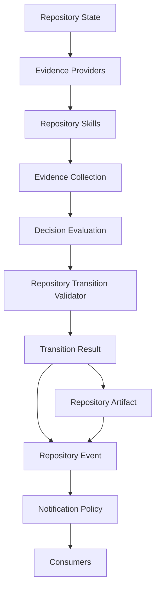

# PCAE Repository Skills Contract

## Purpose

Freeze the exact interface, capability model, manifest, determinism
classes, failure contract, execution boundary, advisory boundary,
composition model, and explainability requirements every future
Repository Skill — deterministic or advisory — must conform to.

Phase 115H designed Repository Skills as a concept. Phase 115I freezes
the contract without implementing a single Repository Skill. No
deterministic skill, no AI/SLM/LLM-backed skill, no DeepSeek
integration is implemented by this document.

## Core Principle

Repository Skills never decide. Repository Skills produce Evidence.
Repository Skills are model-agnostic.

## 1. Repository Skill Contract

The canonical `RepositorySkill` interface — frozen, not implemented —
requires every conforming skill to declare:

| Declaration | Meaning |
| --- | --- |
| Capabilities | Which `RepositorySkillCapability` values (Section 2) this skill provides. |
| Evidence categories produced | Which 115C `EvidenceCategory` values this skill may emit. |
| Determinism class | The skill's default `EvidenceDeterminism` (Section 4). |
| Confidence defaults | The `EvidenceConfidence` the skill's evidence carries absent a more specific per-item override. |
| Required repository inputs | What repository state / prior evidence the skill needs to run. |
| Produces `EvidenceCollection` | The skill's sole return value — 115C's frozen shape, reused unmodified. |

A Repository Skill is explicitly, permanently forbidden from:

- **repository mutation** — no skill writes any repository file, git
  object, or state
- **decision making** — no skill produces a `TransitionVerdict` or any
  accept/reject/quarantine/human-review outcome
- **validator bypass** — no skill circumvents
  `validate_transition`/the Repository Transition Validator
- **lifecycle authority** — no skill is called by, or has authority
  over, `pcae phase complete`, `pcae task finish --commit`, or any
  other lifecycle command
- **artifact promotion** — no skill writes `.pcae/phase-reports/
  latest.*` or any canonical artifact
- **notification dispatch** — no skill sends or marks a notification
  as sent
- **execution** — no skill invokes a subprocess, adapter, or runner
- **authorization** — no skill grants, checks, or asserts permission
  for anything
- **commit** — no skill performs a `git commit`
- **push** — no skill performs a `git push`
- **finalize** — no skill finalizes a phase, task, or report

This list is exhaustive and permanent for the `RepositorySkill`
interface: a future capability requiring any item on it is, by
definition, not a Repository Skill.

## 2. Repository Skill Capability Model

`RepositorySkillCapability` describes **what evidence a skill may
produce — never how it produces it.** Capabilities are outputs, not
implementations; two skills may declare the same capability while
using entirely different internal logic (a bespoke deterministic
checker versus a call to an external tool versus a model prompt), and
Decision Evaluation is unaffected either way.

The frozen minimum capability set:

| Capability | Evidence Produced |
| --- | --- |
| `git_analysis` | Branch topology, dirty/clean state, push state, commit identity, divergence — extends 115D's `GitEvidenceProvider` scope. |
| `runtime_analysis` | Runtime state, execution availability, plugin capability — extends `RuntimeEvidenceProvider` scope. |
| `architecture_analysis` | Architecture status claims, documented boundaries, invariant references. |
| `documentation_analysis` | Documentation completeness, cross-reference consistency between phase docs and `PROJECT_STATUS.md`/`tasks/DONE.md`. |
| `report_analysis` | Phase report internal consistency, phase identity, recommended-next-phase presence — extends `ReportEvidenceProvider` scope. |
| `metadata_analysis` | Cross-checks between `.pcae/phase-completion-metadata.json`, `PROJECT_STATUS.md`, and `tasks/DONE.md` — extends `MetadataEvidenceProvider` scope. |
| `dependency_analysis` | Dependency graph facts: version drift, declared-vs-installed mismatches, known-vulnerability flags (evidence only — no remediation action). |
| `ai_review` | Model-produced review evidence (code review commentary, risk flags, summarization) — always Advisory class (Section 7). |

A skill may declare more than one capability. A future capability name
not listed here may be added by a later phase without breaking this
contract, provided it describes an evidence output, never an
implementation detail or an authority.

## 3. Repository Skill Manifest

The canonical manifest schema — frozen field names and meanings, no
loader/parser/registry table implemented:

| Field | Meaning |
| --- | --- |
| `skill_id` | Stable, unique identifier. |
| `name` | Human-readable name. |
| `version` | Skill implementation version, independent of PCAE's own version. |
| `capability list` | One or more `RepositorySkillCapability` values (Section 2) this skill declares. |
| `determinism` | The skill's default `EvidenceDeterminism` value (Section 4). |
| `confidence policy` | Default `EvidenceConfidence` and any per-capability overrides. |
| `evidence categories` | Which 115C `EvidenceCategory` values this skill may emit. |
| `required inputs` | Repository state / prior evidence the skill needs to run. |
| `optional inputs` | Additional inputs the skill may use if present but does not require. |
| `timeout` | Bounded execution time; a skill exceeding it degrades to `UNKNOWN` evidence (Section 5), never blocks evaluation indefinitely. |
| `failure policy` | Which of the two Section 5 failure outcomes the skill produces on error. |
| `side-effect policy` | Must always read `none` for a conforming skill. |
| `model-produced flag` | Present and `true` for any skill wrapping an AI/SLM/LLM backend; absent or `false` otherwise. |
| `experimental flag` | `true` for a skill not yet trusted for any evidence category a blocking invariant depends on; forces `EvidenceConfidence.LOW` or lower regardless of the skill's own internal confidence signal. |

This manifest freezes field names and meanings only. Schema
enforcement, a loader, a parser, and a registry table remain
unimplemented — a future prototype phase (115J, per the recommended
next phase) may implement them without renaming or removing any field
frozen here.

## 4. Determinism Classes

Five determinism classes are frozen, reusing 115C's existing
`EvidenceDeterminism` enum values plus one orthogonal manifest-level
flag — no new enum member is added by this phase:

| Class | `EvidenceDeterminism` value | Meaning |
| --- | --- | --- |
| `deterministic` | `DETERMINISTIC` | Same repository state and transition always produce the same evidence, byte-for-byte. |
| `reproducible_external` | `REPRODUCIBLE_EXTERNAL` | Depends on a pinned external tool/service whose own output is stable for a given input and tool version. |
| `probabilistic` | `PROBABILISTIC` | May vary run to run; the default for any Advisory/AI-backed skill (Section 7). |
| `human_assisted` | `HUMAN_ASSERTED` | Evidence is a human's direct assertion, not derived automatically. |
| `experimental` | any value + `experimental: true` (Section 3) | Not yet trusted for any blocking-invariant evidence category, regardless of its own declared determinism. |

## 5. Failure Contract

Every Repository Skill failure must produce exactly one of two
outcomes — never anything in between:

1. **Honest `UNKNOWN` evidence** — the skill emits an `Evidence` item
   with `freshness=EvidenceFreshness.UNKNOWN`, following 115D's
   established provider-failure pattern exactly. Decision Evaluation's
   existing rule (115E/115G, unchanged) already treats `UNKNOWN`
   evidence on a blocking invariant as a failure, never a silent pass.
2. **Explicit failure outcome** — the skill's invocation records an
   explicit, structured failure (e.g. a `failed` status distinct from
   "ran and produced UNKNOWN evidence"), still never a `TransitionResult`
   or any decision — only a machine-readable statement that the skill
   itself could not run.

**Never partial hidden failure**: a skill must never emit some evidence
items successfully while silently swallowing an error on others without
surfacing it in at least one of the two forms above.

**Never silent success**: a skill must never report success (or emit
evidence with `PASS`-implying freshness/confidence) when its underlying
observation actually failed, timed out, or was skipped. A timeout
(Section 3's `timeout` field) is itself a failure requiring one of the
two outcomes above, never a fabricated passing result.

## 6. Execution Boundary

Repository Skills must never:

- invoke runtime execution (no subprocess, adapter, or runner
  invocation of any kind)
- authorize execution (no skill grants, checks, or asserts execution
  permission)
- approve transitions (no skill produces or influences a
  `TransitionVerdict`)
- override evidence (a skill never discards, replaces, or silently
  resolves another item's evidence — conflicting evidence is preserved
  and evaluated centrally, per 115B's Conflict Semantics, unchanged)
- override other skills (no skill has priority, veto, or precedence
  over another skill's evidence)
- override the validator (`validate_transition`'s own invariant checks
  remain the sole verdict authority, exactly as 115F/115G already
  established for the adapter path)

This is a restatement of Section 1's prohibitions, isolated here
because execution and override boundaries are the two properties most
likely to be tested under future pressure (e.g. a skill wrapping an
execution-capable backend, or two skills disagreeing) — both remain
absolute regardless of skill class, capability, or determinism.

## 7. Advisory Skill Boundary

Future DeepSeek, GLM, GPT, Qwen, or local-SLM-backed skills — and any
other model-backed skill not yet named — must:

- produce **advisory evidence only** — no separate authority channel
  of any kind
- declare **`probabilistic` determinism** by default (Section 4) —
  never `deterministic`, even if a given run happens to reproduce
- be **labelled model-produced** — every `Evidence` item such a skill
  emits carries `model-produced: true` (Section 3) and identifies
  itself via 115C's existing `Evidence.producer`/`EvidenceProvenance`
  fields; no new field is required
- **never become sole authority** — an Accept verdict must never be
  reachable through advisory evidence alone; at least one
  deterministic (or reproducible-external) blocking invariant must
  independently pass
- **never bypass Decision Evaluation** — advisory evidence flows
  through the identical `EvidenceCollection` -> `evaluate()` path as
  every other evidence item; there is no separate advisory-evidence
  fast path, override channel, or privileged review queue

This is the identical boundary 115H named informally, now frozen as
contract language rather than architectural description. No DeepSeek,
GLM, GPT, Qwen, or SLM integration is implemented by this phase.

## 8. Composition Model

One Repository Skill may internally use multiple 115D Evidence
Providers (or other skills' already-produced evidence) to assemble its
own output. Decision Evaluation never sees this internal
implementation — it receives only an `EvidenceCollection`, exactly as
115F's validator adapter already demonstrates for provider-sourced
evidence.

This means:

- a skill's internal composition (which providers it calls, in what
  order, with what caching) is entirely the skill's own concern and
  may change between skill versions without any Decision Evaluation
  change
- Decision Evaluation's six frozen invariant families (115E, unchanged)
  continue to look up evidence by ID (`EvidenceCollection.by_id`) and
  category, never by which skill or provider produced it
- a skill composing evidence from multiple providers must still
  produce well-formed, non-duplicate-ID `Evidence` items — 115C's
  `EvidenceCollection` already rejects duplicate `evidence_id` values
  at construction, which continues to apply

## 9. Explainability Requirements

Every `Evidence` item a Repository Skill produces must preserve
provenance: 115C's existing `Evidence.provenance`
(`EvidenceProvenance`: `producer`/`produced_from`/`timestamp`/
`deterministic_origin`) is populated exactly as any 115D provider
already populates it — no new provenance field is introduced, and no
skill may omit it.

Decision explanations must reference Evidence IDs regardless of which
Repository Skill produced them: 115E's `EvaluationResult.
explanation_reference` and each `InvariantResult`'s
`supporting_evidence`/`conflicting_evidence` cite `EvidenceReference`
(`evidence_id` + optional note) — a stable citation mechanism that is
already, and remains, completely agnostic to evidence origin. 115G
already verified this property end-to-end for adapter-produced
evidence ("every explanation reference resolves against the evaluated
collection"); this contract freezes the same guarantee for
skill-produced evidence with zero additional code, because skill
evidence is ordinary `Evidence`.

## 10. Canonical Wire Diagram

Unchanged from 115H's diagram: Repository Skills sit strictly between
Evidence Providers and Evidence Collection. This phase freezes the
diagram as canonical (not merely descriptive) — a future phase
changing this flow must explicitly supersede this contract, not
silently drift from it.

## Frozen Boundaries

Phase 115I freezes contract language only:

- the `RepositorySkill` interface and its exhaustive prohibitions
  (Section 1)
- the `RepositorySkillCapability` model (Section 2)
- the skill manifest field set (Section 3)
- five determinism classes (Section 4)
- the two-outcome failure contract (Section 5)
- the execution boundary (Section 6)
- the advisory/AI skill boundary (Section 7)
- the composition model (Section 8)
- explainability requirements (Section 9)
- the canonical wire diagram, now frozen (Section 10)

No Repository Skill, no deterministic skill, no AI/SLM/LLM-backed
skill, no DeepSeek integration is implemented. No change to Evidence
Providers, Decision Evaluation, the Repository Transition Validator,
lifecycle commands, Notification Policy, Canonical Artifact Promotion,
Push-State Reconciliation, or Post-Push Canonicalization.

Execution capability remains unavailable. Runtime state remains
Observed. Maximum plugin capability remains `observe`.

## Recommended Next Phase

115J — Repository Skills Prototype
