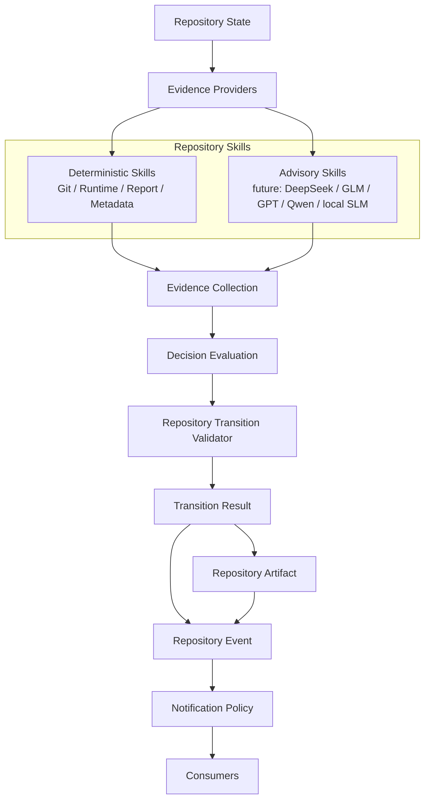

# PCAE Repository Skills Integration Architecture

## Status

Phase 115L. Architecture and design only. No Repository Skills
integration is implemented by this document. No Repository Skill, no
Evidence Provider, no Decision Evaluation, no Repository Transition
Validator, no lifecycle command, no Notification Policy, no Canonical
Artifact Promotion, no Push-State Reconciliation, and no Post-Push
Canonicalization is modified. No execution capability is introduced.

## Purpose

Design how Repository Skills (115H design, 115I contract freeze, 115J
prototype, 115K verification) become the primary evidence-acquisition
layer for Decision Evaluation, replacing today's implicit
"Decision Evaluation consumes whatever Evidence a caller assembles"
model with an explicit one: Repository Skills orchestrate Evidence
Providers; Decision Evaluation consumes only the resulting
`EvidenceCollection`. This must happen **without changing any
observable lifecycle behavior** — the same repository state and
transition must still produce the same verdict, the same explanation,
and the same canonical artifacts.

This document freezes the *target* architecture and the *path* to it.
It implements none of it. A future prototype phase (115M, recommended
next) may begin implementing Stage 3 below; this phase only designs
what that implementation must conform to.

## Current Architecture (as of 115K)

```
Repository State
        |
        v
Evidence Providers
        |
        v
Evidence
        |
        v
Decision Evaluation
        |
        v
Transition Validator
```

115D's four Evidence Providers (`GitEvidenceProvider`,
`RuntimeEvidenceProvider`, `ReportEvidenceProvider`,
`MetadataEvidenceProvider`) are called directly wherever evidence is
needed today: 115F's validator adapter
(`build_evidence_from_repository_state`) constructs `Evidence` items
directly from `RepositoryState` fields (never calling a provider at
all), and 115J's Repository Skills wrap the same four providers as a
parallel, currently-unused path. Decision Evaluation itself
(`core/decision_evaluation.py`) has never called a provider or a skill
directly — it has only ever consumed whatever `EvidenceCollection` a
caller handed it (115F's adapter output today; 115J's skill output in
tests only).

## Target Architecture

```
Repository State
        |
        v
Evidence Providers
        |
        v
Repository Skills
        |
        v
Evidence Collection
        |
        v
Decision Evaluation
        |
        v
Transition Validator
```

Repository Skills become the **sole orchestrators** of Evidence
Providers. Decision Evaluation no longer knows Evidence Providers
exist at all — it receives only an `EvidenceCollection`, exactly as it
does today, but that collection's origin is now uniformly "one or more
Repository Skills ran," never "a caller hand-assembled `Evidence`
items" or "a caller called a provider directly."

## 1. Integration Architecture (Frozen)

Repository Skills become the sole orchestrators of Evidence Providers.
Decision Evaluation receives only `EvidenceCollection` — this is not a
new constraint on Decision Evaluation (115E already has this shape;
`evaluate(context: EvaluationContext)` has never accepted a provider or
a skill as an argument) but a frozen commitment that no future change
may add a provider- or skill-aware code path to Decision Evaluation.

## 2. Integration Boundary (Frozen)

Decision Evaluation must never:

- **construct providers** — no `GitEvidenceProvider()`-style
  instantiation anywhere in `core/decision_evaluation.py`
- **discover providers** — no registry lookup, no capability
  filtering, no "which providers are available" query
- **call providers directly** — no `.collect()` call
- **know provider ordering** — no assumption about which provider ran
  first, last, or at all

Repository Skills own provider orchestration exclusively. This
boundary is identical in spirit to 115B's original "Evidence Providers
never decide" boundary, applied in the opposite direction: Decision
Evaluation never *orchestrates collection*, exactly as Providers never
*decide*. Each side of the pipeline owns exactly one responsibility.

## 3. Orchestration Model (Frozen)

One Repository Skill may invoke:

- **zero providers** — a skill that only enriches or cross-references
  evidence another skill already produced (115H's "may enrich existing
  evidence" property), or a future skill whose evidence comes from
  somewhere other than a 115D provider entirely (e.g. a future AI
  skill's own inference)
- **one provider** — 115J's four current skills, each wrapping exactly
  one provider
- **multiple providers** — a future skill composing evidence from
  several providers internally (115I Section 8's Composition Model,
  already frozen: "One Repository Skill may internally use multiple
  Evidence Providers")

Whichever of these a skill does, it **merges its `EvidenceCollection`
before returning** — 115J's `RepositorySkillResult.evidence` is
already a single `EvidenceCollection` per skill invocation, and
115J's `RepositorySkillRegistry.merge_evidence()` already merges
multiple skills' results into one collection for a caller invoking
several skills. This phase freezes that these are the *only* two merge
points that ever exist: within one skill (provider-to-skill) and
across skills (skill-to-caller). No third, hidden merge point may be
introduced.

## 4. Skill Composition (Frozen)

```
Repository Skill
    |
    v
sub-skills
    |
    v
Evidence Providers
```

A Repository Skill may compose **sub-skills** (not just providers)
internally, preserving deterministic ordering: if a skill invokes two
sub-skills, it must invoke them in the same fixed order every time
(mirroring 115J's `RepositorySkillRegistry.invoke_many`'s already-proven
property, 115K-verified: "multi-skill invocation order matches
requested order exactly").

**No recursive cycles.** A skill's composition graph (skill ->
sub-skill -> ... -> provider) must be a finite, acyclic chain. A skill
may never (directly or transitively) invoke itself, another skill that
invokes it, or any skill/provider already present earlier in its own
active invocation chain. A future skill-composition implementation
must detect and reject a cycle at registration or invocation time,
never allow one to recurse until a stack overflow or timeout — this is
the same "fail closed, never silently degrade into an unbounded loop"
discipline this codebase already applies to timeout policy (115I
Section 3's `timeout` manifest field) and failure policy (115I Section
5's two-outcome failure contract).

## 5. Compatibility Guarantees (Frozen)

- **Existing Evidence Providers remain valid.** No provider API
  change: `EvidenceProvider.collect(context) -> EvidenceProviderResult`
  is unchanged; 115D's four providers keep their existing
  `provider_id`/`producer`/`determinism`/`categories`/
  `required_inputs`/`scope`/`limitations` declarations verbatim.
- **No provider API changes.** A future integration phase adapts
  *how* providers are called (from inside a Repository Skill, instead
  of from a caller or an adapter), never *what* a provider's own
  interface looks like.
- **No Decision Evaluation semantic changes.** The six frozen
  invariant families (115E) keep evaluating whatever `Evidence` items
  are present by ID and category — completely unaware of, and
  unaffected by, the shape of the pipeline stage that produced them.
- **No Transition Validator behavior changes.** `validate_transition`'s
  own structural checks (113U, unchanged since) remain the sole
  verdict authority, exactly as 115F/115G/115K have each re-verified
  in turn.
- **No lifecycle command changes.** `pcae phase complete`/`pcae task
  finish --commit` continue to call
  `repository_transition_integration.py`'s existing adapter path
  unchanged; this phase authorizes no change to that call site.

## 6. Migration Strategy (Frozen, Staged)

| Stage | Description | Status |
| --- | --- | --- |
| **Stage 1** | Decision Evaluation (via 115F's validator adapter) uses `RepositoryState`-derived `Evidence` directly; no Evidence Provider or Repository Skill is involved in the real lifecycle path. | Current production reality, unchanged by this phase. |
| **Stage 2** | Repository Skills wrap Evidence Providers, proven read-only/deterministic/provider-equivalent. | Completed (115J implementation, 115K verification). Not wired into any real path yet. |
| **Stage 3** | Decision Evaluation (via a future adapter or lifecycle change) receives Repository Skill output instead of — or in addition to — the 115F adapter's `RepositoryState`-derived evidence. | Not started. Recommended next phase (115M) may prototype this, still without touching real lifecycle command behavior (a prototype is exercised by tests, not wired into `pcae phase complete`). |
| **Stage 4** | Evidence Providers become an internal implementation detail entirely encapsulated behind Repository Skills; no code outside `repository_skills.py` ever imports `evidence_providers.py` directly. | Not started. This is the end state this document designs toward; it requires Stage 3 to be complete and validated first. |

Each stage is additive and reversible: Stage 2 shipped without
retiring Stage 1's adapter path (both exist today, only one is wired
into production). Stage 3, when implemented, must ship the same way —
proven compatible via tests before any lifecycle command is changed to
prefer it. This phase does not authorize skipping a stage or
collapsing Stage 3 and Stage 4 into one change.

## 7. Dependency Direction (Frozen)

```
Repository Skills  --depends on-->  Evidence Providers
Decision Evaluation --depends on--> Evidence (only)
Transition Validator --depends on--> EvaluationResult (only)
```

- **Repository Skills depend on Evidence Providers.** This is already
  true today (115J's four skills import
  `pcae.core.evidence_providers`) and remains the only direction of
  dependency between these two modules.
- **Decision Evaluation depends only on Evidence.** Already true
  today — `core/decision_evaluation.py`'s only internal import is
  `pcae.core.evidence` (115C/115G-verified, unchanged). This phase
  freezes that this never grows to include
  `pcae.core.evidence_providers` or `pcae.core.repository_skills`.
- **Transition Validator depends only on `EvaluationResult`.** Today
  the validator additionally imports `decision_evaluation` to attach
  `explanation` (115F) — this phase freezes that it must never import
  `evidence_providers` or `repository_skills` directly; any future
  evidence composition the validator's explanation wants must continue
  to flow *through* Decision Evaluation's own `EvaluationResult` type,
  never around it.
- **No reverse dependency** exists or may be introduced: Evidence
  Providers never import Repository Skills; Evidence never imports
  Decision Evaluation; `EvaluationResult` never imports the Transition
  Validator. Each arrow above points exactly one way, permanently.

## 8. Future AI Insertion Point (Frozen)

```
                     Repository Skills
                    /                  \
     Deterministic Skills        Advisory (AI) Skills
     (Git/Runtime/Report/        (future: DeepSeek, GLM,
      Metadata — 115J)            GPT, Qwen, local SLM)
            \                          /
             \                        /
              v                      v
                Evidence Collection
```

Future AI-backed Repository Skills (DeepSeek, GLM, GPT, Qwen, or a
local SLM — 115I's already-frozen Advisory Skill boundary) fit
**beside** deterministic Repository Skills, as parallel
implementations of the same `RepositorySkill` interface, both merging
into the same `EvidenceCollection`. Concretely:

- Decision Evaluation remains unaware of which skills ran, or whether
  any of them was model-backed — it consumes `EvidenceCollection`
  exactly as today, with individual items labelled `model_produced`
  (115I Section 3) but no branch in `evaluate()`'s own logic on that
  label.
- The Transition Validator remains unaware — it consumes
  `EvaluationResult`/`explanation`, never raw evidence or skill
  identity.
- **Repository State remains authoritative.** No AI skill's evidence
  can ever become a second source of truth for repository state; it
  is, like every other skill's output, transient evaluation-scoped
  evidence (115C's frozen "Evidence is not a kernel primitive" rule),
  consumed once and never persisted as fact.

This insertion point requires no architecture change beyond what this
document already freezes: an Advisory Skill is simply a
`RepositorySkill` implementation whose manifest declares
`determinism=PROBABILISTIC`/`model_produced=True` (115I Sections 4/7),
merged into the same `EvidenceCollection` the deterministic skills
already populate, subject to the same "never sole authority for
Accept" rule Decision Evaluation's invariants already enforce
structurally (a blocking invariant requires at least one deterministic
or reproducible-external evidence item to pass; probabilistic evidence
alone cannot satisfy it, per 115B's frozen confidence model).

## 9. Canonical Wire Diagram



Deterministic and Advisory Repository Skills are parallel
implementations under one Repository Skills layer, both consuming
Evidence Providers (directly or not at all) and both producing
evidence into the same undifferentiated `Evidence Collection` stage —
Decision Evaluation cannot tell, and does not need to tell, which kind
of skill (or whether a skill at all, versus 115F's adapter path)
produced a given `Evidence` item, exactly as 115H/115I already
established and 115K verified empirically.

## Frozen Boundaries

Phase 115L freezes architecture and design concepts only:

- the integration architecture (Section 1) making Repository Skills
  the sole Evidence Provider orchestrators
- the integration boundary (Section 2) forbidding Decision Evaluation
  from ever constructing, discovering, or calling a provider
- the orchestration model (Section 3): zero/one/multiple providers per
  skill, exactly two merge points
- the skill composition model (Section 4): sub-skills, deterministic
  ordering, no recursive cycles
- compatibility guarantees (Section 5): no provider API change, no
  Decision Evaluation/Validator/lifecycle behavior change
- a four-stage migration strategy (Section 6), Stages 1-2 already
  real, Stages 3-4 not started
- the dependency direction (Section 7), one-way, no reverse dependency
- the future AI insertion point (Section 8): advisory skills sit
  beside deterministic skills, unknown to Decision Evaluation and the
  Validator
- an updated canonical wire diagram (Section 9)

This phase implements no Repository Skills integration, modifies no
Repository Skill, Evidence Provider, Decision Evaluation code,
Repository Transition Validator code, lifecycle command, Notification
Policy, Canonical Artifact Promotion, Push-State Reconciliation, or
Post-Push Canonicalization code.

Execution capability remains unavailable. Runtime state remains
Observed. Maximum plugin capability remains `observe`.

## Recommended Next Phase

115M — Repository Skills Integration Prototype
