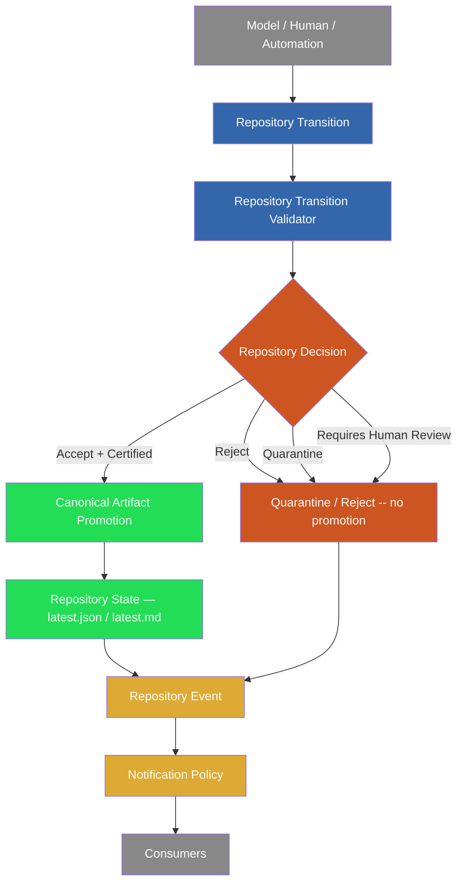

# PCAE Repository State Kernel

## Purpose

This is the definitive reference for the Repository State Kernel after
the 113S–114E arc: Repository Transition Validator architecture through
contract, prototype, verification, and lifecycle integration (113S–113Z);
Canonical Artifact Promotion (114A); Notification Certification &
Idempotency (114B); Repository Events & Notification Policy (114B.1);
Push-State Reconciliation (114C); Cross-Agent Verification (114D);
Post-Push Canonicalization (114D.1); and the Model Containment Drill
(114E), which proved the assembled kernel actually holds against
reproduced drift. Phase 114R (this review) froze the conclusions below;
it added no runtime code.

## The Four Kernel Primitives

Frozen as complete (Phase 114R conclusion — see Kernel Completeness
below):

| Primitive | Answers | Frozen by | Type |
| --- | --- | --- | --- |
| Repository State | What exists right now | 113T/113U | `RepositoryState` |
| Repository Transition | What change is proposed | 113T/113U | `ProposedTransition` |
| Repository Artifact | What durable evidence was recorded | 114A | `ArtifactState` (114A's own enum) |
| Repository Event | What certified outcome was announced | 114B.1 | conceptual (no runtime type yet) |

## Repository Decision

**Conclusion: Repository Decision does not become a fifth top-level
primitive. It is formalized as the named output of Validation, already
implemented as `TransitionResult`.**

The brief's proposed chain --

```
Transition -> Validation -> Decision -> Artifact Promotion
```

-- is not a new architecture. It is what `validate_transition(...)`
already does: `ProposedTransition` (Transition) goes in,
`validate_transition(...)` (Validation) runs the seven structural
invariants, and a `TransitionResult` (Decision: one of `ACCEPT` / `REJECT`
/ `QUARANTINE` / `REQUIRES_HUMAN_REVIEW`, plus the violations that
produced it) comes out. `promote_artifact(...)` (Artifact Promotion) only
ever runs when that Decision is `ACCEPT` with `artifact_state ==
CERTIFIED`. The four verdicts have been frozen since 113T; nothing about
this phase's review changes them.

Promoting Decision to a fifth primitive alongside State/Transition/
Artifact/Event would rename an existing, already-well-defined type
without changing what it does — the kind of premature abstraction this
codebase's own conventions (and this review) reject. What this phase
*does* formalize is the vocabulary: **Repository Decision = a
`TransitionResult`, produced only by `validate_transition(...)`, consumed
only by the two integration adapters (`validate_phase_report_transition`
for `COMPLETE_PHASE`/`FINISH_TASK`, `certify_notification_transition`'s
own call for `NOTIFY`).**

## Invariant Taxonomy

Every invariant across 113X–114E, deduplicated and classified. Two
independent systems currently enforce overlapping ground: the
Repository Transition Validator's seven **structural invariants** (113T/
113U, `STRUCTURAL_INVARIANTS`) and the older **finalization gate**
(`validate_finalization_gate`, 95M.1 → 105A/105B/105D → 113X.1/113X.2,
`src/pcae/core/phase_reports.py`). Both run on every `pcae phase
complete` / `pcae task finish --commit` call.

### Structural invariants (Repository Transition Validator, 113T/113U)

| Invariant | Force | Checked by |
| --- | --- | --- |
| `phase_identity_consistency` | blocking | `_check_phase_identity_consistency` |
| `metadata_consistency` | blocking | `_check_metadata_consistency` |
| `report_completeness` | blocking (warning if `partial`) | `_check_report_completeness` |
| `recommended_next_phase_presence` | blocking | `_check_recommended_next_phase_presence` |
| `canonical_promotion_eligibility` | blocking | `_check_canonical_promotion_eligibility` |
| `notification_eligibility` | blocking (NOTIFY transitions only) | `_check_notification_eligibility` |
| `no_execution_availability_unless_contracted` | blocking | `_check_no_execution_availability_unless_contracted` |

Plus one integration-layer addition: `human_review_required`
(`repository_transition_integration.py`, 113Z) — converts an otherwise-
accepted transition to `REQUIRES_HUMAN_REVIEW` when metadata explicitly
requests it.

### Finalization gate blockers (95M.1/105A/105B/105D/113X.1/113X.2)

`validate_finalization_gate(...)` independently checks: `files_changed`
presence, `tests_run` presence, required `governance_results` keys,
required `test_results` keys, minimum `no_go_confirmation` count (11+),
`recommended_next_phase` presence *and* forward-pointing, `pushed_status`
validity, `origin_main_head_count == 0`, `governance_results.
pcae_push_check` containing `"clean"`/`"nothing_to_push"`, phase-owned
commit declaration consistency, stale-commit heuristics, commit-count-
vs-summary consistency, `report_completeness == "complete"`, structured
`missing_trust_fields`, and phase identity (via `validate_phase_identity`,
113B.2, plus an `identity_conflict` hook, 113X.2).

### Duplicates and Overlap (found by this review)

1. **`recommended_next_phase` presence is checked twice** — once by the
   structural invariant `recommended_next_phase_presence`, once by the
   finalization gate. Both must independently agree for a transition to
   proceed. Not contradictory (same rule, same conclusion every time
   observed), but a literal duplicate enforcement of one requirement.
2. **Report completeness is checked twice** — the structural invariant
   allows a `partial` classification to *quarantine* rather than reject;
   the finalization gate's own check is a strict binary (`complete` or
   blocker). The finalization gate is therefore the stricter of the two
   in practice — a transition can be structurally quarantine-eligible
   (warning-only) while still being hard-blocked by the older gate.
3. **Phase identity has three overlapping validation mechanisms**, not
   two: `validate_phase_identity` (113B.2, checks PROJECT_STATUS.md /
   architecture status / metadata / RuntimeSnapshot cross-references),
   the ad hoc `identity_conflict` parameter (113X.2, currently always
   `None` from the one caller that could populate it —
   113X.4 removed the summary-derived value that used to feed it), and
   the structural invariants `phase_identity_consistency` /
   `metadata_consistency` (113T/113U). All three must pass; none
   supersedes another. This is the largest concentration of overlapping
   enforcement found in this review.
4. **Push state is checked in three places** with three different
   granularities: the finalization gate's three separate checks
   (`pushed_status`, `origin_main_head_count`, `governance_results.
   pcae_push_check`), the structural invariant's `notification_eligibility`
   (push-clean as one of five conditions, NOTIFY transitions only), and
   Phase 114C's `reconcile_push_state(...)` (the actual live-vs-declared
   authority feeding both of the above their `pushed_status`/
   `origin_main_head_count` inputs since 114C/114D.1). 114C did not
   remove the older checks; it corrected what value they receive.

No missing invariants and no true contradictions were found — every
scenario reproducible under Phase 114E's drill was caught by at least one
of the two systems. The overlap is real duplication of enforcement, not
inconsistency of conclusion, in every case checked.

### Recommendation

Do not consolidate the two systems in this phase (out of scope: review
only). A future phase should retire the finalization gate's identity/
next-phase/report-completeness checks in favor of the structural
invariants once the finalization gate's remaining unique value (the
governance-key/test-result-key presence checks, which the structural
invariants do not cover at all) is migrated to a first-class invariant of
its own.

## Containment Assessment

**Containment does not depend on model capability, and this review
found no code path that branches on model identity to decide
containment.** Every enforcement point audited --
`repository_transition_validator.py`, `canonical_artifact_promotion.py`,
`notification_certification.py`, `push_state_reconciliation.py`,
`handoff_verification.py`, `post_push_canonicalization.py`,
`repository_transition_integration.py` -- contains zero references to
`model_id`, `agent_id`, `backend_id`, or `vendor` (confirmed by direct
grep across all seven modules; zero matches). `RepositoryState`, the
input every decision is made from, has no field for "who proposed this"
by construction (113T Non-Goals; 113S Section 9) and this review found no
new field added since.

This means containment for Claude, DeepSeek, Codex, GLM, any other
current model, any human, and any future model is **identical by
construction** -- not because each was individually tested, but because
the validator, promotion pipeline, certification, and reconciliation
logic have no mechanism available to treat them differently. Phase 114E's
drill exercised this claim directly: every scenario was reproduced as bare
repository state (a git tree, a metadata file, a canonical report) with
no simulated "model" actor at all, and containment held -- proof that
containment is a property of repository state, not of who or what
produced it.

**What agent lock *does* couple to identity** (and correctly so, at a
different layer): `pcae agent acquire/release/status` and task-contract
scope enforcement track `agent_id` for session coordination -- who
currently holds the working lock, whose task-scope applies. This is
mutual-exclusion bookkeeping, not a repository-state decision. No
kernel primitive (State/Transition/Artifact/Event) consumes agent
identity, and no kernel decision changes based on it. The separation is
intentional and, per this review's audit, complete.

## Observability Assessment

Every significant transition outcome is observable through at least one
of: the command's own stdout (verdict + violations, printed
unconditionally, 113X.1/113X.3), the canonical report's structured
fields (`notification_result`, `report_completeness`,
`missing_trust_fields`), the Phase 113V.N/114B idempotency marker, or
`pcae agent verify-handoff` (114D), which independently re-derives and
cross-checks phase/report/push/notification/architecture/runtime state
without trusting any single upstream claim.

**Remaining path that is intentionally outside automatic observability:**
`pcae notify send-report --latest` / `pcae notify test` are manual,
human-invoked commands that bypass `certify_notification_transition(...)`
entirely -- by design, since a human explicitly issuing a one-off send is
a different authority than an automatic lifecycle dispatch decision. This
is a documented, intentional exception (Phase 114B's own scope boundary),
not a silent gap: it requires a human at a keyboard, not a model
proposing a transition.

No other silent path was found. Every write to `latest.json`/`latest.md`
goes through `write_phase_report`/`write_quarantined_report` (single
authority, see below); every notification dispatch attempt other than the
two manual commands goes through `certify_notification_transition(...)`.

## Kernel Authorities

Exactly one authority per concern, verified by direct code inspection:

| Concern | Authority | Module |
| --- | --- | --- |
| Repository Transition (Decision) | `validate_transition(...)` | `repository_transition_validator.py` |
| Repository Artifact Promotion | `promote_artifact(...)` / `quarantine_artifact(...)` | `canonical_artifact_promotion.py` |
| Notification eligibility | `certify_notification_transition(...)` | `notification_certification.py` |
| Push reconciliation (live vs. declared) | `reconcile_push_state(...)` / `compute_live_push_state(...)` | `push_state_reconciliation.py` |
| Canonical report reads/writes | `read_latest_report(...)` / `write_phase_report(...)` | `phase_reports.py` |
| Phase identity resolution | `resolve_canonical_phase_identity(...)` | `phase_reports.py` |
| Post-push re-canonicalization trigger | `reconciliation_pending(...)` / `live_push_is_clean(...)` | `post_push_canonicalization.py` |
| Cross-agent handoff safety verdict | `verify_handoff(...)` | `handoff_verification.py` |

**Repository State construction is the one entry without a single
constructor**: `RepositoryState` (the dataclass) is built at two call
sites -- `validate_phase_report_transition(...)` for `COMPLETE_PHASE`/
`FINISH_TASK`, and `certify_notification_transition(...)` for `NOTIFY` --
each independently populating the same fields from the same underlying
metadata/trial-report inputs. They are kept consistent today by
convention and comment (`certify_notification_transition`'s own
docstring says it mirrors the other), not by a shared constructor
function. This is the one place in the kernel where "exactly one
authority" is achieved by discipline rather than by structure -- noted
here as a concrete follow-up candidate, not a defect (114E's drill found
no case where the two actually disagreed).

## Lifecycle Connectivity

```
Model / Human / Automation
       |
       v
Repository Transition (ProposedTransition)
       |
       v
Repository Transition Validator (validate_transition)
       |
       v
Repository Decision (TransitionResult: Accept / Reject / Quarantine / Requires Human Review)
       |
       v
Canonical Artifact Promotion (promote_artifact -- Accept + Certified only)
       |
       v
Repository State (latest.json / latest.md)
       |
       v
Repository Event (conceptual -- Accepted/Rejected/Quarantined/RequiresHumanReview/
                   PromotionSucceeded/PromotionRejected/NotificationDelivered/
                   Failed/Skipped/RetryScheduled, 114B.1 taxonomy)
       |
       v
Notification Policy (certify_notification_transition + 114B.1 visibility rules)
       |
       v
Consumers (Telegram sink today; REST/Dashboard/Audit/Monitoring documented,
           not implemented)
```

No disconnected path was found: every arrow above has a concrete,
identified function or module backing it (see Kernel Authorities). The
one asterisk is Repository Event itself -- 114B.1 froze the taxonomy and
the policy that consumes it, but no `Event` type or emitter exists yet
(deliberately; 114B.1's own non-goal). Today, the "event" step is
implicit in what `certify_notification_transition(...)` observes about
the Decision and Artifact steps that already ran, not a distinct object
passed between them. This is the one honest gap in the wire diagram: the
Event layer is a policy and a vocabulary, not yet a runtime hop.

## Canonical Lifecycle Wire Diagram



Green = implemented and unchanged by this review (113U/114A). Blue =
implemented (113T/113U validator). Orange = policy/taxonomy frozen
(114B.1), no runtime `Event` type yet. Red/decision = the frozen
four-verdict Decision point. Gray = external actors/consumers, unchanged.
This diagram supersedes 114B.1's own wire diagram (which omitted the
explicit Reject/Quarantine/Requires-Human-Review branch reaching
Notification Policy directly, now shown as `Q1 --> G`, since 114B.1
itself froze those three outcomes as visible events, not silent ones).

## Model Independence Audit

Zero occurrences of `model_id`, `agent_id`, `backend_id`, or `vendor` in
any of the seven kernel modules (direct grep, this review). The only
`agent_id` usage anywhere near the lifecycle path is agent-lock session
bookkeeping (`pcae agent acquire/release/status`, task-contract scope
enforcement) -- a coordination concern that never reaches
`RepositoryState`, `ProposedTransition`, or any kernel decision function.
No remaining coupling was found.

## Architecture Assessment

**Fundamental** (frozen, changing these requires a new phase and a
contract freeze, not a patch):

- The four kernel primitives (Repository State, Transition, Artifact,
  Event)
- The four Decision verdicts (Accept, Reject, Quarantine, Requires Human
  Review)
- Model independence (no identity field on any kernel type)
- Live-state authority over declared state wherever both exist (114C's
  precedent, now a kernel-wide expectation)
- Quarantine/reject are never silent (113X.1, reaffirmed by 114B.1's
  visibility rules and 114E's drill)

**Implementation detail** (may legitimately change without a new
architecture phase):

- Which specific fields `RepositoryState` carries
- The exact severity taxonomy inside `verify_handoff`'s 23 checks
- Which sinks Notification Policy currently has (Telegram/filesystem/
  noop today; REST/Dashboard/Audit/Monitoring are documented future
  consumers, not architecture)
- The finalization gate's specific required-key lists

**Should never again be duplicated** (this review's single strongest
recommendation):

- Phase identity consistency checking -- three mechanisms exist today
  (`validate_phase_identity`, `identity_conflict`, the structural
  invariants). Any future phase touching identity resolution should
  consolidate toward the structural invariants, not add a fourth
  mechanism.
- Push-state derivation -- `reconcile_push_state(...)` /
  `compute_live_push_state(...)` are the only functions that should ever
  call `git rev-list --count origin/main..HEAD` for this purpose; every
  consumer (114D, 114D.1, notification certification) already reuses
  them unmodified, and this discipline should hold going forward.

## Future Roadmap

**Containment is complete for the twelve drift patterns drilled in
114E**, and this review found no gap in kernel primitive coverage, no
model-dependent containment logic, and no silent promotion or
notification path. The recommended direction is the one the brief
proposes: **transition toward explainability and autonomous reasoning**
(115A — Repository Decision & Explainability Architecture), building on
top of the now-formalized Repository Decision vocabulary
(`TransitionResult`) this review named rather than replaced.

Two concrete, non-blocking items carried forward for a future phase (not
114R, not required before 115A):

1. Consolidate the three overlapping phase-identity-checking mechanisms
   into the structural invariants.
2. Give `RepositoryState` construction one shared constructor instead of
   two independently-maintained call sites.

## Compatibility Boundaries

This phase does not modify:

- the Repository Transition Validator
- Notification Certification
- Canonical Artifact Promotion
- Push-State Reconciliation
- Post-Push Canonicalization
- `pcae agent verify-handoff`
- `pcae push` / `pcae push check`
- Permission Broker
- execution runtime, authorization, plugins
- Telegram inbound, REST, Web UI, Dashboard

Execution capability remains unavailable. Runtime state remains Observed.
Maximum plugin capability remains `observe`.
