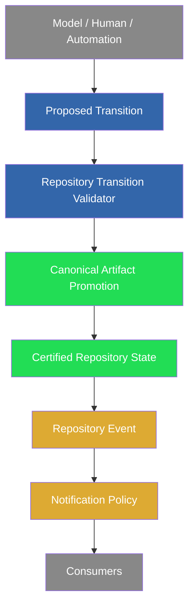

# Phase 114B.1 — Repository Events & Notification Policy

## Status

Completed.

Phase 114B.1 is an architecture/documentation phase. It formalizes
Repository Events as a first-class Repository State Kernel primitive and
freezes the Notification Policy that decides which events are externally
visible. It does not change any runtime behavior implemented in Phase
114B or earlier.

## Origin

Phase 114B's independent forensic verification (see the 114B verification
transcript) established that notification certification, Repository
Transition Validator integration, and canonical artifact promotion all
behave correctly, and that quarantined transitions intentionally produce
no notification. It also identified a gap: the operator has no way to
learn that PCAE successfully prevented an invalid repository transition.
Containment without observability is indistinguishable, from outside the
repository, from containment that never ran. This phase addresses only
that gap, architecturally.

## Repository State Kernel Primitives Summary

Full design: `docs/PCAE_REPOSITORY_EVENTS.md`.

Four primitives, each answering a distinct question:

- **Repository State** -- what exists (113T/113U, `RepositoryState`)
- **Repository Transition** -- what change is proposed (113T/113U,
  `ProposedTransition`)
- **Repository Artifact** -- what durable evidence/state was recorded
  (114A, `ArtifactState`/`promote_artifact`)
- **Repository Event** -- what certified outcome was announced (114B.1)

Every existing subsystem now maps onto these four primitives rather than
its own vocabulary: the Repository Transition Validator operates on
Repository State + Repository Transition; Canonical Artifact Promotion
operates on Repository Artifact; Notification Policy consumes Repository
Event; Push Authorization (114C) will consume all three of State,
Artifact, and Event.

## Repository Event Summary

A Repository Event is emitted once per completed transition evaluation --
Accept, Reject, Quarantine, and Requires Human Review are all completions.
Events never decide anything; they describe an outcome that already
occurred. Lifecycle commands, models, and agents never notify directly --
only the kernel emits events, and only Notification Policy decides which
of those events leave the repository.

## Repository Event Taxonomy

Ten event types frozen as the minimum taxonomy (full definitions:
`docs/PCAE_REPOSITORY_EVENTS.md`):

`TransitionAccepted`, `TransitionRejected`, `TransitionQuarantined`,
`TransitionRequiresHumanReview`, `CanonicalPromotionSucceeded`,
`CanonicalPromotionRejected`, `NotificationDelivered`,
`NotificationFailed`, `NotificationSkipped`, `RetryScheduled`.

Future phases may extend this taxonomy; none may remove or redefine these
ten.

## Notification Policy Summary

Full design: `docs/PCAE_NOTIFICATION_POLICY.md`.

Notification Policy decides which Repository Events are externally
visible; Repository Events themselves remain neutral. The direct answer
to the 114B forensic gap: `TransitionRejected`, `TransitionQuarantined`,
and `TransitionRequiresHumanReview` are frozen as **visible**, not
optional -- containment succeeding is exactly as newsworthy as forward
progress succeeding. `NotificationFailed` must be observable through a
channel that does not depend on the transport that just failed
(non-circularity rule).

## Visibility Policy

| Event | Visibility |
| --- | --- |
| `TransitionAccepted` | visible |
| `TransitionRejected` | visible |
| `TransitionQuarantined` | visible |
| `TransitionRequiresHumanReview` | visible |
| `CanonicalPromotionSucceeded` | visible (folds into acceptance) |
| `CanonicalPromotionRejected` | visible |
| `NotificationDelivered` | not re-notified |
| `NotificationFailed` | visible via a non-transport-dependent channel |
| `NotificationSkipped` | visible only when attention-worthy |
| `RetryScheduled` | not independently visible |

## Wire Diagram Summary

Full canonical lifecycle diagram updated in
`docs/GOVERNANCE_LIFECYCLE_DIAGRAM.md`-adjacent style, reproduced here with
Repository Events made explicit:

Green = implemented and unchanged (113U/114A). Orange = frozen by this
phase, not yet implemented. Gray = external actors/consumers, unchanged.

## Future Consumer Model

Telegram, REST, Dashboard, Web UI, Audit, Monitoring, and future plugins
all subscribe to Notification Policy-visible Repository Events rather than
calling into lifecycle commands directly. None of these consumers,
present or future, requires a change to `validate_transition(...)`,
`promote_artifact(...)`, or `certify_notification_transition(...)` -- see
`docs/PCAE_NOTIFICATION_POLICY.md` for the full consumer table.

## Non-Goals

This phase does not implement an event bus, an `Event` dataclass, a policy
engine, or any change to `certify_notification_transition(...)`,
`validate_transition(...)`, `promote_artifact(...)`, sink behavior, or any
lifecycle command's runtime behavior. It freezes the concept and taxonomy
a future implementation phase must conform to.

## Compatibility Guarantees

This phase does not modify:

- Repository Transition Validator
- Repository Transition Validator integration
- Notification Certification
- Canonical Artifact Promotion
- notification sinks or dispatch
- `pcae phase complete` / `pcae task finish --commit` runtime behavior
- `pcae push check`
- Permission Broker
- REST, Web UI, Dashboard
- Telegram inbound

Execution capability remains unavailable. Runtime state remains Observed.
Maximum plugin capability remains `observe`.

## Validation

Validation completed:

- focused architecture/documentation tests: see final report
- governance/autonomy tests: see final report
- release/lifecycle regression: see final report
- fast_green: see final report
- `pcae health`: healthy
- `pcae check`: passed
- `pcae doctor task-memory`: clean
- `pcae push check`: see final report
- `pcae session bootstrap --compact --profile implementation`: completed
- `pcae runtime inspect --json`: execution availability `unavailable`, runtime state `Observed`, maximum plugin capability `observe`
- `pcae notify status`: checked before and after sourcing Telegram env
- `pcae skill invoke phase-finalization 114B.1`: resolved, target status completed

## Recommended Next Phase

114C — Push Authorization & Repository Trust Integration
