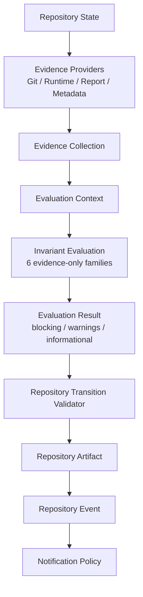

# Phase 115E — Repository Decision Evaluation Prototype

## Status

Completed. Deterministic evaluation prototype only: not Repository
Transition Validator integration, not lifecycle integration. No
Repository Skills, no execution, no authorization, no Repository
Transition Validator behavior changes, no lifecycle command changes, no
Notification Policy changes, no Canonical Artifact Promotion changes, no
Push-State Reconciliation changes, no Post-Push Canonicalization
changes, no Telegram changes, no REST, no Dashboard, no plugins, no
SLM/LLM integration.

## Purpose

Implement the deterministic Repository Decision Evaluation layer between
115D's Evidence Providers and the Repository Transition Validator.
Evidence never decides; evaluation is deterministic; the Repository
Transition Validator remains the only authority capable of determining
repository state transitions.

Implementation: `src/pcae/core/decision_evaluation.py`.

## Evaluation Framework

### EvaluationContext

Immutable (`@dataclass(frozen=True)`), carrying: `evidence:
EvidenceCollection`, `evaluation_id`, `evaluation_timestamp`,
`repository_snapshot_reference`, `evaluation_version`. Deliberately
carries no live handle to anything re-queryable — only the already-
collected `EvidenceCollection` and identity/provenance metadata for the
evaluation run itself.

### InvariantResult

One evaluated invariant: `invariant_id`, `status` (`InvariantStatus`),
`severity` (`blocking`/`warning`/`informational`),
`supporting_evidence`/`conflicting_evidence` (`EvidenceReference`
tuples — stable Evidence ID citations, never inlined copies),
`explanation` (deterministic, template-generated text), and an optional
`suggested_repair`.

### EvaluationResult

The aggregated outcome of one evaluation run: `invariant_results`,
`summary`, `blocking_failures`, `warnings`, `informational`, and
`explanation_reference` (deduplicated union of every Evidence ID cited
across all invariant results). **Produces no `TransitionVerdict`** —
that remains the Repository Transition Validator's sole authority.

## Invariant Model

`InvariantStatus` — 4 frozen values, no fifth: `PASS`, `FAIL`,
`UNKNOWN`, `NOT_APPLICABLE`.

Six deterministic, evidence-only invariant families, each a plain
function `(EvidenceCollection) -> InvariantResult`:

| Invariant | Reads | Severity |
| --- | --- | --- |
| `phase_identity_consistency` | `E-report-002` vs `E-metadata-002` | blocking |
| `push_state_consistency` | `E-git-005` vs `E-metadata-003` | blocking |
| `metadata_consistency` | `E-metadata-003` vs `E-metadata-004` (internal) | blocking |
| `report_completeness` | `E-report-003` | blocking (`partial` → warning) |
| `runtime_execution_unavailable` | `E-runtime-002` | blocking |
| `canonical_promotion_eligibility` | `E-report-003` + `E-report-005` | blocking |

**Deliberately independent from `repository_transition_validator.py`**:
four of these six families share a name with one of
`STRUCTURAL_INVARIANTS`' checks (`phase_identity_consistency`,
`metadata_consistency`, `report_completeness`,
`canonical_promotion_eligibility`) because 115E is the evidence-based
analogue those checks are expected to eventually integrate with (115F,
not this phase) — but the two implementations share no code, no import,
and no call path. The validator's checks read `RepositoryState` fields
directly; this module's checks read only `Evidence` items by ID.
Verified directly: `TestNoValidatorIntegration` greps both modules'
import lines for the other's name.

## Explainability Model

Every non-`NOT_APPLICABLE` `InvariantResult` cites at least one
`EvidenceReference` (by stable Evidence ID) in
`supporting_evidence`/`conflicting_evidence` — never inlines evidence
content, so a result is reproducible by re-resolving the same IDs
against the same `EvaluationContext`. Explanations are deterministic,
template-generated strings (e.g. `"Disagreeing phase identity sources:
report='115D', metadata='115E'."`) — never AI-generated prose. Running
`evaluate()` twice against an identical `EvaluationContext` produces an
identical `EvaluationResult` (`TestDeterministicExplanations`).

## Conflict Handling

`push_state_consistency` implements 115B's own literal conflict example
("declared push state disagrees with live push state") directly: when
the Git Provider's derived pushed status and the Metadata Provider's
declared pushed status disagree, **both** items are preserved in
`conflicting_evidence`, `status=FAIL`, and neither is chosen over the
other by provider priority. `metadata_consistency` and
`phase_identity_consistency` follow the identical pattern for their own
respective disagreements.

## UNKNOWN Handling

`UNKNOWN` evidence never silently `PASS`es. Each invariant checks its
inputs' `freshness` first; if any relevant Evidence item has
`freshness=EvidenceFreshness.UNKNOWN`, the invariant's own status is
immediately `UNKNOWN` — evaluated before any pass/fail logic runs.

**Bucketing rule** (`EvaluationResult.blocking_failures`/`warnings`/
`informational`): an invariant with status `UNKNOWN` is bucketed exactly
as if it had `FAIL`ed, by its declared severity — a `blocking`
invariant that could not be evaluated lands in `blocking_failures`, not
`informational`. This is a bucketing convention only; it never mutates
the underlying `InvariantResult.status`, which always still reports the
true `UNKNOWN`.

**A real bug found and fixed during this phase's own smoke-testing**:
the initial "is this evidence unknown?" check also matched
`observed_value == "unavailable"` — but that string is *also* the
correct, genuine domain value for `runtime_execution_unavailable`'s
input (execution really being unavailable is the desired, passing
state). The fix relies solely on `freshness == EvidenceFreshness.UNKNOWN`
to detect provider-side unknown-ness, never on matching the observed
value's string content. Covered by
`test_genuine_unavailable_value_is_pass_not_unknown`.

## No Integration (Confirmed)

`src/pcae/core/decision_evaluation.py`'s only import is
`pcae.core.evidence` (plus `dataclasses`/`enum`/`collections.abc` from
the standard library) — no Git access, no filesystem access, no
subprocesses, no runtime inspection, no lifecycle command access, no
import of `evidence_providers.py` or
`repository_transition_validator.py`. Not called by the Repository
Transition Validator, any lifecycle command (`pcae phase complete`,
`pcae task finish`, `pcae push`), Notification Policy, or `pcae agent
verify-handoff`. No Repository Skills, no execution, no authorization,
no SLM/LLM integration.

## Updated Wire Diagram

`EvaluationResult` flows toward the Repository Transition Validator on
this diagram to show the intended future integration point (115F) — no
such call exists in this phase; the arrow documents an architectural
relationship, not implemented behavior.

## Validation

- Focused: `python -m pytest tests/test_decision_evaluation.py -n auto
  -q -ra --durations=100` — see final report.
- Evidence regression: `python -m pytest tests/test_evidence*.py -n auto
  -q -ra --durations=100` — see final report.
- Runtime/autonomy regression: `python -m pytest tests/test_*runtime*
  tests/test_*contract* tests/test_*autonomy* tests/test_*plugin* -n
  auto -q -ra --durations=100` — see final report.
- Fast-green: `python -m pytest -m "fast_green" -n auto -ra
  --durations=100` — see final report.
- `pcae health` / `pcae check` / `pcae doctor task-memory` / `pcae push
  check` / `pcae agent verify-handoff` / `pcae session bootstrap
  --compact --profile implementation` / `pcae runtime inspect --json` /
  `pcae notify status` — see final report.
- `pcae skill invoke phase-finalization 115E` — see final report.

## Governance

No Repository Transition Validator, lifecycle, Notification Policy,
Canonical Artifact Promotion, Push-State Reconciliation, Post-Push
Canonicalization, Permission Broker, plugin, Telegram inbound, REST, Web
UI, or Dashboard code was changed. Execution capability remains
unavailable. Runtime state remains Observed. Maximum plugin capability
remains `observe`.

## Recommended Next Phase

115F — Repository Decision Evaluation Integration
