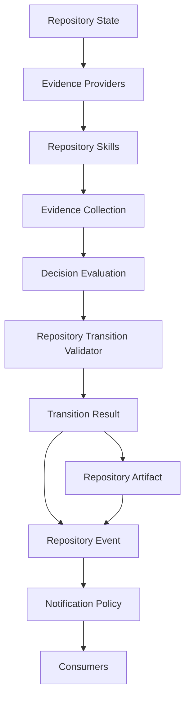

# Phase 115H — Repository Skills Architecture

## Status

Completed. Architecture and design only: no Repository Skill
implemented, no AI/SLM/LLM-backed skill implemented, no DeepSeek
integration, no changes to Evidence Providers, Decision Evaluation, the
Repository Transition Validator, or any lifecycle command. No
execution, authorization, Permission Broker enforcement, plugins,
Telegram inbound, REST, Web UI, or Dashboard capability introduced.

## Purpose

Design Repository Skills as the governed extension mechanism for PCAE
decision support, building on 115C (Evidence), 115D (Evidence
Providers), 115E (Decision Evaluation), 115F (behavior-preserving
integration), and 115G (verified compatibility).

Canonical architecture document:

- `docs/PCAE_REPOSITORY_SKILLS_ARCHITECTURE.md`

This document is the deeper elaboration of the brief sketch 115A left
in `docs/PCAE_REPOSITORY_SKILLS.md` — that file is left unmodified as a
historical artifact; the new document is the canonical Repository
Skills reference going forward.

## Core Principle

**Repository Skills produce evidence. Repository Skills do not
decide.**

## Repository Skills Architecture Summary

A Repository Skill observes repository state, collects or derives
evidence, may enrich existing evidence, and returns an
`EvidenceCollection` — reusing 115C's frozen Evidence shape unmodified.
A skill never mutates repository state, decides, votes, authorizes,
promotes artifacts, sends notifications, bypasses the Repository
Transition Validator, or invokes execution. Structurally, a Repository
Skill is a more disciplined synonym for a 115D Evidence Provider: same
contract, broader intended scope (composition over existing evidence,
and future AI/SLM backing).

## Skill Class Summary

Five skill classes are defined, each mapped onto 115C's existing
`EvidenceDeterminism` enum (no new enum introduced):

| Class | Determinism | Example |
| --- | --- | --- |
| Deterministic | `DETERMINISTIC` | Git Topology Skill |
| Reproducible External | `REPRODUCIBLE_EXTERNAL` | Pinned static-analysis wrapper |
| Advisory | `PROBABILISTIC` | Future DeepSeek/Claude/Codex/GLM/Qwen code-review skill |
| Human-Assisted | `HUMAN_ASSERTED` | Human code-review sign-off skill |
| Experimental | any + `experimental: true` | Prototype skill exploring a new evidence category |

Six deterministic skill concepts are named (design only, no
implementation): Git Topology, Report Consistency, Metadata
Consistency, Architecture Status, Documentation Completeness, and
Test-Result Consistency skills.

## Evidence-Only Boundary

Every skill class, without exception, is bound by the same
prohibitions: never mutate repository state, never decide, never vote,
never authorize, never promote artifacts, never notify, never bypass
the validator, never invoke execution. Advisory skills add strictly
narrower guarantees on top (probabilistic-by-default, labelled
model-produced, never sole authority for Accept) — never a looser set.

## Advisory / AI Skill Boundary

Advisory skills are the governed home for any future AI/SLM/LLM-backed
contribution (DeepSeek, GLM, Qwen, Claude, Codex, or a local SLM). They
must be advisory only, probabilistic by default, labelled
model-produced (via 115C's existing `Evidence.producer`/
`EvidenceProvenance`, no new field needed), never sole authority for
Accept, never allowed to mutate state or finalize/push/notify, and
allowed only to produce evidence.

## DeepSeek Future Pilot Boundary

DeepSeek must not be reintroduced as lifecycle authority, decision-
maker, approver, artifact-promoter, notifier, or execution authority,
under any framing. Any future DeepSeek pilot must be scoped as a
bounded Advisory Repository Skill: evidence-only, `model_produced:
true`, `PROBABILISTIC` by default, never sole authority for Accept,
subject to the same `EvidenceConfidence`/severity handling as every
other evidence item.

## Skill Lifecycle Summary

Seven stages: registered -> configured -> invoked -> evidence produced
-> evidence validated -> evidence consumed by Decision Evaluation ->
result referenced in explanation. No stage authorizes, decides,
mutates, promotes, or notifies. Registration reuses 110C's existing
Runtime Registry / Plugin Discovery concept rather than inventing a
second one.

## Skill Manifest Concept

Documented, not frozen: `skill_id`, `name`, `version`, `class`,
`determinism`, `categories produced`, `required inputs`, `allowed
outputs`, `side-effect policy`, `timeout policy`, `failure behavior`,
`confidence defaults`, `model-produced flag`. Schema freeze explicitly
deferred to 115I, mirroring the established architecture-then-
contract-freeze pattern of this arc (115A->115B, 113S->113T).

## Skill Safety Boundary

Skills must never own Repository State, Repository Transition,
Repository Artifact promotion, Repository Event emission, Notification
Policy, lifecycle authority, or execution authority — an exhaustive
list covering 114R's four kernel primitives plus every governance
authority a skill could plausibly be tempted to acquire.

## Wire Diagram Summary

Repository Skills sit strictly between Evidence Providers and Evidence
Collection. Decision Evaluation cannot tell, and does not need to tell,
whether an `Evidence` item came from a 115D Provider or a Skill —
identical to how 115F's validator-adapted evidence already reuses
115D's Evidence IDs with 115E's evaluators unmodified.

## Tests

`tests/test_phase_115h_repository_skills_architecture.py` (new):
architecture/documentation verification only. Verifies both new docs
exist and contain: the Repository Skill definition, all five skill
classes, all six deterministic skill examples, the advisory skill
boundary, the DeepSeek future pilot boundary, the seven-stage
lifecycle, the manifest concept field list, the safety boundary, the
Mermaid wire diagram, and explicit "no implementation"/"execution
capability remains unavailable" confirmations. No implementation-claim
strings (e.g. new `src/pcae/core/` skill modules) are asserted to
exist — the tests confirm none were added.

## Validation

- focused architecture/documentation tests: see final report
- `pcae health`: see final report
- `pcae check`: see final report
- `pcae doctor task-memory`: see final report
- `pcae push check`: see final report
- `pcae agent verify-handoff`: see final report
- `pcae session bootstrap --compact --profile implementation`: see final report
- `pcae runtime inspect --json`: see final report
- `pcae notify status`: see final report
- `pcae skill invoke phase-finalization 115H`: see final report

## Governance

No Evidence Provider, Decision Evaluation, Repository Transition
Validator, or lifecycle command behavior changed. No Repository Skill,
AI/SLM/LLM-backed skill, or DeepSeek integration implemented. No
execution, authorization, Permission Broker enforcement, plugins,
Telegram inbound, REST, Web UI, or Dashboard capability introduced.

Execution capability remains unavailable. Runtime state remains
Observed. Maximum plugin capability remains `observe`.

## Recommended Next Phase

115I — Repository Skills Contract Freeze
