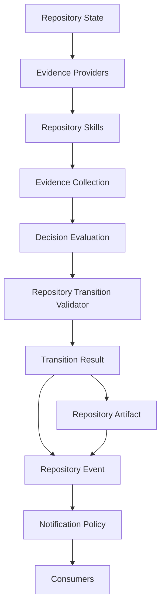

# Phase 115I — Repository Skills Contract Freeze

## Status

Completed. Contract freeze only: no Repository Skill implemented, no
deterministic skill implemented, no AI/SLM/LLM-backed skill
implemented, no DeepSeek integration, no changes to Evidence
Providers, Decision Evaluation, the Repository Transition Validator,
lifecycle commands, Notification Policy, Canonical Artifact
Promotion, Push-State Reconciliation, or Post-Push Canonicalization.
No execution capability.

## Purpose

Freeze the Repository Skills contract 115H designed, so every future
Repository Skill — deterministic or advisory — must conform to exactly
the same interface.

Canonical contract document:

- `docs/PCAE_REPOSITORY_SKILLS_CONTRACT.md`

## Core Principle

Repository Skills never decide. Repository Skills produce Evidence.
Repository Skills are model-agnostic.

## Repository Skill Contract Summary

The frozen `RepositorySkill` interface requires every skill to declare
capabilities, evidence categories produced, determinism class,
confidence defaults, and required repository inputs, and to produce
only an `EvidenceCollection` (115C's frozen shape). Explicitly and
permanently forbidden: repository mutation, decision making, validator
bypass, lifecycle authority, artifact promotion, notification
dispatch, execution, authorization, commit, push, and finalize.

## Capability Model

`RepositorySkillCapability` describes evidence outputs, never
implementations. Frozen minimum set: `git_analysis`,
`runtime_analysis`, `architecture_analysis`, `documentation_analysis`,
`report_analysis`, `metadata_analysis`, `dependency_analysis`,
`ai_review`. Two skills may declare the same capability while using
entirely different internal logic — Decision Evaluation is unaffected
either way.

## Manifest Summary

Frozen fields, no schema/loader/registry implemented: `skill_id`,
`name`, `version`, capability list, `determinism`, confidence policy,
evidence categories, required inputs, optional inputs, `timeout`,
failure policy, side-effect policy, model-produced flag, experimental
flag.

## Determinism Classes

Five classes frozen, reusing 115C's existing `EvidenceDeterminism`
enum with no new member: `deterministic`, `reproducible_external`,
`probabilistic`, `human_assisted`, `experimental` (the last being any
determinism value plus a manifest-level `experimental: true` flag).

## Failure Contract

Every Repository Skill failure must produce exactly one of two
outcomes: honest `UNKNOWN` evidence (115D's established pattern) or an
explicit, structured failure outcome. Never partial hidden failure.
Never silent success — a timeout is itself a failure requiring one of
the two outcomes, never a fabricated passing result.

## Advisory Boundary

Future DeepSeek, GLM, GPT, Qwen, or local-SLM-backed skills must
produce advisory evidence only, declare `probabilistic` determinism by
default, be labelled model-produced (via 115C's existing
`Evidence.producer`/`EvidenceProvenance`), never become sole authority
for Accept, and never bypass Decision Evaluation — advisory evidence
flows through the identical `EvidenceCollection` -> `evaluate()` path
as every other evidence item.

## Composition Model

One Repository Skill may internally use multiple 115D Evidence
Providers to assemble its own evidence. Decision Evaluation never sees
this internal composition — it receives only an `EvidenceCollection`,
looked up by evidence ID/category, never by producing skill or
provider.

## Explainability Summary

Every Evidence item a Repository Skill produces must preserve
provenance via 115C's existing `Evidence.provenance` field — no new
provenance field introduced. Decision explanations reference Evidence
IDs (`EvaluationResult.explanation_reference`,
`InvariantResult.supporting_evidence`/`conflicting_evidence`)
regardless of which Repository Skill produced them — a guarantee
115G already verified end-to-end for adapter-produced evidence, now
frozen as contract for skill-produced evidence with zero additional
code required.

## Wire Diagram

Unchanged from 115H's diagram; frozen here as canonical rather than
merely descriptive.

## Tests

`tests/test_phase_115i_repository_skills_contract_freeze.py` (new):
architecture/documentation verification only. Verifies both new docs
exist and contain the frozen `RepositorySkill` contract, the
capability model, the manifest field list, the five determinism
classes, the failure contract, the advisory boundary, the composition
model, explainability requirements, the Mermaid wire diagram, and
explicit "no implementation"/"execution capability remains
unavailable" confirmations. No implementation-claim strings are
asserted to exist — the tests confirm none were added.

## Validation

- focused architecture/documentation tests: see final report
- `pcae health`: see final report
- `pcae check`: see final report
- `pcae doctor task-memory`: see final report
- `pcae push check`: see final report
- `pcae agent verify-handoff`: see final report
- `pcae session bootstrap --compact --profile implementation`: see final report
- `pcae runtime inspect --json`: see final report
- `pcae notify status`: see final report
- `pcae skill invoke phase-finalization 115I`: see final report

## Governance

No Evidence Provider, Decision Evaluation, Repository Transition
Validator, lifecycle command, Notification Policy, Canonical Artifact
Promotion, Push-State Reconciliation, or Post-Push Canonicalization
behavior changed. No Repository Skill, deterministic skill,
AI/SLM/LLM-backed skill, or DeepSeek integration implemented.

Execution capability remains unavailable. Runtime state remains
Observed. Maximum plugin capability remains `observe`.

## Recommended Next Phase

115J — Repository Skills Prototype
