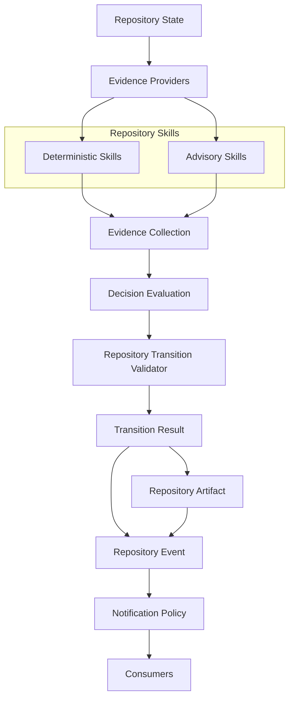

# Phase 115L — Repository Skills Integration Design

## Status

Completed. Architecture and design only: no Repository Skills
integration implemented, no Repository Skill modified, no Evidence
Provider modified, no Decision Evaluation modified, no Repository
Transition Validator modified, no lifecycle command modified, no
Notification Policy modified, no Canonical Artifact Promotion
modified, no Push-State Reconciliation modified, no Post-Push
Canonicalization modified. No execution capability.

## Purpose

Design how Repository Skills (115H design, 115I contract freeze, 115J
prototype, 115K verification) become the primary evidence-acquisition
layer for Decision Evaluation, without changing any observable
lifecycle behavior.

Canonical architecture document:

- `docs/PCAE_REPOSITORY_SKILLS_INTEGRATION_ARCHITECTURE.md`

## Integration Architecture Summary

Repository Skills become the sole orchestrators of Evidence Providers.
Decision Evaluation no longer knows which providers exist — it
receives only an `EvidenceCollection`, exactly the shape it already
has today (`evaluate(context: EvaluationContext)` has never accepted a
provider or skill argument). The target pipeline:

```
Repository State -> Evidence Providers -> Repository Skills
    -> Evidence Collection -> Decision Evaluation
    -> Transition Validator
```

replaces today's reality where 115F's validator adapter builds
`Evidence` directly from `RepositoryState` and 115J's Repository
Skills exist as a parallel, currently-unused path.

## Orchestration Summary

Decision Evaluation must never construct, discover, or call an
Evidence Provider directly, and must never know provider ordering —
Repository Skills own provider orchestration exclusively. One
Repository Skill may invoke zero, one, or multiple providers, merging
its own `EvidenceCollection` before returning (115J's
`RepositorySkillResult.evidence` per skill;
`RepositorySkillRegistry.merge_evidence()` across skills — the only
two merge points that may ever exist). A skill may compose sub-skills
internally, preserving deterministic invocation order (115K already
verified this property for multi-skill invocation) with no recursive
cycles permitted.

## Migration Strategy

Four stages, frozen:

1. **Stage 1** (current production reality) — Decision Evaluation
   consumes `RepositoryState`-derived evidence via 115F's adapter.
2. **Stage 2** (completed: 115J/115K) — Repository Skills wrap
   Evidence Providers, proven read-only/deterministic/
   provider-equivalent, not yet wired into any real path.
3. **Stage 3** (not started; candidate for 115M) — Decision Evaluation
   receives Repository Skill output, proven via tests before any
   lifecycle command changes to prefer it.
4. **Stage 4** (not started) — Evidence Providers become fully
   encapsulated behind Repository Skills; no code outside
   `repository_skills.py` imports `evidence_providers.py` directly.

Each stage is additive and reversible; this phase does not authorize
skipping or collapsing stages.

## Dependency Direction

```
Repository Skills   -> Evidence Providers
Decision Evaluation  -> Evidence (only)
Transition Validator -> EvaluationResult (only)
```

One-way only, no reverse dependency: Evidence Providers never import
Repository Skills; Evidence never imports Decision Evaluation;
`EvaluationResult` never imports the Transition Validator.

## Compatibility Guarantees

No provider API change (`EvidenceProvider.collect(context) ->
EvidenceProviderResult` unchanged); no Decision Evaluation semantic
change (the six frozen invariant families keep evaluating whatever
evidence is present, unaware of pipeline shape); no Transition
Validator behavior change (`validate_transition`'s structural checks
remain sole verdict authority); no lifecycle command change (`pcae
phase complete`/`pcae task finish --commit` continue calling the
existing 115F adapter path unchanged).

## AI Insertion Point

Future AI-backed Repository Skills (DeepSeek, GLM, GPT, Qwen, local
SLM) fit beside deterministic Repository Skills as parallel
implementations of the same `RepositorySkill` interface, both merging
into the same `EvidenceCollection`. Decision Evaluation and the
Transition Validator remain unaware of which skills ran or whether any
were model-backed. Repository State remains authoritative — no AI
skill's evidence becomes a second source of truth; it is transient,
evaluation-scoped evidence like any other skill's output, and cannot
alone satisfy a blocking invariant (115B's frozen confidence model
already requires deterministic/reproducible-external evidence for
that).

## Wire Diagram Summary



Deterministic and Advisory Repository Skills are parallel
implementations under one Repository Skills layer; Decision Evaluation
cannot tell, and does not need to tell, which kind of skill (or
whether a skill at all) produced a given `Evidence` item.

## Tests

`tests/test_phase_115l_repository_skills_integration_design.py` (new):
architecture/documentation verification only. Verifies both new docs
exist and contain: the integration architecture, the integration
boundary, the orchestration model, the skill composition model
(sub-skills, no cycles), compatibility guarantees, the four-stage
migration strategy, the dependency direction, the AI insertion point,
the Mermaid wire diagram, and explicit "no implementation"/"execution
capability remains unavailable" confirmations. No implementation-claim
strings are asserted to exist — the tests confirm none were added.

## Validation

- focused architecture/documentation tests: see final report
- `pcae health`: see final report
- `pcae check`: see final report
- `pcae doctor task-memory`: see final report
- `pcae push check`: see final report
- `pcae agent verify-handoff`: see final report
- `pcae session bootstrap --compact --profile implementation`: see final report
- `pcae runtime inspect --json`: see final report
- `pcae notify status`: see final report
- `pcae skill invoke phase-finalization 115L`: see final report

## Governance

No Repository Skill, Evidence Provider, Decision Evaluation,
Repository Transition Validator, lifecycle command, Notification
Policy, Canonical Artifact Promotion, Push-State Reconciliation, or
Post-Push Canonicalization behavior changed. No Repository Skills
integration implemented.

Execution capability remains unavailable. Runtime state remains
Observed. Maximum plugin capability remains `observe`.

## Recommended Next Phase

115M — Repository Skills Integration Prototype
