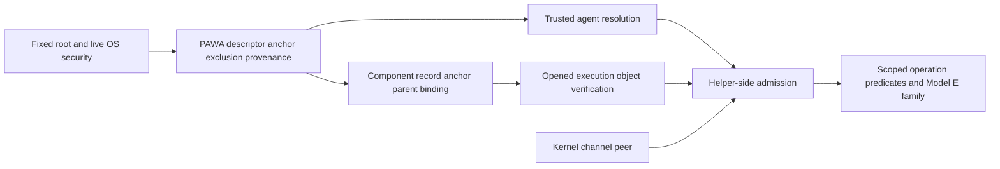

# Independent Model I-B identity contract verification

Canonical Phase ID: `149O.20L.7O.3W.1R.2B.1R.1.1R.30R.5R.2.1R.1R.2R.1R.1R.1R.1.1R.1R.1R.1R.1R.1R.1R.1R.1R.1R.1.1R.1R.1R.1R.1R.1R.1R.1R.1R.1R.1R.1R.1R.1R.1R.1R.1.1.1.1.1.1.1.1.1.1.1.1.1.1.1.1.1.1.1.1.1.1.1.1.1.1.1.1.1.1.1`

Alias: **N16-5-F-5-TB-HELPER-INSTALLATION-IDENTITY-CONTRACT-REPAIR-IV**

Title: Independent Adversarial Verification of Model I-B Installation Identity and Helper Admission Contracts

Independent technical verdict: **COMPLETE — NOT VERIFIED / BLOCKED**. Finding **F1: no consistently authorized, non-circular helper registration/provisioning executor and provenance path; sole-current-lineage rotation is also contradictory**. The contract set is **NOT READY FOR IMPLEMENTATION**. Production identity/admission remains **NOT IMPLEMENTED**. This document freezes technical evidence; actual commit/push/completion/notification results are maintained by the canonical phase-completion metadata and generated Phase Report.

## Governance, entry and predecessor reconstruction

Baseline/final predecessor HEAD: `c4f452c6a8e5d45b7076cd984d6f701a01cfa5e4`; main clean and synchronized with origin/main, ahead 0 at entry. No active governed phase; the explicit idle task was transitioned through PCAE. Check PASS, health healthy, status coherence coherent before activation. Agent codex-local acquired the governed lock. Full source/contract SHA-256 baseline is [baseline.json](evidence/helper-installation-identity-iv/baseline.json).

Actual predecessor: `149O.20L.7O.3W.1R.2B.1R.1.1R.30R.5R.2.1R.1R.2R.1R.1R.1R.1.1R.1R.1R.1R.1R.1R.1R.1R.1R.1R.1.1R.1R.1R.1R.1R.1R.1R.1R.1R.1R.1R.1R.1R.1R.1R.1R.1.1.1.1.1.1.1.1.1.1.1.1.1.1.1.1.1.1.1.1.1.1.1.1.1.1.1.1.1.1` — N16-5-F-5-TB-HELPER-INSTALLATION-IDENTITY-CONTRACT-REPAIR. Its completed transaction, completed task, finalized delivery receipt and delivered canonical report establish canonical completion. Historical pending-completion prose is non-authoritative generation residue. A separate reconciliation diagnostic re-rendered JSON fast_green dictionary keys in a different order; semantic object equality and original delivered Markdown/marker/transaction digest agree. No historical report or notification was rewritten/reissued.

Predecessor entry was `79ea7e1644535d011da6ca3869b5557b44c50737`. Exact attributed commits in chronological order:

| Commit | Role |
|---|---|
| 2c91cce42f42ffa79d38e9b730d12f46aee1c30d | contract repair and initial tests/evidence |
| 7e73083ac2b327254dc64dc9ae83b55fb30c0d01 | historical epoch expectations and attribution evidence |
| 27a4d731d04852918429795c99dcf9ae7116a319 | task closure / passing checkpoint |
| c2bca0bd4e870bd41d940d645fba740600a60af0 | pushed attribution and final report |
| c4f452c6a8e5d45b7076cd984d6f701a01cfa5e4 | final evidence inventory bookkeeping |

The report enumerated the first four; the enclosing fifth could not self-embed its own hash. The Fast Green candidate 27a4d731 is not final HEAD c4f452c6: subsequent commits are Class B reporting, not contract/source evolution. The final predecessor report records post-push clean/ahead0. Git and complete source hashes show no predecessor source change and no authority-bearing drift after the repair. FOUNDATION-REPAIR was a pre-activation stop, never a lineage node.

CPIPC was independently derived with live `pcae.core.phase_id.parse` and `scan_tokens`, current predecessor and full git history: normalized direct first unused numeric child, one additional component, no collision. Activation followed validation. Historical missing-B ancestry reconciliation remains closed. Transition validator checks intra-phase identity consistency, **not ancestry**; independent derivation supplies ancestry evidence here. Its implementation is untouched.

## Exact identity model and trust argument

Model I-B means **distinct typed component installations**, not one shared identifier or a new root issuer. HELPER172–183, PAWA341–344, PPA104–108 and the normative JSON annex define the current epoch. Earlier incompatible shared hpahi/hpawi equality and generic-H-only profile interpretations are explicitly superseded. The repair rejected a common installation token (I-A), a new root installation issuer (I-C), and a mere wording-only currentness fix (I-D); explicit typed cross-bindings are required. No alternative is selected by this IV.

| Identity / category | Trusted source and consumer | Relationship / currentness / authority |
|---|---|---|
| PAWA `hpawi` logical installation | existing protected descriptor/current anchor independently recognized from fixed root + live OS + provenance | parent, not H/P; PAWA recognition cannot depend on component admission; record is non-bearer |
| H `hpahi` logical installation | schema2 helper record and anchor, verified opened executable | privileged profile; exact `pawa_binding`; distinct from hpawi/hppi; record/digest alone no admission |
| P `hppi` logical installation | PPA2.1 schema2 record/descriptor/currentness | presentation profile; own generation/digest/renderer; exact PAWA parent; H cannot impersonate P |
| PAWA generation | parent current anchor | distinct counter; parent rotation invalidates component bindings |
| H deployment generation | helper current anchor | H lineage only, monotonic replacement; numeric coincidence with PAWA/P is not equality of identity |
| P generation / helper deployment generation | P installation/descriptor binding | names P lineage in P profile; never H currentness |
| Installation/helper/descriptor digests | canonical records and verified execution object | integrity/binding only; equal bytes do not restore stale installation authority |
| Protected root identity | fixed root live device/inode and security predicates | single existing trust root; copied metadata from another root fails binding |
| Deployment-owner OS uid/gid | validated installation profile + live OS | helper and actual admitted peer uid equal owner; ownership alone insufficient |
| Helper process OS principal | real process/profile verification | distinct configured-agent uid; not human principal or logical installation |
| Admitted peer pid/uid/gid | kernel authenticated one-shot channel | uid equals deployment owner, not configured agent; no request credential substitution |
| Configured PCAE agent label | canonical governance context | logical agent is not OS account or producer provenance; cannot authorize by name |
| Configured-agent OS account/uid/groups | protected PAWA exclusion record + trusted live resolver and pinned uid | mandatory exactly-one resolution; owner/helper/peer inequality and effective write exclusion; missing/None/stale/ambiguous DENY |
| Human principal / actual election | separate protected authentication and informed APPROVE | not OS username, peer, installer, agent, digest or installation string |
| Model E authority-family identity | verified process-local typed mint after admission and operation predicates | three exact distinct families, non-exportable/nonpersistent; no HPACWriterCapability relation |
| Foundation comparison principal today | sealed legacy binding or ambient-process fallback | current implementation limitation: owner helper fallback is misidentified as configured agent; later repair, not authority here |

Installation descriptors may persist and be serialized as evidence, but copying/JSON/pickle/deepcopy/logging/restart does not preserve active authority. Active provenance/authority cannot cross IPC or disk. No request may choose root, trusted path, resolver, profile, configured-agent account, authoritative generation or writer family. Request values are only exact echoes/comparisons of independently recognized facts. Owner/helper/peer equality is intentional; owner/configured-agent equality is unsupported and denied. Human identities inhabit a separate category, not numeric OS inequality assertions.

Runtime trust graph (edges identify independently checked prerequisites):

PAWA verifier roots in fixed-root OS/provenance predicates, never the component it verifies. Component verifier consumes live recognized parent and checks exact tuple. Kernel peer is independent OS evidence. PPA launch proves only selected execution object/currentness, never admission or actual APPROVE. No runtime loop was found. **Creating the component registration graph still has F1 below.** Machine graph: [trust-graph.json](evidence/helper-installation-identity-iv/trust-graph.json).

## F1 concrete reproduction and affected clauses

PAWA328 requires configure_privileged_helper itself to pass §33C as admin_mutation and says registration metadata is written by a verified helper process. PAWA311/342 requires that helper already have registered current schema2 generation and exact PAWA parent binding. HELPER023/024 requires PAWA writer provenance/capability for initial registration. HELPER175 and PAWA343 instead assign external recognized owner provisioning and prohibit a helper from registering/rotating/revoking its active executing lineage. HELPER144/145 confines Model E mint to protected dispatch; HELPER183 preserves the legacy-factory prohibition.

1. Start with valid independently recognized PAWA root, installed H bytes, no H record/anchor. PAWA328 requires admitted H to write registration. PAWA311/342 denies H without registration. P cannot admin-mutate. An external coordinator still cannot satisfy the required executor. This is the directed cycle H registration → registered H admission → H registration.
2. Start with exactly one current H=A generation1. Rotate or revoke A. PAWA328 requires current H execution, while HELPER175 prohibits A changing its active lineage. Another H cannot become current under the same fixed anchor until that blocked transition happens.
3. Raw external writes do not close the gap: PAWA056 bootstrap exception covers root/manifest/PAWA descriptor/current anchor/audit; PAWA194 adds exclusion-record provisioning/provenance. Neither freezes an external H/P component writer/provenance exception. Reading HELPER175 as implicit supersession of PAWA328 still leaves that load-bearing producer mechanism unspecified.

Fresh tests enumerate the candidate executors for initial registration, rotation and revocation and find no consistent one under these clauses. They are contract constraint tests, not a production authorization emulator. This finding establishes an implementation-readiness defect, **not a demonstrated current unprivileged write bypass**. No contract was silently repaired in IV.

Smallest repair surface: explicitly reconcile PAWA327/328/343 and HELPER023/024/175/181 with one bounded externally rooted component-provisioning producer/provenance path, or an independently admitted non-circular executor. Preserve no legacy helper factory import, no self-trust, no second root, fixed paths, create-only records/atomic anchors and exact Model E families. Then fresh independent IV is required.

## Admission, failure, replay and currentness reconstruction

The safe intended sequence is trusted fixed profile/installation selection and opened execution object verification; helper-side kernel peer authentication; independent PAWA/exclusion recognition and live account resolution; owner/peer/helper relationship checks; exact component-parent currentness; schema/closed operation/freshness/request binding and durable replay admission; operation-specific predicates; dispatch. Every required conjunct is mandatory. HELPER179 permits only trusted primitive provenance reads before admission, avoiding an artificial read-needs-admission cycle. No protected operation may run before those predicates.

All five operation names remain closed. Privileged H handles its allowed admin/certification/read/ceremony surface; P owns presentation evidence after its original admitted ceremony and actual APPROVE (HELPER180/PPA106). Generic H IPC may not dispatch a fifth-operation substitute. Read operations do not bypass admission. PPA launch is not the helper-side admission verifier, evidence writer or human approver. Two-stage ceremony admission then actual election then local evidence facade is coherent under PPA091/106; no new authentication operation or generic broker is introduced.

Missing/unreadable/malformed/wrong-schema/unknown-field/duplicate/stale/revoked/mismatched-generation/installation/digest/path/root/provenance, symlink/nonregular/wrong owner/mode, OS errors, unavailable resolver, empty or multiple resolution, unsupported platform and unverifiable currentness all deny. None never skips protected production exclusion. Environment, argv, username alone, module state or request identities are not authority. Failure taxonomy remains closed and maps failures to existing codes.

Exact tuple at admission and immediately before mutation: profile, component installation_id, component generation, component installation_digest, helper_sha256, pawa_binding; P additionally descriptor_digest/renderer_profile/ceremony binding. Parent/component generations are independently current, not compared merely as equal integers. Schema1/historical records are installer-only repair inputs, never runtime eligibility. Reinstall/rollback/copied bytes do not resurrect retired currentness. PAWA069/070 bounds TOCTOU claims and requires expected-current compare/write; no absolute race-elimination claim is inferred. Actual atomicity/currentness and retained-process group behavior remain implementation-IV obligations.

## Fresh matrices and normative inventory

All matrices are machine-readable in [matrices.json](evidence/helper-installation-identity-iv/matrices.json). Each row specifies source, consumer, origin, currentness, installation/generation/peer/agent binding, request influence, replayability, failure, conveyed authority and explicitly unconveyed authority. No load-bearing blank cells. PERMIT means the stated contract combination is allowed, not production authorization; DEFERRED IMPLEMENTATION DEPENDENCY is never permission.

| Matrix | Cases |
|---|---:|
| A_identity | 4 |
| B_trust_sources | 3 |
| C_equality | 4 |
| D_admission | 6 |
| E_agent_exclusion | 22 |
| F_currentness | 13 |
| G_request_control | 16 |
| H_failures | 20 |
| I_dependencies | 3 |
| J_Model_E | 10 |
| K_platform | 5 |
| L_rotation | 7 |

### A_identity

| Case | Disposition | Clauses |
|---|---|---|
| PAWA hpawi distinct H hpahi distinct P hppi | PERMIT | HELPER172, HELPER176 |
| P generation names P only | PERMIT | HELPER172, HELPER176 |
| human principal distinct OS and producer | PERMIT | HELPER172, HELPER176 |
| OS uid used as installation ID | DENY | HELPER172 |

### B_trust_sources

| Case | Disposition | Clauses |
|---|---|---|
| root -> PAWA -> component -> admission -> typed operation | PERMIT | HELPER175, HELPER178 |
| H generation1 registration through registered H | DENY | PAWA328, PAWA311, HELPER175 |
| external installer authors H without specified provenance authority | DENY | HELPER023, PAWA328, PAWA343 |

### C_equality

| Case | Disposition | Clauses |
|---|---|---|
| helper uid = peer uid = owner uid != agent uid | PERMIT | HELPER178 |
| hpahi = hpawi or hppi | DENY | HELPER172 |
| human ID numeric equals UID | NOT APPLICABLE | HELPER178 |
| component generation equals parent generation numerically | NOT APPLICABLE | HELPER176 |

### D_admission

| Case | Disposition | Clauses |
|---|---|---|
| verified executable before peer checks | PERMIT | HELPER178, HELPER179, PAWA311 |
| peer and agent checks before request-driven reads | PERMIT | HELPER178, HELPER179, PAWA311 |
| request/profile validation before replay reservation | PERMIT | HELPER178, HELPER179, PAWA311 |
| reservation before mutation boundary | PERMIT | HELPER178, HELPER179, PAWA311 |
| P ceremony admission before election; write eligibility after election | PERMIT | HELPER178, HELPER179, PAWA311 |
| launch substitutes for admission | DENY | HELPER036, HELPER180 |

### E_agent_exclusion

| Case | Disposition | Clauses |
|---|---|---|
| absent | DENY | HELPER178, HELPER182, PAWA344 |
| None | DENY | HELPER178, HELPER182, PAWA344 |
| empty | DENY | HELPER178, HELPER182, PAWA344 |
| malformed | DENY | HELPER178, HELPER182, PAWA344 |
| unresolved | DENY | HELPER178, HELPER182, PAWA344 |
| multiple ambiguous resolution | DENY | HELPER178, HELPER182, PAWA344 |
| stale | DENY | HELPER178, HELPER182, PAWA344 |
| wrong generation | DENY | HELPER178, HELPER182, PAWA344 |
| wrong installation | DENY | HELPER178, HELPER182, PAWA344 |
| request supplied | DENY | HELPER178, HELPER182, PAWA344 |
| environment supplied | DENY | HELPER178, HELPER182, PAWA344 |
| caller path | DENY | HELPER178, HELPER182, PAWA344 |
| mutable module claim | DENY | HELPER178, HELPER182, PAWA344 |
| username only | DENY | HELPER178, HELPER182, PAWA344 |
| silent downgrade | DENY | HELPER178, HELPER182, PAWA344 |
| same peer uid | DENY | HELPER178, HELPER182, PAWA344 |
| same helper uid | DENY | HELPER178, HELPER182, PAWA344 |
| group write | DENY | HELPER178, HELPER182, PAWA344 |
| other write | DENY | HELPER178, HELPER182, PAWA344 |
| ACL write | DENY | HELPER178, HELPER182, PAWA344 |
| unsafe ancestor | DENY | HELPER178, HELPER182, PAWA344 |
| resolver error | DENY | HELPER178, HELPER182, PAWA344 |

### F_currentness

| Case | Disposition | Clauses |
|---|---|---|
| previous generation | DENY | HELPER176, HELPER181, PPA107 |
| future generation | DENY | HELPER176, HELPER181, PPA107 |
| unknown generation | DENY | HELPER176, HELPER181, PPA107 |
| mixed H/P generation | DENY | HELPER176, HELPER181, PPA107 |
| old parent | DENY | HELPER176, HELPER181, PPA107 |
| old exclusion digest | DENY | HELPER176, HELPER181, PPA107 |
| rotated during request | DENY | HELPER176, HELPER181, PPA107 |
| revoked before mutation | DENY | HELPER176, HELPER181, PPA107 |
| same bytes superseded ID | DENY | HELPER176, HELPER181, PPA107 |
| stale cache | DENY | HELPER176, HELPER181, PPA107 |
| copied root | DENY | HELPER176, HELPER181, PPA107 |
| restart active admission | DENY | HELPER176, HELPER181, PPA107 |
| independent current counters 3/5/7 | PERMIT | HELPER176 |

### G_request_control

| Case | Disposition | Clauses |
|---|---|---|
| select installation | DENY | HELPER173, HELPER174, HELPER177, HELPER178 |
| select parent | DENY | HELPER173, HELPER174, HELPER177, HELPER178 |
| select peer | DENY | HELPER173, HELPER174, HELPER177, HELPER178 |
| select agent | DENY | HELPER173, HELPER174, HELPER177, HELPER178 |
| select path | DENY | HELPER173, HELPER174, HELPER177, HELPER178 |
| select root | DENY | HELPER173, HELPER174, HELPER177, HELPER178 |
| select verifier | DENY | HELPER173, HELPER174, HELPER177, HELPER178 |
| select family | DENY | HELPER173, HELPER174, HELPER177, HELPER178 |
| unknown operation | DENY | HELPER173, HELPER174, HELPER177, HELPER178 |
| arbitrary mutation target | DENY | HELPER173, HELPER174, HELPER177, HELPER178 |
| extra field | DENY | HELPER173, HELPER174, HELPER177, HELPER178 |
| duplicate field | DENY | HELPER173, HELPER174, HELPER177, HELPER178 |
| symlink alias | DENY | HELPER173, HELPER174, HELPER177, HELPER178 |
| hardlink alias | DENY | HELPER173, HELPER174, HELPER177, HELPER178 |
| same ID changed bytes | DENY | HELPER173, HELPER174, HELPER177, HELPER178 |
| same bytes changed metadata | DENY | HELPER173, HELPER174, HELPER177, HELPER178 |

### H_failures

| Case | Disposition | Clauses |
|---|---|---|
| missing file | DENY | HELPER020, HELPER028, HELPER045, HELPER182, PAWA314 |
| unreadable file | DENY | HELPER020, HELPER028, HELPER045, HELPER182, PAWA314 |
| malformed JSON | DENY | HELPER020, HELPER028, HELPER045, HELPER182, PAWA314 |
| wrong schema | DENY | HELPER020, HELPER028, HELPER045, HELPER182, PAWA314 |
| unknown field | DENY | HELPER020, HELPER028, HELPER045, HELPER182, PAWA314 |
| duplicate record | DENY | HELPER020, HELPER028, HELPER045, HELPER182, PAWA314 |
| revoked record | DENY | HELPER020, HELPER028, HELPER045, HELPER182, PAWA314 |
| digest mismatch | DENY | HELPER020, HELPER028, HELPER045, HELPER182, PAWA314 |
| path mismatch | DENY | HELPER020, HELPER028, HELPER045, HELPER182, PAWA314 |
| symlink | DENY | HELPER020, HELPER028, HELPER045, HELPER182, PAWA314 |
| nonregular | DENY | HELPER020, HELPER028, HELPER045, HELPER182, PAWA314 |
| wrong owner | DENY | HELPER020, HELPER028, HELPER045, HELPER182, PAWA314 |
| wrong mode | DENY | HELPER020, HELPER028, HELPER045, HELPER182, PAWA314 |
| permission error | DENY | HELPER020, HELPER028, HELPER045, HELPER182, PAWA314 |
| UID lookup failure | DENY | HELPER020, HELPER028, HELPER045, HELPER182, PAWA314 |
| GID lookup failure | DENY | HELPER020, HELPER028, HELPER045, HELPER182, PAWA314 |
| peer API unavailable | DENY | HELPER020, HELPER028, HELPER045, HELPER182, PAWA314 |
| empty lookup | DENY | HELPER020, HELPER028, HELPER045, HELPER182, PAWA314 |
| multiple lookup | DENY | HELPER020, HELPER028, HELPER045, HELPER182, PAWA314 |
| concurrent rotation | DENY | HELPER020, HELPER028, HELPER045, HELPER182, PAWA314 |

### I_dependencies

| Case | Disposition | Clauses |
|---|---|---|
| HELPER4 / PAWA3 / PPA2.1 runtime identity model | PERMIT | HELPER183, PAWA344, PPA108 |
| PAWA328 vs HELPER175/PAWA343 bootstrap executor | DENY | PAWA328, HELPER175, PAWA343 |
| foundation trusted bootstrap/read context | DEFERRED IMPLEMENTATION DEPENDENCY | HELPER179, HELPER183 |

### J_Model_E

| Case | Disposition | Clauses |
|---|---|---|
| H author P evidence | DENY | HELPER144, HELPER145, HELPER176, HELPER183 |
| P admin authority | DENY | HELPER144, HELPER145, HELPER176, HELPER183 |
| legacy factory fallback | DENY | HELPER144, HELPER145, HELPER176, HELPER183 |
| broad HPACWriterCapability | DENY | HELPER144, HELPER145, HELPER176, HELPER183 |
| duck typed writer | DENY | HELPER144, HELPER145, HELPER176, HELPER183 |
| Model D | DENY | HELPER144, HELPER145, HELPER176, HELPER183 |
| generic broker | DENY | HELPER144, HELPER145, HELPER176, HELPER183 |
| identity is writer | DENY | HELPER144, HELPER145, HELPER176, HELPER183 |
| admission is approval | DENY | HELPER144, HELPER145, HELPER176, HELPER183 |
| three separate exact authority families | PERMIT | HELPER176 |

### K_platform

| Case | Disposition | Clauses |
|---|---|---|
| Linux kernel peer + separate execution provenance | PERMIT | HELPER029, HELPER042 |
| macOS real same-file execution | DENY | HELPER029 |
| current PPA pipes need credential-capable logical-channel realization | DEFERRED IMPLEMENTATION DEPENDENCY | PPA089, HELPER178 |
| account DB omits retained process group | DEFERRED IMPLEMENTATION DEPENDENCY | HELPER178 |
| PID treated as durable authority | DENY | HELPER179 |

### L_rotation

| Case | Disposition | Clauses |
|---|---|---|
| old generation restored alone | DENY | HELPER025, HELPER026, HELPER181 |
| two current H records | DENY | HELPER025, HELPER026, HELPER181 |
| old response after revoke | DENY | HELPER025, HELPER026, HELPER181 |
| schema1 silently promoted | DENY | HELPER025, HELPER026, HELPER181 |
| own active H lineage rotation via H | DENY | HELPER025, HELPER026, HELPER181 |
| historical records solely read for external migration | PERMIT | HELPER181 |
| external generation1/provenance producer | DEFERRED IMPLEMENTATION DEPENDENCY | PAWA328, PAWA343 |

The independently extracted full inventory in [inventory.json](evidence/helper-installation-identity-iv/inventory.json) preserves exact clause text, line/section, invariant and threat rows. HELPER: 184 unique declarations, numeric001–183 plus historical114A, 24 invariants; PAWA344/17; PPA108/12. Gap-free numeric namespaces and unique IDs hold. Fully qualified self-references resolve. HELPER's 40-row Model E matrix remains plus12 identity rows; PPA adds4 identity rows. Inventory integrity does not cure F1's prose/lifecycle inconsistency. All new trust rows map to identified requirements; F1 is the concrete semantic contradiction despite syntactic traceability.

## Version and epoch audit

No blocking version-classification defect: HELPER3.0→4.0 changes identity meanings/profile execution and exceeds REQ108 permitted MINOR no-remeaning; PAWA2.0→3.0 changes shared identity/generic-only admission beyond REQ153; PPA2.0→2.1 tightens parent/currentness acceptance under REQ070 without changing protected ceremony owner/evidence authority, consistent with REQ069. Schema2 incompatibility alone is not a MAJOR trigger under this contract's semantic version rule. Current headers/frozen-by identity/dependencies match the repair phase; historical header banners scope old status/version/count claims to their epochs. HELPER174's unqualified §33 shorthand is contextually PAWA §33, a clarity issue rather than another blocker.

[version-review.md](evidence/helper-installation-identity-iv/version-review.md) independently classifies all13 changed historical assertions, with git-diff inspection and13 passing isolated nodes. They are exact version/count updates or pins to immutable pre-identity endpoint79ea7e1; no security assertion deletion/skip/xfailed/inversion/arbitrary-version wildcard. Historical byte tests no longer prove current integrity; this IV's complete source/contract baseline hashes supply that distinct current check. Existing unmodified old suites still contain historical expectations, classified by isolated baseline comparison rather than excused by label.

## Source implementability and foundation sequencing

Source remains byte-identical. Entrypoint main→build_helper_context→run_one_shot→handle_one_request→dispatch has no helper authenticate_peer call; HelperContext has no verified admission. authenticate_peer's configured_agent=None branch omits exclusion. Launcher checks the child, not independent helper-side parent admission. Existing H adapter and Model E currentness resolve PPA hppi: future H schema2 registry/profile separation is necessary. PPA pipes are not SO_PEERCRED channels; future credential-capable one-shot channel must realize the existing ceremony channel without inventing H evidence brokerage. Current PPA parent evidence write must later move to protected P owner under already-frozen requirements.

HPACStoreAuthority.verify_record calls _ensure_root then _validate_production_boundary; relative-record path handling also reaches it. Therefore foundation blocker is **not write-only**: presentation metadata/provenance reads reach it. Today bound configured-agent identity needs legacy seal; ambient fallback treats helper/deployment owner as agent and rejects. HELPER179/183 explicitly allow intended primitive verification and defer the safe source repair; they do not permit bypass, same-owner-only acceptance or factory fallback. Read methods that do not call this chain retain their distinct behavior; no universal read bypass is claimed.

After F1 repair and fresh IV, trustworthy bootstrap identity/foundation support must precede successful production component-admission reads, either as a separate foundation phase before admission integration or a separately authorized prerequisite stage. Then implement external provisioning/currentness and helper/P launch/admission/replay/profile wiring; only afterward validate Model E real writes. Admission implementation alone cannot be promised complete before this read dependency. No such phase begins here.

## Platform and authentication classification

Linux SO_PEERCRED returns kernel credentials associated with connected AF_UNIX peers; for socketpair the snapshot is at creation. An inherited socketpair endpoint does not automatically prove the later exec child identity on its opposite side. Same-file-object verification remains independently required; PID is not durable authority. See [Linux unix(7)](https://man7.org/linux/man-pages/man7/unix.7.html).

Account group lookup describes database membership, while a running process has its own supplementary groups. Effective exclusion implementation must address retained credentials and account-change lifecycle, not assume a live directory lookup revokes an existing process. See [getgrouplist(3)](https://man7.org/linux/man-pages/man3/getgrouplist.3.html) and [getgroups(2)](https://man7.org/linux/man-pages/man2/getgroups.2.html). These are implementation obligations under mandatory effective exclusion, not an extra inferred permissive contract exception.

macOS real helper execution remains FAIL-CLOSED / NOT IMPLEMENTED. Linux-specific tests skip on this Mac with explicit reasons; no mocked pass is presented as real Linux execution. No new Linux host probe was needed for this contract finding. No remote protected state was touched and no disposable remote artifacts were created. FIDO2/YubiKey remains REAL-HARDWARE VERIFIED SUPPORTED and non-exclusive; local protected TTY non-exclusive; deterministic authentication NON-REAL; mobile-only future authentication remains independent of installation identity.

## Model E, no-go boundaries and verdict

Three exact families and typed facades remain distinct: HelperAdminMutationAuthority, HelperCertificationWriteAuthority, HelperPresentationEvidenceAuthority. No shared HPACWriterCapability recognition, generic writer mint, duck-typed sink, authority export/persistence, legacy factory import/fallback or Model D return is introduced. Registration, launch, admission, actual approval, writer authority, PB permission, runtime capability and execution remain separate. The prior Model E contract IV is preserved; its production implementation remains blocked/unverified, not unlocked by this review.

All production source and contracts remain byte-unchanged, including hpac_foundation.py and hpac_protected_admin_writer.py. No caller migration, legacy retirement, packaging, install/registration/generation rotation, live protected write, real FIDO2/approval/certification, release/version/tag/publication or private research repository work. Runtime remains Observed / observe / unavailable, plugins/capabilities0/0, first governed runtime external effect ABSENT / UNREACHABLE. DispatchEnvelope is neither permission, runtime capability nor permission to dispatch. F-5-B2 pending; F-5 certification blocked; N-16-5 OPEN / NOT CLOSED; N-16-6 and N-16-7 untouched, N-16-7 strictly last.

**Independent verdict: COMPLETE — NOT VERIFIED / BLOCKED (F1). NOT READY FOR IMPLEMENTATION.** No repair was made in IV. The primary operator personally rechecked all load-bearing clauses and findings; bounded workers supplied read-only independent reviews.

DELEGATED .3 FINALIZATION / COMMIT / PUSH: UNAUTHORIZED

## Recommended successor — not begun

`149O.20L.7O.3W.1R.2B.1R.1.1R.30R.5R.2.1R.1R.2R.1R.1R.1R.1.1R.1R.1R.1R.1R.1R.1R.1R.1R.1R.1.1R.1R.1R.1R.1R.1R.1R.1R.1R.1R.1R.1R.1R.1R.1R.1R.1.1.1.1.1.1.1.1.1.1.1.1.1.1.1.1.1.1.1.1.1.1.1.1.1.1.1.1.1.1.1.1` — **N16-5-F-5-TB-HELPER-INSTALLATION-PROVISIONING-CONTRACT-REPAIR**. CPIPC-normalized unused direct child independently derived from current IV. Repair only F1 provisioning executor/provenance and lifecycle semantics, then fresh IV. No identity/admission implementation, foundation repair, caller migration or certification successor may be skipped to. **Successor NOT BEGUN.**

## Executed regression checkpoint and attribution

| Selection | Candidate | Isolated predecessor baseline | Disposition |
|---|---:|---:|---|
| fresh IV |161 pass|not present|F1 reproduced; not a verified verdict|
| focused including fresh |371 pass|historical suites unchanged|41 predecessor +13 admission +44 Model E +40 Model E IV +48 repair +24 failed Model D IV +161 fresh|
| helper selection |97 pass /1 skip|source byte-identical|Linux-only fexecve skip on Mac|
| historical PAWA/PPA contracts |272 pass /21 fail|270 pass /23 fail|all21 candidate failures reproduced;2 baseline-only detached/current-phase assertions|
| helper/source/PAWA/PPA regressions |431 pass /6 fail /37 skip|431 pass /6 fail /37 skip|same6 existing expectations; Linux-specific skips retained|
| governance/report/notification/transition36 suites |1646 pass /6 fail /2 skip|1634 pass /18 fail /2 skip|all6 candidate failures reproduced;12 baseline-only build/fixture-context failures not used as exclusions|
| bootstrap/session3 suites |166 pass /4 fail|166 pass /4 fail|same stale successor metadata failures; IV-owned planning metadata then repaired and rerun|
|13 historical edited epoch nodes |13 pass|independent git-diff classification|legitimate bounded epoch changes|

Raw logs and exact failure-name sets are retained in [regression-attribution.json](evidence/helper-installation-identity-iv/regression-attribution.json) and adjacent candidate/baseline logs. No candidate-only failure in these selections; do not add overlapping tallies as unique tests. Governance Fast Green is separately generated against the parent of first IV commit and recorded unmodified in final metadata. Technical evidence predates that immutable-HEAD run; final canonical report owns its actual result and pushed HEAD.

Final focused rerun after current-phase planning metadata synchronization: **179 passed** (161 IV +18 bootstrap/TODO consistency). Baseline-only stale metadata was corrected in IV-owned status/TODO; no production parser or historical tests changed. Local isolated worktree removed; no remote artifacts created.
