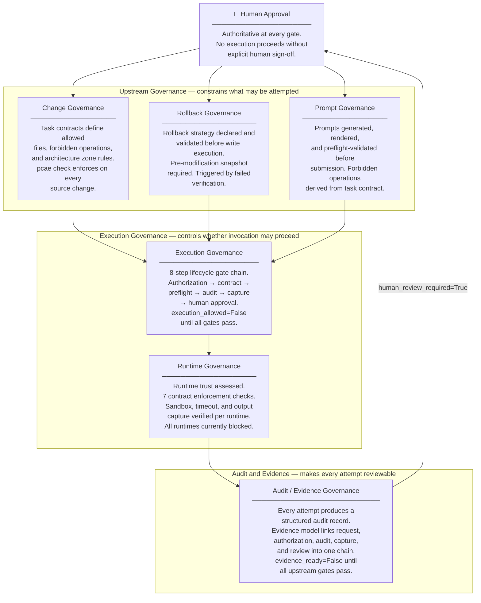

# PCAE Governance Stack

The governance stack shows how each domain governs a distinct layer of the AI execution lifecycle. Human Approval is the authoritative gate at every level — no domain can produce an execution-eligible artifact without it.

## Current Status

All execution gates are currently **blocked**. `execution_allowed=False` for all runtimes. The governance stack is scaffolded and validated; execution will be unblocked progressively as each gate is cleared by subsequent phases.
