# PCAE Execution Lifecycle

The execution lifecycle is the 8-step gate chain that every invocation attempt must traverse. Every gate is blocking — a failure at any step halts the chain and produces a structured blocker report.

```mermaid
flowchart TD
    START(["Invocation Request\nCreated"])

    PA["1 · Prompt Approval\n──────────────────\nPrompt rendered and\npreflight-validated.\nForbidden operations\nchecked against task\ncontract.\npcae prompt-render"]

    EA["2 · Execution Authorization\n────────────────────────────\nAuthorization artifact\nevaluated. Must be present,\nstructurally valid, not\nexpired, and human-approved.\npcae invocation-authorization-enforcement"]

    RCE["3 · Runtime Contract Enforcement\n──────────────────────────────────\n7 blocking checks: contract\nexists, trust acceptable,\nsandbox verified, timeout\nverified, capture verified,\nmode matches, write blocked.\npcae runtime-contract-enforcement"]

    IP["4 · Invocation Preflight\n──────────────────────\nRuntime status, sandbox,\ntimeout, and capture path\nconfirmed. execution_allowed\nchecked. Blockers reported.\npcae readonly-invocation"]

    AT["5 · Audit Trail\n────────────────\nAudit record created\nlinking request, authorization,\nenforcement, and preflight.\nAudit record must not be\nin a blocked state.\npcae invocation-audit"]

    RC["6 · Result Capture\n───────────────────\nCapture path confirmed\nready to receive output.\nCapture record preflight\nmust pass.\npcae invocation-result-capture"]

    HR["7 · Human Review\n─────────────────\nExplicit human approval\nrecorded for this invocation.\nNo automated bypass.\nhuman_review_required=True"]

    RR["8 · Result Review\n──────────────────\nCaptured output reviewed\nper-stream (stdout, stderr,\nmetadata). Quality framework\napplied. Findings reported.\npcae invocation-result-review"]

    QR["Quality Review\n───────────────\nQuality framework evaluates\nresult against acceptance\ncriteria. Escalation required\nif quality gate fails."]

    EVIDENCE["Evidence Record\n─────────────────\nAll upstream artifacts linked\ninto InvocationEvidenceRecord.\nevidence_status=complete only\nwhen all gates passed.\npcae invocation-evidence"]

    BLOCKED{{"Gate\nBlocked?"}}
    REPORT["Blocker Report\n───────────────\nStructured report of\nfailed gate, blockers,\nand warnings produced.\nNo invocation occurs."]

    START --> PA
    PA --> BLOCKED
    BLOCKED -->|"Yes"| REPORT
    BLOCKED -->|"No"| EA
    EA --> RCE --> IP --> AT --> RC --> HR --> RR --> QR --> EVIDENCE

    style BLOCKED fill:#ffd700,stroke:#b8860b,color:#000
    style REPORT fill:#ff6b6b,stroke:#c0392b,color:#fff
    style EVIDENCE fill:#27ae60,stroke:#1e8449,color:#fff
    style START fill:#2980b9,stroke:#1a5276,color:#fff
```

## Current State

All gates are currently blocked. `execution_allowed=False` for all runtimes. The lifecycle scaffold is complete; individual gates will be cleared as governance infrastructure matures across subsequent phases.
