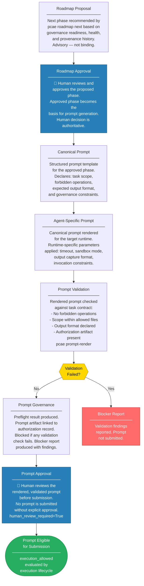

# PCAE Prompt Governance

Prompt governance ensures that every prompt submitted to an AI runtime is derived from a governed roadmap, parameterized against the current task context, validated against the task contract, and explicitly approved before submission.

## Governance Invariants

- No prompt is generated without an approved roadmap phase as its source.
- No prompt is rendered without the task contract being applied.
- No prompt is submitted without a passing preflight and explicit human approval.
- Prompt artifacts are linked to authorization records for full traceability.
