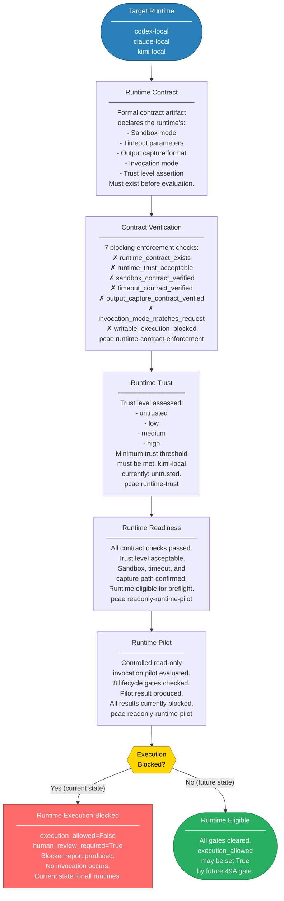

# PCAE Runtime Governance

Runtime governance evaluates each AI runtime independently against explicit trust, contract, and readiness criteria before any invocation is attempted. Different runtimes have different sandboxing guarantees, output behaviors, and trust levels — these differences are verified systematically, not assumed.

## Per-Runtime Current State

| Runtime | Trust Level | Contract | Sandbox | Execution |
|---------|-------------|----------|---------|-----------|
| codex-local | low | blocked | unverified | **blocked** |
| claude-local | low | blocked | unverified | **blocked** |
| kimi-local | untrusted | blocked | unverified | **blocked** |

All three runtimes are blocked in the current phase. This is expected and intentional. The contract and trust scaffolding must be validated before any runtime is cleared for invocation.
