# PCAE Future Autonomous Engineering Flow

This diagram describes the target autonomous engineering loop that PCAE is designed to govern. This flow does **not** represent current capabilities — it is the intended end state. All execution steps currently produce `execution_allowed=False`. Autonomous execution depends on every upstream governance gate being cleared and sustained.

```mermaid
flowchart TD
    HG["👤 Human Goal\n──────────────────\nHuman engineer defines\nthe engineering objective.\nGoal is the authoritative\nstarting point. No autonomous\ncycle begins without it."]

    EC["Evidence Collection\n──────────────────────\nExisting governance artifacts\ncollected and validated:\nhealth, task contracts,\narchitecture state, rollback\nreadiness, runtime trust.\npcae health / pcae inspect"]

    RP["Roadmap Proposal\n──────────────────\nNext governed phase\nrecommended from provenance\nhistory and readiness state.\nAdvisory — not binding.\npcae roadmap next"]

    HA1["👤 Human Approval\n──────────────────\nHuman approves proposed\nphase and authorizes prompt\ngeneration. Approval is\nexplicit and recorded.\nNo autonomous skip."]

    PG["Prompt Generation\n──────────────────\nGoverned prompt generated\nfor approved phase.\nTask contract applied.\nForbidden operations\nexcluded. Scope constrained.\npcae prompt-render"]

    AS["Agent Selection\n─────────────────\nBest-matched agent selected\nfrom capability matrix for\nthe task type. Selection\ndriven by orchestration\npolicy, not ad hoc.\npcae orchestration select"]

    CI["Controlled Invocation\n──────────────────────\nFull 8-step execution lifecycle\ngated. Authorization → contract\n→ preflight → audit → capture\n→ human approval → invocation.\nexecution_allowed must be True.\nAll gates must pass."]

    RV["Review\n───────\nCaptured output reviewed\nper-stream. Quality framework\napplied. Findings and warnings\nreported. Evidence record\nproduced.\npcae invocation-result-review\npcae invocation-evidence"]

    HA2["👤 Human Approval\n──────────────────\nHuman reviews evidence record\nand result review findings.\nApproves or rejects the\noutcome. Approval required\nbefore any commit or push."]

    COMMIT(["Governed Commit\n────────────────\nChange committed with\nfull audit trail.\nChangelog, status docs,\nand task artifacts updated.\nNo automatic push."])

    REJECT["Rollback\n─────────\nPre-declared rollback plan\nexecuted. Repository restored\nto pre-modification snapshot.\nAudit trail updated.\nNo autonomous retry."]

    LOOP(["Next Cycle\n───────────\nHuman Goal updated\nor next phase proposed.\nLoop begins again."])

    BLOCKED{{"Review\nAccepted?"}}

    HG --> EC --> RP --> HA1 --> PG --> AS --> CI --> RV --> HA2 --> BLOCKED
    BLOCKED -->|"Yes"| COMMIT --> LOOP --> HG
    BLOCKED -->|"No"| REJECT --> LOOP

    style HG fill:#2980b9,stroke:#1a5276,color:#fff
    style HA1 fill:#2980b9,stroke:#1a5276,color:#fff
    style HA2 fill:#2980b9,stroke:#1a5276,color:#fff
    style CI fill:#8e44ad,stroke:#6c3483,color:#fff
    style COMMIT fill:#27ae60,stroke:#1e8449,color:#fff
    style REJECT fill:#e67e22,stroke:#ca6f1e,color:#fff
    style BLOCKED fill:#ffd700,stroke:#b8860b,color:#000
```

## Important Notes

- **This is a future state diagram.** No PCAE command currently invokes a runtime, submits a prompt, or commits changes autonomously.
- Human approval appears at three critical points: goal setting, prompt authorization, and result review. These are structural checkpoints, not optional suggestions.
- The loop is not infinite — each cycle requires a new human-approved goal or a human-approved next phase. There is no autonomous recurrence.
- Rollback is pre-declared before the cycle begins. It is not improvised after a failure.
- The "Controlled Invocation" step depends on Phase 49A (Invocation Execution Gate Implementation) clearing `execution_allowed` for at least one runtime.
